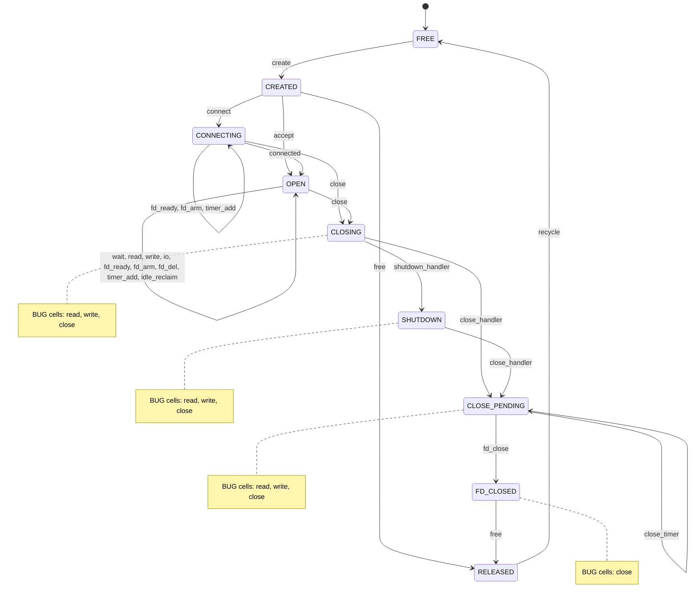

# Connection Lifecycle Contract (`nxt_conn_t`)

Code-verified specification of the connection state machine: states,
events, the full transition table, invariants, resource ownership and the
places where the code does not match the intended contract.

Every claim cites `file:line` against master (`eb1767c9`).  Items that could
not be settled from the code are marked **OPEN QUESTION**.  The transition
table and the diagram are generated from `docs/fsm/conn.yaml` by
`tools/fsm/render.py`; `tools/fsm/trace_check.py` replays a `--debug`
`unit.log` against the same YAML (section 10).

Scope: `src/nxt_conn.{h,c}`, `src/nxt_conn_accept.c`, `src/nxt_conn_read.c`,
`src/nxt_conn_write.c`, `src/nxt_conn_connect.c`, `src/nxt_conn_close.c`,
`src/nxt_fd_event.h`, `src/nxt_timer.{h,c}`, the epoll engine as the
reference facility (`src/nxt_epoll_engine.c`), and the users that install
`nxt_conn_state_t` tables: `src/nxt_h1proto.c`, `src/nxt_controller.c`,
`src/nxt_conn_proxy.c`, `src/nxt_openssl.c`, `src/nxt_router.c`,
`src/nxt_runtime.c`.  The fd-event vtable itself is specified in
`docs/io_uring/engine-contract.md`; this document only uses it.

---

## 1. Where the state lives

The connection has no `state` field.  Its state is spread over the handler
pointers, a few flag bytes, two embedded timers and the engine's queues.

| storage | meaning | cite |
|---|---|---|
| `c->socket` (`nxt_fd_event_t`, must be first) | the fd and its per-direction event state (`read`, `write`), readiness latches (`read_ready`, `write_ready`), `changing`, `closed`, `timedout`, `shutdown`, `error`, and the installed `read_handler` / `write_handler` / `error_handler` | `nxt_conn.h:125-130`, `nxt_fd_event.h:55-115` |
| `c->read_state`, `c->write_state` (`const nxt_conn_state_t *`) | the protocol-level state: which handlers run on ready/close/error, which timer to arm and whether it auto-resets | `nxt_conn.h:15-27`, `:133`, `:138` |
| `c->read_timer`, `c->write_timer` (`nxt_timer_t`, embedded) | deadline per direction; the write timer is reused as the 0 ms close timer | `nxt_conn.h:135`, `:141`, `nxt_conn_close.c:132-135` |
| `c->block_read`, `c->block_write` | owner-set "do not touch this direction any more" flags, never cleared | `nxt_conn.h:166-167`, `nxt_conn_read.c:52`, `nxt_conn_write.c:30` |
| `c->idle` (`NXT_CONN_TRACK_NONE/IDLE/ACTIVE`) and `c->link` | membership in `engine->idle_connections` / `engine->active_connections` | `nxt_conn.h:170-185`, `:194`, `nxt_event_engine.h:478-479` |
| `c->next` | freelist / parked-list link | `nxt_conn.h:195`, `nxt_conn.c:68-69`, `:200-201`, `:271-272` |
| `c->mem_pool` | the per-connection pool; the struct itself normally lives in `engine->mem_pool` | `nxt_conn.c:57-86`, `:147-153` |
| `c->task`, `c->log`, `c->socket.task`, `*_timer.task` | the connection-scoped task captured by every queued work item | `nxt_conn.c:101-118` |
| `c->listen` (`nxt_listen_event_t *`) and `lev->count` | the listener that accepted the conn and its reference count | `nxt_conn.h:160`, `nxt_conn_accept.c:217-218`, `nxt_router.c:5183-5217` |
| `engine->connections`, `max_connections` | live struct count (created minus freed), accept limit | `nxt_event_engine.h:471-472`, `nxt_conn.c:99`, `:143`, `nxt_conn_accept.c:94` |
| `engine->free_connections`, `pending_connections` | recyclable structs; structs parked after free until the engine drains | `nxt_event_engine.h:482-483`, `nxt_conn.c:186-202`, `:257-278` |
| `engine->*_conns_cnt` | accepted / idle / active / closed counters | `nxt_event_engine.h:485-488`, `nxt_conn.h:334-414` |

The work queues matter for ordering.  The engine drains them in this fixed
order before every poll: `fast`, `accept`, `read`, `socket`, `connect`,
`write`, `shutdown`, `close` (`nxt_event_engine.c:70-85`, `:464-502`), and
only when all are empty does it recycle parked structs and call
`epoll_wait` (`nxt_event_engine.c:521-556`).

---

## 2. States

Nine lifecycle states.  Orthogonal sub-machines (tracking, read direction,
write direction, timers) are in section 5.

| state | representation in memory | cite |
|---|---|---|
| **FREE** | struct on `engine->free_connections`, or never allocated. | `nxt_conn.c:67-70`, `:271-272` |
| **CREATED** | `nxt_conn_create()` returned: `fd == -1`, `idle == NONE`, no states, timers quiescent, `socket.task == &c->task`, counted in `engine->connections`.  Includes the listener's spare `lev->next` and an upstream peer before `connect`. | `nxt_conn.c:49-133`, `nxt_conn_accept.c:111`, `nxt_h1proto.c:2361-2411` |
| **CONNECTING** | `fd >= 0` after `socket(2)`; write fd-event armed with `write_handler = nxt_conn_connect_test` (or the epoll edge variant); write timer from `write_state`. | `nxt_conn_connect.c:35-74`, `:104`, `nxt_epoll_engine.c:1101-1130` |
| **OPEN** | fd open, no close scheduled; `socket.error_handler` is the current state's handler; I/O and timers as in section 5. | `nxt_conn_read.c:28-33`, `:62-64`, `nxt_conn_write.c:40-41` |
| **CLOSING** (phase 0) | `nxt_conn_close()` ran: `c->write = NULL`, `error_handler = nxt_conn_close_error_ignore`, shutdown or close handler queued.  fd still open and registered; `c->read` and `block_read` untouched. | `nxt_conn_close.c:19-71` |
| **SHUTDOWN** (phase 1) | `socket.shutdown = 1`, `shutdown(fd, SHUT_RDWR)` done, close handler queued. | `nxt_conn_close.c:75-91` |
| **CLOSE_PENDING** (phase 2) | close handler ran: timers deleted, `EPOLL_CTL_DEL` batched, 0 ms close timer armed on `write_timer`.  fd still open unless the fd-event had no pending change. | `nxt_conn_close.c:95-136` |
| **FD_CLOSED** | `fd == -1`, conn untracked, `write_state->ready_handler` (the owner's release handler) queued on `fast_work_queue`. | `nxt_conn_close.c:118-129`, `:140-163` |
| **RELEASED** (phase 3) | `nxt_conn_free()` ran: `connections--`, timers deleted, struct parked on `engine->pending_connections`, `c->mem_pool` released.  Memory still valid, must not be touched. | `nxt_conn.c:137-207` |

---

## 3. Events

| event | meaning | cite | debug log line (see section 10) |
|---|---|---|---|
| `create` | `nxt_conn_create()` | `nxt_conn.c:49-133` | `connections: N` |
| `accept` | `accept(2)` succeeded, `nxt_conn_accept()` on `lev->next` | `nxt_conn_accept.c:136-243`, `nxt_epoll_engine.c:1012-1046` | `accept4(L): fd` under the listener ident only |
| `connect` | `nxt_conn_connect()` → `socket(2)` → `connect(2)` attempt | `nxt_conn.h:292-294`, `nxt_conn_connect.c:14-74` | `connect(fd, addr)` |
| `connected` | connect completed (inline, `nxt_conn_connect_test`, or edge fast path) | `nxt_conn_connect.c:48-51`, `:134-157`, `nxt_epoll_engine.c:1137-1160` | `epoll event conn connected fd:N`, `event connect test fd:N`; none when inline |
| `wait` | `nxt_conn_wait()` | `nxt_conn_read.c:11-34` | `conn wait fd:N rdy:R` |
| `read` | `nxt_conn_io_read()` runs | `nxt_conn_read.c:38-128` | `conn read fd:N rdy:R cl:C er:E bl:B` |
| `write` | `nxt_conn_io_write()` runs | `nxt_conn_write.c:17-154` | `conn write fd:N er:E bl:B` |
| `io` | a socket syscall on the fd | `nxt_conn_read.c:132-252`, `nxt_conn_write.c:174-401` | `recv(N, …)`, `readv(N, …)`, `send(N, …)`, `writev(N, …)`, `sendfile(F, N, …)` |
| `fd_ready` | the engine dispatches readiness for `c->socket` | `nxt_epoll_engine.c:918-1007` | `epoll: fd:N ev:X d:P rd:R wr:W` |
| `fd_arm` | `EPOLL_CTL_ADD` / `MOD` batched | `nxt_epoll_engine.c:415-462`, `:592-611` | `epoll E set event: fd:N op:1|3 ev:X` |
| `fd_del` | `EPOLL_CTL_DEL` batched | `nxt_epoll_engine.c:371-394`, `:465-506` | `epoll E set event: fd:N op:2 ev:0` |
| `timer_add` | `nxt_timer_add()` on either conn timer | `nxt_conn.c:282-295`, `nxt_timer.c:70-101` | `timer add: T±B timeout:deadline` (which timer is not logged) |
| `close` | `nxt_conn_close()` | `nxt_conn_close.c:19-71` | `conn close fd:N, to:T` |
| `shutdown_handler` | `nxt_conn_shutdown_handler()` | `nxt_conn_close.c:75-91` | `conn shutdown handler fd:N` |
| `close_handler` | `nxt_conn_close_handler()` | `nxt_conn_close.c:95-136` | `conn close handler fd:N` |
| `close_timer` | `nxt_conn_close_timer_handler()` | `nxt_conn_close.c:140-163` | `conn close timer handler fd:N` |
| `fd_close` | `close(2)` of the fd | `nxt_socket.c:283-310` | `socket close(N)` |
| `free` | `nxt_conn_free()` | `nxt_conn.c:137-207` | none; only the owners' lines `h1p conn free`, `h1p peer free`, `controller conn free` |
| `recycle` | `nxt_conn_recycle_pending()` | `nxt_conn.c:257-278` | none |
| `idle_reclaim` | an idle conn is picked for closing (fd pressure, runtime quit) | `nxt_conn_accept.c:284-328`, `nxt_runtime.c:495-516` | `idle connection: N rdy:R` (fd pressure only) |

---

## 4. Transition table

Generated from `docs/fsm/conn.yaml` by `tools/fsm/render.py --table`.
9 states × 20 events = 180 cells; each cell has a verdict.  Guarded cells
(`a / b`) depend on the flags in the logged line (`bl`, `er`, `timeout`).

<!-- BEGIN GENERATED TABLE (tools/fsm/render.py docs/fsm/conn.yaml --table) -->
Legend: `->STATE` transition (target state), `=` ignored (no-op), `x` impossible, `BUG` bug (see mismatch inventory).  `a / b` is a guarded cell: `a` applies when its `when` guard matches the logged flags, `b` otherwise.

| state \ event | create | accept | connect | connected | wait | read | write | io | fd_ready | fd_arm | fd_del | timer_add | close | shutdown_handler | close_handler | close_timer | fd_close | free | recycle | idle_reclaim |
|---|---|---|---|---|---|---|---|---|---|---|---|---|---|---|---|---|---|---|---|---|
| **FREE** | ->CREATED | x | x | x | x | x | x | x | x | x | x | x | x | x | x | x | x | x | x | x |
| **CREATED** | x | ->OPEN | ->CONNECTING | x | x | x | x | x | x | x | x | x | x | x | x | x | = | ->RELEASED | x | x |
| **CONNECTING** | x | x | x | ->OPEN | x | x | x | x | ->CONNECTING | ->CONNECTING | x | ->CONNECTING | ->CLOSING | x | x | x | x | x | x | x |
| **OPEN** | x | x | x | = | ->OPEN | ->OPEN | ->OPEN | ->OPEN | ->OPEN | ->OPEN | ->OPEN | ->OPEN | ->CLOSING | x | x | x | x | x | x | ->OPEN |
| **CLOSING** | x | x | x | x | x | = / = / BUG | = / BUG | x | x | x | x | x | BUG | ->SHUTDOWN | ->CLOSE_PENDING | x | x | x | x | x |
| **SHUTDOWN** | x | x | x | x | x | = / = / BUG | = / BUG | x | x | x | x | x | BUG | x | ->CLOSE_PENDING | x | x | x | x | x |
| **CLOSE_PENDING** | x | x | x | x | x | = / = / BUG | = / BUG | x | x | x | = | = / x | BUG | x | x | ->CLOSE_PENDING | ->FD_CLOSED | x | x | x |
| **FD_CLOSED** | x | x | x | x | x | x | x | x | x | x | x | x | BUG | x | x | = | x | ->RELEASED | x | x |
| **RELEASED** | x | x | x | x | x | x | x | x | x | x | x | x | x | x | x | x | x | x | ->FREE | x |

Cell notes, one block per event.  Cells not listed under an event take that event's default verdict (given first).

#### `create`

nxt_conn_create(mp, task).  Cite: nxt_conn.c:49-133.
Default: **impossible** -- create allocates a new struct; an existing struct is re-zeroed only after recycle (nxt_conn.c:70).

- **FREE**: transition -> **CREATED**. recycled struct re-zeroed (nxt_conn.c:67-70) or fresh from engine->mem_pool (:73); engine->connections++ (:99). [nxt_conn.c:65-99]

#### `accept`

accept(2)/accept4(2) succeeded and nxt_conn_accept() ran on lev->next.  Cite: nxt_conn_accept.c:136-196, nxt_conn_accept.c:200-243, nxt_epoll_engine.c:1012-1046.
Default: **impossible** -- only lev->next, a CREATED spare, is handed to accept (nxt_conn_accept.c:145, nxt_epoll_engine.c:1022).

- **CREATED**: transition -> **OPEN**. fd assigned (nxt_conn_accept.c:180 / nxt_epoll_engine.c:1041); c->idle = IDLE (nxt_conn_accept.c:215); lev->count++ (:218); listen handler queued (:229-234).  Requires c == lev->next. [nxt_conn_accept.c:200-243]

#### `connect`

nxt_conn_connect() -> nxt_conn_sys_socket() -> io->connect().  Cite: nxt_conn.h:292-294, nxt_conn_connect.c:14-31, nxt_conn_connect.c:35-74.
Default: **impossible** -- connect needs c->socket.fd == -1 and no fd-event; every caller connects a fresh conn (nxt_h1proto.c:2411, nxt_conn_proxy.c:116,:842).

- **CREATED**: transition -> **CONNECTING**. socket(2) (nxt_conn_connect.c:87,:104).  NXT_OK: write_ready = 1 and ready_handler queued, the conn is already OPEN (:48-51,:73).  NXT_AGAIN: write handler + timer + enable_write (:53-62).  NXT_DECLINED/NXT_ERROR: close/error handler queued with the fd still open (:64-73).  socket(2) failure: error_handler queued, fd stays -1, the conn stays CREATED (:25-30). [nxt_conn_connect.c:14-74]

#### `connected`

connect(2) completed (inline NXT_OK, nxt_conn_connect_test, or the epoll edge fast path).  Cite: nxt_conn_connect.c:48-51, nxt_conn_connect.c:134-157, nxt_epoll_engine.c:1137-1160.
Default: **impossible** -- only the write handler installed while CONNECTING produces this event; it blocks the write fd-event before dispatching (nxt_conn_connect.c:143, nxt_epoll_engine.c:1146).

- **CONNECTING**: transition -> **OPEN**. write fd-event blocked (nxt_conn_connect.c:143, nxt_epoll_engine.c:1146); autoreset write timer disabled (:145-147); ready_handler queued (:152), or on SO_ERROR the close/error handler via nxt_conn_connect_error (:155,:161-196).  Either way the fd is open and must be closed by the owner. [nxt_conn_connect.c:134-196]
- **OPEN**: ignored. the epoll edge fast path defers to nxt_conn_connect_test() when the EPOLLOUT came with EPOLLERR/EPOLLHUP (nxt_epoll_engine.c:1157), so one completion logs both `epoll event conn connected` and `event connect test`. [nxt_epoll_engine.c:1147-1158]

#### `wait`

nxt_conn_wait() arms read readiness without a buffer.  Cite: nxt_conn_read.c:11-34.
Default: **impossible** -- no caller; the function has no guard, so a call here would re-arm read on a closing or closed fd.

- **CONNECTING**: impossible. no caller waits on a connecting socket; nxt_conn_proxy waits on the client only (nxt_conn_proxy.c:124-126).
- **OPEN**: transition -> **OPEN**. read_ready: ready_handler queued at once (nxt_conn_read.c:22-25); else read_handler = ready_handler, error_handler, read timer, enable_read (:28-33). [nxt_conn_read.c:11-34]

#### `read`

nxt_conn_io_read() runs (queued by nxt_conn_read() or by an EPOLLIN dispatch).  Cite: nxt_conn.h:297-305, nxt_conn_read.c:38-128.
Default: **impossible** -- no fd (CREATED) or no handler can be queued any more (FD_CLOSED, RELEASED: the fd-event was deleted before the fd was closed, CONN-INV-8).

- **CONNECTING**: impossible. no caller reads before connected; on Linux recv() on an unconnected socket returns EAGAIN (comment nxt_epoll_engine.c:1110-1115).
- **OPEN**: transition -> **OPEN**. guard: socket.error != 0 or c->block_read returns silently (nxt_conn_read.c:52-54).  n > 0: fd read BLOCKED, autoreset timer disabled, ready_handler queued (:77-91).  n == 0: socket.closed = 1 (:168,:220), close_handler queued (:93-102).  NXT_ERROR: socket.error set (:187,:244), error_handler queued.  NXT_AGAIN: enable_read if disabled (:121-123), timer (:125-127). [nxt_conn_read.c:38-128]
- **CLOSING**: ignored (when {'bl': '1'}). the owner set c->block_read before nxt_conn_close(); the handler returns at nxt_conn_read.c:52-54. [nxt_conn_read.c:52-54]
- **CLOSING**: ignored (when {'er': '!0'}). socket.error != 0; the handler returns at nxt_conn_read.c:52-54. [nxt_conn_read.c:52-54]
- **CLOSING**: bug. a queued read handler runs unguarded (bl:0, er:0) on a closing conn: nxt_conn_close() does not block reads or clear c->read (nxt_conn_close.c:37 clears only c->write), so it recv()s on the closing fd and dispatches read_state handlers, which in h1proto re-enter nxt_h1p_shutdown() -> second nxt_conn_close() (M-3).  M-2. [nxt_conn_read.c:52-54, nxt_conn_close.c:37]
- **SHUTDOWN**: ignored (when {'bl': '1'}). the owner set c->block_read before nxt_conn_close(); the handler returns at nxt_conn_read.c:52-54. [nxt_conn_read.c:52-54]
- **SHUTDOWN**: ignored (when {'er': '!0'}). socket.error != 0; the handler returns at nxt_conn_read.c:52-54. [nxt_conn_read.c:52-54]
- **SHUTDOWN**: bug. a queued read handler runs unguarded (bl:0, er:0) on a closing conn: nxt_conn_close() does not block reads or clear c->read (nxt_conn_close.c:37 clears only c->write), so it recv()s on the closing fd and dispatches read_state handlers, which in h1proto re-enter nxt_h1p_shutdown() -> second nxt_conn_close() (M-3).  M-2. [nxt_conn_read.c:52-54, nxt_conn_close.c:37]
- **CLOSE_PENDING**: ignored (when {'bl': '1'}). the owner set c->block_read before nxt_conn_close(); the handler returns at nxt_conn_read.c:52-54. [nxt_conn_read.c:52-54]
- **CLOSE_PENDING**: ignored (when {'er': '!0'}). socket.error != 0; the handler returns at nxt_conn_read.c:52-54. [nxt_conn_read.c:52-54]
- **CLOSE_PENDING**: bug. a queued read handler runs unguarded (bl:0, er:0) on a closing conn: nxt_conn_close() does not block reads or clear c->read (nxt_conn_close.c:37 clears only c->write), so it recv()s on the closing fd and dispatches read_state handlers, which in h1proto re-enter nxt_h1p_shutdown() -> second nxt_conn_close() (M-3).  M-2. [nxt_conn_read.c:52-54, nxt_conn_close.c:37]

#### `write`

nxt_conn_io_write() runs (queued by nxt_conn_write() or by an EPOLLOUT dispatch).  Cite: nxt_conn.h:308-316, nxt_conn_write.c:17-154.
Default: **impossible** -- no fd (CREATED) or no handler can be queued any more (FD_CLOSED, RELEASED).

- **CONNECTING**: impossible. write_ready is 0 until connect succeeds (nxt_conn_connect.c:49); the write handler slot is the connect test.
- **OPEN**: transition -> **OPEN**. socket.error != 0 or c->block_write: write_state->error_handler queued (nxt_conn_write.c:30-32,:150-153).  !write_ready or c->write == NULL: return (:34-36).  Else sendbuf loop (:57-85); done: fd write BLOCKED (:74); limit hit: 0 ms write timer (:97-103); NXT_AGAIN: timer + enable_write (:105-118); ready_handler (:121-127) or error_handler (:129-153). [nxt_conn_write.c:17-154]
- **CLOSING**: ignored (when {'er': '0', 'bl': '0'}). c->write == NULL (set by nxt_conn_close(), nxt_conn_close.c:37) makes the queued write handler return at nxt_conn_write.c:34-36. [nxt_conn_write.c:34-36]
- **CLOSING**: bug. block_write or socket.error is set (bl:1 or er:!0): the test at nxt_conn_write.c:30-32 runs BEFORE the c->write == NULL test and jumps to `error:`, which queues c->write_state->error_handler (:150-153) -- NULL in every close state (nxt_h1proto.c:2315-2319, :3363-3367; nxt_controller.c:1116-1120; nxt_conn_proxy.c:933-937).  The engine then calls a NULL function pointer (nxt_event_engine.c:545).  M-1. [nxt_conn_write.c:30-36, nxt_conn_write.c:150-153]
- **SHUTDOWN**: ignored (when {'er': '0', 'bl': '0'}). c->write == NULL (set by nxt_conn_close(), nxt_conn_close.c:37) makes the queued write handler return at nxt_conn_write.c:34-36. [nxt_conn_write.c:34-36]
- **SHUTDOWN**: bug. block_write or socket.error is set (bl:1 or er:!0): the test at nxt_conn_write.c:30-32 runs BEFORE the c->write == NULL test and jumps to `error:`, which queues c->write_state->error_handler (:150-153) -- NULL in every close state (nxt_h1proto.c:2315-2319, :3363-3367; nxt_controller.c:1116-1120; nxt_conn_proxy.c:933-937).  The engine then calls a NULL function pointer (nxt_event_engine.c:545).  M-1. [nxt_conn_write.c:30-36, nxt_conn_write.c:150-153]
- **CLOSE_PENDING**: ignored (when {'er': '0', 'bl': '0'}). c->write == NULL (set by nxt_conn_close(), nxt_conn_close.c:37) makes the queued write handler return at nxt_conn_write.c:34-36. [nxt_conn_write.c:34-36]
- **CLOSE_PENDING**: bug. block_write or socket.error is set (bl:1 or er:!0): the test at nxt_conn_write.c:30-32 runs BEFORE the c->write == NULL test and jumps to `error:`, which queues c->write_state->error_handler (:150-153) -- NULL in every close state (nxt_h1proto.c:2315-2319, :3363-3367; nxt_controller.c:1116-1120; nxt_conn_proxy.c:933-937).  The engine then calls a NULL function pointer (nxt_event_engine.c:545).  M-1. [nxt_conn_write.c:30-36, nxt_conn_write.c:150-153]

#### `io`

a socket syscall on c->socket.fd (recv, readv, send, writev, sendfile).  Cite: nxt_conn_read.c:132-252, nxt_conn_write.c:174-401.
Default: **impossible** -- only reached from read/write handlers; in CLOSING and later it means an unguarded handler ran (M-2) or the fd was closed (FD_CLOSED, RELEASED: EBADF or I/O on a reused descriptor).

- **CONNECTING**: impossible. no read/write handler runs while CONNECTING (see read/write cells).
- **OPEN**: transition -> **OPEN**. recv/readv clear read_ready on short read or EAGAIN (nxt_conn_read.c:160-161,:179,:213,:234); n == 0 sets closed (:168,:220); errors set socket.error (:187,:244).  send/writev/sendfile clear sb.ready on EAGAIN (nxt_conn_write.c:241,:342,:384) and set sb.error otherwise. [nxt_conn_read.c:132-252, nxt_conn_write.c:174-401]

#### `fd_ready`

the engine dispatches kernel readiness for c->socket (EPOLLIN/EPOLLOUT/EPOLLERR/EPOLLHUP).  Cite: nxt_epoll_engine.c:918-1007.
Default: **impossible** -- CLOSING/SHUTDOWN/CLOSE_PENDING all complete inside one work-queue drain (nxt_event_engine.c:521-545) and the EPOLL_CTL_DEL is committed before the next epoll_wait (nxt_epoll_engine.c:888-890), so no readiness can be delivered after nxt_conn_close(); a closed fd is not in the set.

- **CONNECTING**: transition -> **CONNECTING**. EPOLLOUT: write_ready = 1, write_handler (connect test) queued (nxt_epoll_engine.c:957-967).  EPOLLERR/HUP without IN/OUT: nxt_epoll_error_handler queued (:985-1006) -> nxt_conn_connect_error (nxt_conn_connect.c:55). [nxt_epoll_engine.c:918-1007]
- **OPEN**: transition -> **OPEN**. sets read_ready/write_ready latches (:938,:958); queues read_handler/write_handler unless that direction is BLOCKED (:940-947,:960-967); ONESHOT -> DISABLED (:942-943).  Error with both directions blocked: latches set, nothing queued (:992-1001; level mode disables the fd). [nxt_epoll_engine.c:918-1007]

#### `fd_arm`

EPOLL_CTL_ADD or EPOLL_CTL_MOD batched for c->socket (enable_read/enable_write/enable).  Cite: nxt_epoll_engine.c:415-462, nxt_epoll_engine.c:592-611.
Default: **impossible** -- no fd (CREATED), or only reachable through an unguarded handler (CLOSING/SHUTDOWN, M-2); after the DEL of phase 2 any ADD/MOD would re-register a closing fd (CLOSE_PENDING) or a closed one.

- **CONNECTING**: transition -> **CONNECTING**. enable_write (nxt_conn_connect.c:61) or nxt_epoll_enable + read BLOCKED (nxt_epoll_engine.c:1127-1128). [nxt_conn_connect.c:61, nxt_epoll_engine.c:1127-1128]
- **OPEN**: transition -> **OPEN**. enable_read when the read direction is disabled (nxt_conn_read.c:33,:121-123); enable_write on NXT_AGAIN (nxt_conn_write.c:115-117).  block_read/block_write are state-only, no syscall (nxt_epoll_engine.c:509-524). [nxt_epoll_engine.c:415-462]

#### `fd_del`

EPOLL_CTL_DEL batched for c->socket (disable_read/disable_write/disable/delete/close).  Cite: nxt_epoll_engine.c:371-394, nxt_epoll_engine.c:465-506.
Default: **impossible** -- the DEL of phase 2 is batched with the conn already in CLOSE_PENDING; nothing else deletes the fd-event of a closing conn.

- **OPEN**: transition -> **OPEN**. level-triggered engine disabling a BLOCKED direction (nxt_epoll_engine.c:948-951,:968-971,:994-998); nxt_fd_event_disable_read on the listener (nxt_conn_accept.c:277).  Not used by conn code on the edge engine. [nxt_epoll_engine.c:465-506]
- **CLOSE_PENDING**: ignored. this is the DEL batched by nxt_fd_event_close() inside the close handler (nxt_conn_close.c:116, nxt_epoll_engine.c:406-412); it is logged after the handler's own line, so the conn is already CLOSE_PENDING. [nxt_conn_close.c:116]

#### `timer_add`

nxt_timer_add() on c->read_timer or c->write_timer.  Cite: nxt_conn.c:282-295, nxt_timer.c:70-101.
Default: **impossible** -- timers are armed only from wait/read/write/connect (nxt_conn.c:292) and from the close handler; nothing arms a timer of a closed or released conn (nxt_conn.c:183-184 deletes both).

- **CONNECTING**: transition -> **CONNECTING**. nxt_conn_timer() arms the state's timer when timer_value != 0 (nxt_conn.c:287-294); 0 ms write timer to postpone writing (nxt_conn_write.c:102-103); TLS shutdown timer (nxt_openssl.c:1522-1523).  `to` is the current state. [nxt_conn.c:282-295]
- **OPEN**: transition -> **OPEN**. nxt_conn_timer() arms the state's timer when timer_value != 0 (nxt_conn.c:287-294); 0 ms write timer to postpone writing (nxt_conn_write.c:102-103); TLS shutdown timer (nxt_openssl.c:1522-1523).  `to` is the current state. [nxt_conn.c:282-295]
- **CLOSE_PENDING**: ignored (when {'timeout': '0'}). the 0 ms close timer added by the close handler (nxt_conn_close.c:132-135), logged after the handler's own line.  Only timeout 0 is legal here (the checker verifies the `timeout` group). [nxt_conn_close.c:135]

#### `close`

nxt_conn_close(engine, c).  Cite: nxt_conn_close.c:19-71.
Default: **impossible** -- see the per-state cells.

- **CREATED**: impossible. no guard in nxt_conn_close(); every caller checks c->socket.fd != -1 first (nxt_h1proto.c:3352, nxt_conn_proxy.c:954,:960).  With fd == -1 it would issue setsockopt/shutdown/close on -1 and still queue the release handler.  CONN-INV-4.
- **CONNECTING**: transition -> **CLOSING**. precondition CONN-INV-2: c->write_state points to a state whose ready_handler releases the conn.  c->write = NULL (:37); SO_LINGER off if timedout (:39-52); error_handler = ignore (:59); shutdown handler when error == 0 && !closed && !shutdown, else close handler (:61-70). [nxt_conn_close.c:19-71]
- **OPEN**: transition -> **CLOSING**. precondition CONN-INV-2: c->write_state points to a state whose ready_handler releases the conn.  c->write = NULL (:37); SO_LINGER off if timedout (:39-52); error_handler = ignore (:59); shutdown handler when error == 0 && !closed && !shutdown, else close handler (:61-70). [nxt_conn_close.c:19-71]
- **CLOSING**: bug. double close: nxt_conn_close() has no idempotence flag.  A second call queues a second close handler; the release handler then runs twice and nxt_conn_free() parks the struct twice (caught only by the debug assert nxt_conn.c:187).  The error path is guarded (error_handler = ignore, :59); other re-entries rely on callers (untrack-before-close nxt_runtime.c:512, nxt_controller.c:1143; socket.data = NULL nxt_h1proto.c:2270).  M-3. [nxt_conn_close.c:19-71, nxt_conn.c:187]
- **SHUTDOWN**: bug. double close: nxt_conn_close() has no idempotence flag.  A second call queues a second close handler; the release handler then runs twice and nxt_conn_free() parks the struct twice (caught only by the debug assert nxt_conn.c:187).  The error path is guarded (error_handler = ignore, :59); other re-entries rely on callers (untrack-before-close nxt_runtime.c:512, nxt_controller.c:1143; socket.data = NULL nxt_h1proto.c:2270).  M-3. [nxt_conn_close.c:19-71, nxt_conn.c:187]
- **CLOSE_PENDING**: bug. double close: nxt_conn_close() has no idempotence flag.  A second call queues a second close handler; the release handler then runs twice and nxt_conn_free() parks the struct twice (caught only by the debug assert nxt_conn.c:187).  The error path is guarded (error_handler = ignore, :59); other re-entries rely on callers (untrack-before-close nxt_runtime.c:512, nxt_controller.c:1143; socket.data = NULL nxt_h1proto.c:2270).  M-3. [nxt_conn_close.c:19-71, nxt_conn.c:187]
- **FD_CLOSED**: bug. double close: nxt_conn_close() has no idempotence flag.  A second call queues a second close handler; the release handler then runs twice and nxt_conn_free() parks the struct twice (caught only by the debug assert nxt_conn.c:187).  The error path is guarded (error_handler = ignore, :59); other re-entries rely on callers (untrack-before-close nxt_runtime.c:512, nxt_controller.c:1143; socket.data = NULL nxt_h1proto.c:2270).  M-3. [nxt_conn_close.c:19-71, nxt_conn.c:187]
- **RELEASED**: impossible. use after free; nothing holds the conn after the release handler returned (CONN-INV-13).

#### `shutdown_handler`

nxt_conn_shutdown_handler() runs from engine->shutdown_work_queue.  Cite: nxt_conn_close.c:75-91.
Default: **impossible** -- queued only by nxt_conn_close() (nxt_conn_close.c:62-63,:70).

- **CLOSING**: transition -> **SHUTDOWN**. socket.shutdown = 1; shutdown(fd, SHUT_RDWR); close handler queued. [nxt_conn_close.c:75-91]

#### `close_handler`

nxt_conn_close_handler() runs from engine->close_work_queue.  Cite: nxt_conn_close.c:95-136.
Default: **impossible** -- queued only by nxt_conn_close() (nxt_conn_close.c:66-67) or by the shutdown handler (nxt_conn_close.c:89-90).

- **CLOSING**: transition -> **CLOSE_PENDING**. timers deleted (:113-114); DEL batched (:116).  events_pending == 0: fd closed and conn untracked at once (:118-122), and with no timer change pending the release handler is queued directly, i.e. FD_CLOSED (:124-128).  With epoll, events_pending is 1 whenever the fd was ever armed (nxt_epoll_engine.c:406-412), so the fd close is deferred to the 0 ms timer (:132-135). [nxt_conn_close.c:95-136]
- **SHUTDOWN**: transition -> **CLOSE_PENDING**. timers deleted (:113-114); DEL batched (:116).  events_pending == 0: fd closed and conn untracked at once (:118-122), and with no timer change pending the release handler is queued directly, i.e. FD_CLOSED (:124-128).  With epoll, events_pending is 1 whenever the fd was ever armed (nxt_epoll_engine.c:406-412), so the fd close is deferred to the 0 ms timer (:132-135). [nxt_conn_close.c:95-136]

#### `close_timer`

nxt_conn_close_timer_handler() runs (0 ms write timer).  Cite: nxt_conn_close.c:140-163.
Default: **impossible** -- installed only by the close handler (nxt_conn_close.c:132-135); nxt_conn_free() deletes it (nxt_conn.c:184).

- **CLOSE_PENDING**: transition -> **CLOSE_PENDING**. closes the fd if still open and untracks (:154-159), then queues the release handler (:161-162).  The fd_close event that follows moves the conn to FD_CLOSED. [nxt_conn_close.c:140-163]
- **FD_CLOSED**: ignored. fd already -1 (closed inline by the close handler); the guard at :154 skips close(2); the release handler is queued a second time ONLY if the handler was not queued inline -- it was not, because the timer path is taken only when the inline queueing at :124-128 was skipped. [nxt_conn_close.c:154-162]

#### `fd_close`

close(2) of c->socket.fd via nxt_socket_close().  Cite: nxt_socket.c:283-310, nxt_conn_close.c:119, nxt_conn_close.c:155.
Default: **impossible** -- the conn's fd is closed only by the close handler or the close timer; a second close(2) of the same number would hit an unrelated, reused descriptor.

- **CREATED**: ignored. nxt_conn_socket() closes the just-created socket when bind(2) fails (nxt_conn_connect.c:122-126); the conn stays CREATED with fd == -1. [nxt_conn_connect.c:122-126]
- **CLOSE_PENDING**: transition -> **FD_CLOSED**. close(2) by the close handler (:119) or the close timer (:155); c->socket.fd = -1; nxt_conn_untrack. [nxt_conn_close.c:118-122, nxt_conn_close.c:154-159]

#### `free`

nxt_conn_free(task, c).  Cite: nxt_conn.c:137-207.
Default: **impossible** -- see the per-state cells.

- **CREATED**: transition -> **RELEASED**. a conn that never got an fd: listener spare released (nxt_router.c:5193-5197), accept alloc failure (nxt_conn_accept.c:115), peer whose socket() failed (nxt_h1proto.c:3357-3359). [nxt_conn.c:137-207]
- **CONNECTING**: impossible. would leak the fd and leave the fd-event registered with a dangling data.ptr; nxt_conn_free() does not assert fd == -1 (M-9), callers check it (nxt_h1proto.c:3352).
- **OPEN**: impossible. would leak the fd and leave the fd-event registered with a dangling data.ptr; nxt_conn_free() does not assert fd == -1 (M-9), callers check it (nxt_h1proto.c:3352).
- **CLOSING**: impossible. would leak the fd and leave the fd-event registered with a dangling data.ptr; nxt_conn_free() does not assert fd == -1 (M-9), callers check it (nxt_h1proto.c:3352).
- **SHUTDOWN**: impossible. would leak the fd and leave the fd-event registered with a dangling data.ptr; nxt_conn_free() does not assert fd == -1 (M-9), callers check it (nxt_h1proto.c:3352).
- **CLOSE_PENDING**: impossible. would leak the fd and leave the fd-event registered with a dangling data.ptr; nxt_conn_free() does not assert fd == -1 (M-9), callers check it (nxt_h1proto.c:3352).
- **FD_CLOSED**: transition -> **RELEASED**. from the release handler installed in write_state: nxt_h1p_conn_free (nxt_h1proto.c:2323-2340), nxt_h1p_peer_free (:3371-3380), nxt_controller_conn_free (nxt_controller.c:1152-1173), nxt_conn_proxy_completion (nxt_conn_proxy.c:969-987). [nxt_conn.c:137-207]
- **RELEASED**: impossible. double free; debug builds abort on nxt_conn_is_parked (nxt_conn.c:187,:228-240); release builds would alias the freelist.

#### `recycle`

nxt_conn_recycle_pending() promotes parked structs to the freelist.  Cite: nxt_conn.c:257-278, nxt_event_engine.c:525-539.
Default: **impossible** -- only engine->pending_connections is walked.

- **RELEASED**: transition -> **FREE**. only when both timers are quiescent (nxt_conn.c:266-268); otherwise the struct stays parked (ignored) and is retried on the next drain. [nxt_conn.c:257-278]

#### `idle_reclaim`

an idle conn is picked to be closed (fd pressure or runtime quit).  Cite: nxt_conn_accept.c:284-328, nxt_runtime.c:495-516.
Default: **impossible** -- only conns on engine->idle_connections are visited; every close path moves the conn to active or untracks it first (CONN-INV-6).

- **OPEN**: transition -> **OPEN**. fd pressure: read_state->close_handler called directly for up to 10 idle conns regardless of read_ready (nxt_conn_accept.c:300-327); the handler moves the conn to active and closes it (nxt_h1proto.c:1952-1963).  Runtime quit: untrack + nxt_conn_close for idle conns with read_ready == 0 (nxt_runtime.c:499-514).  The close itself is a separate event. [nxt_conn_accept.c:284-328, nxt_runtime.c:495-516]
<!-- END GENERATED TABLE -->

### 4.1 Diagram

Generated by `tools/fsm/render.py --mermaid`; never drawn by hand.

<!-- BEGIN GENERATED MERMAID (tools/fsm/render.py docs/fsm/conn.yaml --mermaid) -->

<!-- END GENERATED MERMAID -->

### 4.2 The three-phase teardown, step by step

1. **Phase 0, `nxt_conn_close()`** (`nxt_conn_close.c:19-71`).  Runs
   synchronously in the owner's handler.  It disables pending writes by
   clearing `c->write` (`:37`), turns a timed-out socket into an RST close
   with `SO_LINGER {1, 0}` (`:39-52`), silences further event errors
   (`:59`) and queues *either* the shutdown handler (`socket.error == 0 &&
   !closed && !shutdown`) *or* the close handler directly (`:61-70`).  It
   does not touch the read side, the timers, the tracking queue or the
   fd-event.
2. **Phase 1, `nxt_conn_shutdown_handler()`** (`:75-91`), from
   `engine->shutdown_work_queue`.  Sets `socket.shutdown`, calls
   `shutdown(fd, SHUT_RDWR)` and queues phase 2.
3. **Phase 2, `nxt_conn_close_handler()`** (`:95-136`), from
   `engine->close_work_queue`.  Deletes both timers (`:113-114`; each
   returns 1 when a tree change is pending) and asks the facility to drop
   the fd-event (`:116`).  With epoll `nxt_fd_event_close()` returns
   `ev->changing` (`nxt_epoll_engine.c:406-412`), which is 1 whenever the
   fd was ever armed because the DEL is batched, not executed.  So the fd
   is closed inline only for never-armed sockets (`:118-123`); otherwise
   the handler re-uses `write_timer` as a 0 ms timer (`:132-135`).  The
   timer commits with the DEL at the top of the next poll
   (`nxt_timer_find` at `nxt_event_engine.c:550`, `nxt_epoll_poll` at
   `nxt_epoll_engine.c:888-890`), `epoll_wait` returns at once (timeout 0),
   and `nxt_timer_expire` queues the close timer.
4. **Phase 2b, `nxt_conn_close_timer_handler()`** (`:140-163`).  Closes
   the fd if still open, untracks, and queues `c->write_state->ready_handler`
   on `fast_work_queue`.
5. **Phase 3, the owner's release handler** — `nxt_h1p_conn_free`
   (`nxt_h1proto.c:2323-2340`), `nxt_h1p_peer_free` (`:3371-3380`),
   `nxt_controller_conn_free` (`nxt_controller.c:1152-1173`),
   `nxt_conn_proxy_completion` (`nxt_conn_proxy.c:969-987`) — frees what it
   owns and calls `nxt_conn_free()` (`nxt_conn.c:137-207`), which parks the
   struct.  `nxt_conn_recycle_pending()` (`:257-278`) promotes it to the
   freelist at the next full drain when both timers are quiescent
   (`:211-216`).

Observed on the debug trace of the full pytest slice (section 10.3):
12,394 close handlers, 11,963 close timers, i.e. 431 (3.5 %) closed inline
and everything else took the extra engine cycle.

---

## 5. Sub-machines

### 5.1 Tracking queue (`c->idle`)

Three states, three idempotent macros (`nxt_conn.h:334-414`).  All nine
cells:

| `c->idle` \ macro | `nxt_conn_idle` | `nxt_conn_active` | `nxt_conn_untrack` |
|---|---|---|---|
| NONE | → IDLE, `idle_conns_cnt++` (`:344-347`) | ignored (`:371`) | ignored (`:401`) |
| IDLE | ignored (`:338`) | → ACTIVE, `idle--`, `active++` (`:371-378`) | → NONE, `idle--`, `closed++` (`:401-412`) |
| ACTIVE | → IDLE, `active--`, `idle++` (`:339-347`) | ignored (`:371`) | → NONE, `active--`, `closed++` (`:401-412`) |

Who drives it: `nxt_conn_accept` → IDLE (`nxt_conn_accept.c:215`);
request start → ACTIVE (`nxt_h1proto.c:491`, `nxt_controller.c:907`);
keep-alive → IDLE (`nxt_h1proto.c:2023`); every h1p close path → ACTIVE
first (`nxt_h1proto.c:1960`, `:1975`, `:2077`, `:2096`); close handler /
close timer → NONE (`nxt_conn_close.c:122`, `:158`); early untrack before
an async close (`nxt_runtime.c:512`, `nxt_controller.c:1143`); asserted
NONE in `nxt_conn_free` (`nxt_conn.c:180`).  Untracked conns (`NONE` for
the whole life) are upstream peers and `nxt_conn_proxy` peers.

### 5.2 Read direction

Fields: `c->socket.read` (facility state), `c->socket.read_ready` (latch),
`c->block_read` (owner flag), `c->socket.closed`, `c->socket.error`.

| step | effect | cite |
|---|---|---|
| `nxt_conn_read()` | queues `c->io->read` on `engine->read_work_queue` | `nxt_conn.h:297-305` |
| `nxt_conn_wait()` | `read_ready` → ready_handler at once; else `read_handler = ready_handler`, timer, `enable_read` | `nxt_conn_read.c:22-33` |
| `nxt_conn_io_read()` entry | returns if `socket.error != 0 \|\| block_read` (silently, no handler) | `nxt_conn_read.c:52-54` |
| `n > 0` | `read` := BLOCKED (state only, no syscall on epoll), autoreset timer disabled, ready_handler queued on `c->read_work_queue` | `nxt_conn_read.c:77-91`, `nxt_epoll_engine.c:509-515` |
| short read | `read_ready = 0` | `nxt_conn_read.c:160-161`, `:212-213` |
| `n == 0` | `closed = 1`, `read_ready = 0`, BLOCKED, timer disabled, close_handler queued on `fast_work_queue` | `nxt_conn_read.c:93-102`, `:167-171`, `:219-227` |
| error | `socket.error = errno`, BLOCKED, error_handler queued | `nxt_conn_read.c:93-102`, `:186-191`, `:243-249` |
| `EAGAIN` | `read_ready = 0`; `enable_read` when disabled; timer (re)armed | `nxt_conn_read.c:105-127`, `:177-180`, `:233-237` |
| EPOLLIN dispatch | `read_ready = 1`; read_handler queued unless BLOCKED; ONESHOT → DISABLED | `nxt_epoll_engine.c:937-951` |
| `enable_read` from BLOCKED | state := ACTIVE, **no** `epoll_ctl` (edge-triggered fd stays registered) | `nxt_epoll_engine.c:421`, `:436` |
| `block_read = 1` (owner) | set by every read-side timeout and by peer close; never cleared | `nxt_h1proto.c:1834`, `:2094`, `:3263`, `:3287`, `:3347`, `nxt_h1proto_websocket.c:791` |
| edge-triggered EOF | `epoll_eof` forces `read_ready = 1` after a full read so the pending EOF is not lost | `nxt_epoll_engine.c:1166-1178` |

### 5.3 Write direction

| step | effect | cite |
|---|---|---|
| `write_ready = 1` initially | set by accept alloc and by inline connect; a fresh socket is writable | `nxt_conn_accept.c:107`, `nxt_conn_connect.c:49` |
| `nxt_conn_write()` | queues `c->io->write` on `engine->write_work_queue` | `nxt_conn.h:308-316` |
| `nxt_conn_io_write()` entry | `socket.error != 0 \|\| block_write` → **jumps to `error:`** and queues `write_state->error_handler`; then `!write_ready \|\| c->write == NULL` → return | `nxt_conn_write.c:30-36` |
| sendbuf loop | up to 10 MiB per call; `write_ready = sb.ready`, `socket.error = sb.error` after each `sendbuf` | `nxt_conn_write.c:53-85` |
| chain done | `write` := BLOCKED | `nxt_conn_write.c:73-76` |
| limit exhausted | 0 ms `write_timer` → `nxt_conn_write_timer_handler` → `c->io->write` | `nxt_conn_write.c:97-103`, `:158-171` |
| `EAGAIN` | `sb.ready = 0`; timer; `enable_write` when disabled | `nxt_conn_write.c:105-118`, `:241`, `:342`, `:384` |
| progress | autoreset timer disabled; `c->sent += sb.sent`; ready_handler queued | `nxt_conn_write.c:89-93`, `:121-127` |
| error after partial send | logged, `c->sent` updated, BLOCKED, error_handler (fail-fast) | `nxt_conn_write.c:133-153` |
| `block_write = 1` (owner) | set by send timeouts and peer close; never cleared | `nxt_h1proto.c:1865`, `:2205`, `:3262`, `:3286`, `:3348` |

The asymmetry between the two entries (read returns silently, write
dispatches `error_handler`) is the root of mismatch M-1.

### 5.4 Timers (`nxt_timer_t`)

Fields: `node.parent` (in tree when non-NULL, `nxt_timer.h:85-86`),
`enabled` (`:31`), `queued` (`:32`), `change` (index into the batched
changes array, 0 = none, `:30`), `bias` (50 ms by default, `:12`).

| operation | effect | cite |
|---|---|---|
| `nxt_timer_add(t, timeout)` | `enabled = 1`; if in tree and the new deadline is within ±`bias` of the old one, a NOPE change keeps the old deadline; else an ADD change | `nxt_timer.c:70-101` |
| `nxt_timer_disable(t)` | `enabled = 0` only; the node stays in the tree | `nxt_timer.h:104-110` |
| `nxt_timer_delete(t)` | `enabled = 0`; DELETE change if in tree (returns 1); else NOPE, returns `queued \|\| change != 0` | `nxt_timer.c:105-122` |
| change batching | one slot per timer; a later change overwrites the slot (a NOPE can cancel a queued DELETE, see M-10); committed by `nxt_timer_find` before every poll or when the array is full | `nxt_timer.c:126-156`, `:160-225`, `:240-242` |
| expire | removes the node; if `enabled`, `queued = 1` and `nxt_timer_handler` is queued on `t->work_queue` | `nxt_timer.c:281-327` |
| `nxt_timer_handler` | `queued = 0`; runs `t->handler` only if `enabled && change == 0`, clearing `enabled` first | `nxt_timer.c:331-344` |
| quiescent | `!in_tree && !queued && change == 0`; required before a parked struct is recycled | `nxt_conn.c:211-216`, `:266-268` |
| `timer_autoreset` | states with it disable the timer on every progress and re-arm on the next wait | `nxt_conn.h:26`, `nxt_conn_read.c:84-86`, `:125-127`, `nxt_conn_write.c:90-92` |

`nxt_conn_timer()` arms a timer only when `state->timer_value` returns a
non-zero value (`nxt_conn.c:282-295`); a state without `timer_value` has no
deadline.

### 5.5 Accept and the listener (`nxt_listen_event_t`)

- `nxt_listen_event()` allocates the per-engine listener, pre-allocates one
  spare conn (`lev->next`) and arms level-triggered accept
  (`nxt_conn_accept.c:37-82`).  If the spare cannot be allocated the
  listener is returned but never armed nor linked (M-6).
- Each EPOLLIN on the listener runs `lev->accept` up to `lev->batch` times
  (`nxt_conn_accept.c:123-132`, `:147-148`, `:237-242`).
- After a successful accept the next spare is allocated at once
  (`nxt_conn_accept_next`, `:246-262`).  If that fails, accept is disarmed
  for 100 ms and up to 10 idle conns are closed
  (`nxt_conn_accept_close_idle`, `:265-328`).  `EMFILE`/`ENFILE`/`ENOBUFS`/
  `ENOMEM` from `accept(2)` take the same path (`:353-361`).
- The listener's own timer re-arms accept when a spare can be allocated
  again (`:371-390`).
- `lev->count` starts at 1 (`:50`), is incremented per accepted conn
  (`:218`) and released by the h1p release handler
  (`nxt_h1proto.c:2339` → `nxt_router.c:5183-5217`).  When it drops to 0 the
  spare is freed and `lev` is freed; a draining listener (`lev->draining`)
  finishes phase 2 when the last accepted conn goes
  (`nxt_router.c:4959-5033`, `:5201-5216`).

---

## 6. Invariants

| id | invariant | evidence |
|---|---|---|
| CONN-INV-1 | `c->socket.task == &c->task`, `c->read_timer.task == &c->task`, `c->write_timer.task == &c->task` for the whole life of the struct; queued work captures the task by value. | set `nxt_conn.c:116-118`; asserted `nxt_conn_connect.c:118-120`, `nxt_h1proto.c:509`, `:1910-1912`, `:3319-3321` |
| CONN-INV-2 | Before `nxt_conn_close()`, `c->write_state` points to a state whose `ready_handler` releases the conn (calls `nxt_conn_free`).  The close handler / close timer queue exactly that handler. | `nxt_conn_close.c:125-127`, `:161-162`; states `nxt_h1proto.c:2309`, `:3353`, `nxt_controller.c:1145`, `nxt_conn_proxy.c:957`, `:963`.  Violated by `nxt_runtime_close_idle_connections` (M-11). |
| CONN-INV-3 | `nxt_conn_close()` is called at most once per fd lifetime.  Not enforced by the function (M-3). | `nxt_conn_close.c:19-71`; guards `nxt_conn_close.c:59`, `nxt_runtime.c:512`, `nxt_controller.c:1143`, `nxt_h1proto.c:2270` |
| CONN-INV-4 | `nxt_conn_close()` requires `c->socket.fd != -1`.  Not enforced by the function; callers check. | `nxt_h1proto.c:3352`, `nxt_conn_proxy.c:954`, `:960` |
| CONN-INV-5 | `c->idle == NXT_CONN_TRACK_NONE` when `nxt_conn_free()` runs. | asserted `nxt_conn.c:180`; produced by `nxt_conn_close.c:122`, `:158` or an early untrack |
| CONN-INV-6 | A conn on `engine->idle_connections` is never in CLOSING or later: every close path moves it to active or untracks it first. | `nxt_h1proto.c:1960`, `:1975`, `:2077`, `:2096`; `nxt_runtime.c:512`; `nxt_controller.c:1143` |
| CONN-INV-7 | After `nxt_conn_close()` no I/O handler performs I/O on the fd.  Guaranteed only when the owner set `block_read`/`block_write` or `socket.error` is set (M-2), because `nxt_conn_close()` clears only `c->write`. | `nxt_conn_close.c:37`, `nxt_conn_read.c:52-54`, `nxt_conn_write.c:30-36` |
| CONN-INV-8 | The fd-event is removed from the facility before the fd is closed: the close handler defers `close(2)` while a change is pending. | `nxt_conn_close.c:116-135`, `nxt_epoll_engine.c:397-412` |
| CONN-INV-9 | Both timers of a conn are quiescent before its struct is reused. | `nxt_conn.c:211-216`, `:266-268` |
| CONN-INV-10 | `engine->connections` equals the number of structs in CREATED … FD_CLOSED (created minus freed), and accept stops at `max_connections`. | `nxt_conn.c:99`, `:143`, `nxt_conn_accept.c:94` |
| CONN-INV-11 | `idle_conns_cnt` + `active_conns_cnt` equals the number of tracked conns; `closed_conns_cnt` counts untrack operations. | `nxt_conn.h:334-414` |
| CONN-INV-12 | `lev->count == 1 + (accepted conns not yet released)`; the spare `lev->next` is not counted. | `nxt_conn_accept.c:50`, `:218`, `nxt_router.c:5193` |
| CONN-INV-13 | After `nxt_conn_free()` nothing references the struct except `engine->pending_connections`; the engine promotes it only when every local work queue is empty. | `nxt_conn.c:189-201`, `nxt_event_engine.c:525-539` |
| CONN-INV-14 | `write_ready` is a latch: I/O is attempted only when it is set; it is set by accept, inline connect and EPOLLOUT, and cleared by `EAGAIN`. | `nxt_conn_accept.c:107`, `nxt_conn_connect.c:49`, `nxt_epoll_engine.c:958`, `nxt_conn_write.c:34`, `:60` |
| CONN-INV-15 | `c->read_state != NULL` whenever a read handler can run: `nxt_conn_io_read` dereferences it unconditionally.  The TLS shutdown sets it NULL, so read events must be impossible from then on. | `nxt_conn_read.c:63-64`, `nxt_openssl.c:1436` |
| CONN-INV-16 | `c->mem_pool` is released exactly once, by `nxt_conn_free()`; the struct never lives in `c->mem_pool` unless `engine->mem_pool == NULL`, in which case it is not recycled. | `nxt_conn.c:57-86`, `:147-206` |
| CONN-INV-17 | Work-queue order is part of the contract: read handlers run before write handlers, and `shutdown`/`close` run last within one drain; a handler queued on `fast_work_queue` runs before all of them. | `nxt_event_engine.c:70-85`, `:464-502` |

---

## 7. Resource ownership

### 7.1 By resource

| resource | acquired by | released by | must be released before |
|---|---|---|---|
| `nxt_conn_t` struct | `nxt_conn_create` from `engine->mem_pool` or freelist (`nxt_conn.c:65-84`) | parked by `nxt_conn_free` (`:200-201`), promoted by `nxt_conn_recycle_pending` (`:257-278`); never returned to malloc | — |
| `c->mem_pool` | the owner: `nxt_conn_accept_alloc` (`nxt_conn_accept.c:96`), `nxt_h1p_peer_connect` (`nxt_h1proto.c:2361`), controller | `nxt_conn_free` (`nxt_conn.c:204-206`); on accept-alloc failure `nxt_mp_destroy` (`nxt_conn_accept.c:101`) | everything allocated from it (`c->local`, h1p, buffers) is dead afterwards |
| fd | `accept` (`nxt_conn_accept.c:180`, `nxt_epoll_engine.c:1041`), `socket(2)` (`nxt_conn_connect.c:104`) | close handler (`nxt_conn_close.c:119`) or close timer (`:155`); bind failure `nxt_conn_connect.c:124`; accept `fcntl` failure `nxt_conn_accept.c:176` | the release handler (CONN-INV-4, M-9) |
| fd-event registration | `enable_read`/`enable_write`/`enable`/`enable_accept` | `nxt_fd_event_close` in the close handler (`nxt_conn_close.c:116`) | `close(2)` (CONN-INV-8) |
| timers (embedded) | `nxt_conn_timer` (`nxt_conn.c:282-295`) | close handler (`nxt_conn_close.c:113-114`), `nxt_conn_free` (`nxt_conn.c:183-184`) | struct reuse (CONN-INV-9) |
| `c->remote` (accepted) | engine sockaddr cache (`nxt_conn_accept.c:109`) | the owner's release handler: `nxt_sockaddr_cache_free` (`nxt_h1proto.c:2334`, `nxt_controller.c:1170`, `nxt_router.c:5194`), **not** `nxt_conn_free` | `nxt_conn_free` |
| `c->remote` (peer) | points at the upstream config (`nxt_h1proto.c:2389`) | not owned | — |
| `c->local` | `nxt_conn_local_addr` from `c->mem_pool` (`nxt_conn.c:338`) | dies with the pool | — |
| `c->read`, `c->write` buffers | the protocol | the protocol (`nxt_h1p_complete_buffers`, `nxt_h1proto.c:2228`); `nxt_conn_close` drops `c->write` **without** completion (`nxt_conn_close.c:37`) | `nxt_conn_close` |
| tracking link | `nxt_conn_idle` (`nxt_conn_accept.c:215`) | close handler / close timer / early untrack | `nxt_conn_free` (CONN-INV-5) |
| `lev->count` reference | `nxt_conn_accept` (`nxt_conn_accept.c:218`) | `nxt_router_listen_event_release` from `nxt_h1p_conn_free` (`nxt_h1proto.c:2339`) | — (controller conns never release it; harmless, the controller listener is never closed) |
| TLS session `c->u.tls` | `tls->conn_init` (`nxt_h1proto.c:382`) | `nxt_openssl_conn_free` at the end of the TLS shutdown (`nxt_openssl.c:1535`) | `nxt_conn_close` |
| `c->socket.data` (h1p / peer / request) | the protocol | h1p lives in `c->mem_pool`; `nxt_h1p_closing` clears the pointer (`nxt_h1proto.c:2270`); the peer object lives in the request pool and can be freed **before** the peer conn is closed (comment `nxt_h1proto.c:3333-3346`) | — |

### 7.2 By exit path

| exit path | who frees what | cite |
|---|---|---|
| normal h1p close (EOF, error, `keepalive = 0`) | phases 0–2b; `nxt_h1p_conn_free`: sockaddr cache, `nxt_conn_free` (pool, timers, park), `lev` release | `nxt_h1proto.c:2266-2340` |
| TLS h1p close | `nxt_h1p_shutdown_state` → `c->io->shutdown` frees the TLS session, then the normal path | `nxt_h1proto.c:2273-2280`, `nxt_openssl.c:1421-1536` |
| idle timeout | 408 written first (`nxt_h1p_idle_response`), `block_read = 1`, then normal path; `timedout` stays 0 so no RST (M-7) | `nxt_h1proto.c:2082-2154` |
| request / send timeout | `block_read` or `block_write` set, request error, then normal path | `nxt_h1proto.c:1822-1868` |
| upstream peer close | `block_read = block_write = 1`, timers disabled, `nxt_conn_close` if `fd != -1` else direct `nxt_h1p_peer_free` (pool only, no sockaddr) | `nxt_h1proto.c:3309-3380` |
| controller conn | untrack, `nxt_conn_close`; `nxt_controller_conn_free`: sockaddr cache, `nxt_conn_free` | `nxt_controller.c:1126-1173` |
| fd pressure | `read_state->close_handler` of up to 10 idle conns, then the normal path | `nxt_conn_accept.c:284-328` |
| runtime quit | untrack + `nxt_conn_close` for idle conns with `read_ready == 0`; the release handler is whatever `write_state` holds (M-11) | `nxt_runtime.c:495-516` |
| accept spare alloc failure | `nxt_mp_destroy` or `nxt_conn_free` before any fd exists | `nxt_conn_accept.c:96-116` |
| listener release | spare `lev->next`: sockaddr cache + `nxt_conn_free`; then `nxt_free(lev)` | `nxt_router.c:5193-5199` |
| peer `socket(2)` failure | `write_state->error_handler` runs with `fd == -1`; peer close frees the struct directly | `nxt_conn_connect.c:25-30`, `nxt_h1proto.c:3357-3359` |
| `epoll_ctl` failure | `nxt_epoll_error_handler` forces both directions INACTIVE and calls `ev->error_handler` (the state's, or `nxt_conn_close_error_ignore` once closing) | `nxt_epoll_engine.c:637-666` |

---

## 8. Mismatch inventory

Places where the code does not match the contract above.  Severity:
**high** = crash or memory corruption reachable in normal operation;
**medium** = wrong behaviour on an error path or a missing guard the
contract depends on; **low** = noise, dead code or a latent hazard behind
a caller-side guard; **info** = design note worth recording.  All items are
static findings unless stated; none was hit by the trace replay in
section 10.

| id | severity | where | mismatch |
|---|---|---|---|
| **M-1** | high | `nxt_conn_write.c:30-36`, `:150-153`; close states `nxt_h1proto.c:2315-2319`, `:3363-3367`, `nxt_controller.c:1116-1120`, `nxt_conn_proxy.c:933-937` | `nxt_conn_io_write()` tests `socket.error \|\| block_write` **before** `c->write == NULL` and jumps to `error:`, which queues `c->write_state->error_handler`.  Every close state leaves `error_handler` NULL, and the engine calls it without a check (`nxt_event_engine.c:545`).  Reachable when a write work item is already queued (EPOLLOUT dispatch or `nxt_conn_write`) in the cycle in which the owner sets `block_write` and closes: `nxt_h1p_peer_close` (`nxt_h1proto.c:3347-3355`, whose comment says the flag makes a queued `nxt_conn_io_write()` "bail out early" — it does not, it dispatches), `nxt_h1p_idle_response_timeout` (`:2205`), `nxt_h1p_conn_request_send_timeout` (`:1865`), `nxt_h1p_peer_send_timeout` (`:3262`), `nxt_h1p_peer_read_timeout` (`:3286`).  Example: client aborts (EPOLLIN/RDHUP on the client, drained from `read_work_queue`) while the upstream has EPOLLOUT pending in the same `epoll_wait` batch (drained later from `write_work_queue`).  The same code exists upstream in NGINX Unit.  Fix candidates: test `c->write == NULL` first, or give every close state a `.error_handler` (the release handler is not safe there because it would run twice). |
| **M-2** | medium | `nxt_conn_close.c:37`, `nxt_conn_read.c:52-54` | `nxt_conn_close()` blocks writes (`c->write = NULL`) but not reads: `c->read` is kept and `block_read` is not set.  A read work item already queued in the same cycle runs `nxt_conn_io_read()` on the closing fd and dispatches `read_state` handlers, which in h1proto re-enter `nxt_h1p_shutdown()` → second `nxt_conn_close()` (M-3).  The guard is caller-side and uneven: timeouts set `block_read`, `nxt_h1p_conn_close`/`nxt_h1p_conn_error`/`nxt_h1p_request_close` do not and rely on the fd-level BLOCKED state (`nxt_conn_read.c:82`, `:97`) plus the read-before-write drain order (CONN-INV-17).  The contract needs `nxt_conn_close()` to set `block_read = 1`. |
| **M-3** | medium | `nxt_conn_close.c:19-71`, `nxt_conn.c:187` | `nxt_conn_close()` is not idempotent: no flag records "close scheduled".  A second call queues a second close handler; the release handler runs twice and `nxt_conn_free()` parks the struct twice.  Only debug builds catch it (`nxt_conn_is_parked`, `nxt_conn.c:187`, `:228-240`); release builds alias the freelist and two live conns share one struct.  The defenses are all caller-side (`:59` error ignore, `nxt_runtime.c:512`, `nxt_controller.c:1143`, `nxt_h1proto.c:2270`). |
| **M-4** | low | `nxt_conn_accept.c:182-191` | On Linux, when `nxt_socket_nonblocking()` fails the accepted socket is closed but the function falls through into `nxt_conn_accept()` with `c->socket.fd` already set to the closed descriptor (`:180`).  The `fcntl` failure just above returns (`:173-178`).  The conn enters OPEN with a dead (or soon reused) fd.  The `accept4` path (`nxt_epoll_engine.c:1012-1046`) is not affected, so this is reachable only on builds without `accept4`. |
| **M-5** | low | `nxt_conn_accept.c:266-280`, `:371-390`, `nxt_epoll_engine.c:465-484` | `nxt_conn_accept_close_idle()` calls `nxt_fd_event_disable_read()` unconditionally.  When the 100 ms listen timer fires and the spare still cannot be allocated (`engine->connections >= max_connections` with no idle conn to reclaim), it is called again on a listener that is already INACTIVE; `nxt_epoll_disable_read` has no state check and batches an `EPOLL_CTL_DEL` for an fd not in the set → `epoll_ctl` `ENOENT` alert, `nxt_epoll_error_handler`, "accept event error" alert, and `engine->u.epoll.error` forces one zero-timeout poll — every 100 ms until a slot frees.  The router's own listener close guards the same call with `nxt_fd_event_is_active` (`nxt_router.c:4992-4994`). |
| **M-6** | low | `nxt_conn_accept.c:72-78`, `nxt_router.c:4786-4790` | `nxt_listen_event()` returns a non-NULL `lev` even when the spare conn cannot be allocated; that `lev` is neither armed (`enable_accept`) nor linked into `engine->listen_connections`.  The router treats non-NULL as success, so the listener silently never accepts on that engine and the `listen_connections` walk does not see it. |
| **M-7** | info | `nxt_conn_close.c:39-52`, `nxt_h1proto.c:1834-1838`, `:2087-2098`, `nxt_h1proto_websocket.c:791-796` | The RST-on-timeout logic (`SO_LINGER {1,0}` when `socket.timedout`) is never used for HTTP/1 client connections: the request and websocket timeouts explicitly clear `timedout` (to send a 408) and the idle timeout never sets it.  Only the legacy proxy (`nxt_conn_proxy.c:755`, `:773`), the controller (`nxt_controller.c:1002`, `:1109`) and the TLS shutdown timeout (`nxt_openssl.c:1637`) set it.  The `to:` field of the `conn close` log line is therefore always 0 for router client conns. |
| **M-8** | info | `nxt_epoll_engine.c:406-412`, `nxt_conn_close.c:116-135` | With epoll the inline fd close in phase 2 is dead for every socket that was ever armed: `nxt_epoll_close()` returns `ev->changing`, which the batched DEL has just set.  Every such close costs an extra engine cycle (`epoll_wait` with timeout 0) and two rbtree operations.  Observed: 96.5 % of closes took the timer path (section 10.3). |
| **M-9** | low | `nxt_conn.c:137-207` | `nxt_conn_free()` asserts `c->idle == NONE` but not `c->socket.fd == -1`.  Freeing an OPEN/CONNECTING conn leaks the fd and leaves the fd-event registered with a dangling `data.ptr` (CONN-INV-4 is caller-enforced only, `nxt_h1proto.c:3352`). |
| **M-10** | info | `nxt_conn_close.c:113-114`, `:135`, `nxt_timer.c:91-97`, `:134-156` | The close handler deletes `write_timer` (queuing a DELETE change) and then re-adds it with timeout 0.  If the old deadline is within ±50 ms of now, `nxt_timer_add` issues a NOPE that overwrites the pending DELETE in the same change slot, so the timer keeps its old deadline but gets the close handler.  Harmless (the old deadline is at most 50 ms away, and `nxt_timer_expire` fires at `deadline - bias`), but the "0 ms" close timer can fire up to 50 ms late and the fd stays open that long. |
| **M-11** | low | `nxt_runtime.c:495-516`, `nxt_conn_close.c:125-127` | `nxt_runtime_close_idle_connections()` calls `nxt_conn_close()` without installing a release `write_state` (CONN-INV-2).  For a keep-alive h1p conn `write_state` is still `nxt_h1p_request_send_state`, whose `ready_handler` (`nxt_h1p_conn_sent`, `nxt_h1proto.c:1934-1950`) is a no-op with `c->write == NULL`, so the conn is never freed; for a conn that never received a request `write_state` is NULL and the close handler would dereference it.  Masked today: `nxt_runtime_quit()` queues `nxt_runtime_exit` on `fast_work_queue` (`nxt_runtime.c:476-478`), which the engine drains before `shutdown`/`close` (CONN-INV-17), so the process exits before phase 1 runs.  Any change that makes quit asynchronous (drain, thread pools) exposes it. |
| **M-12** | info | `nxt_conn.c:95-97`, `nxt_h1proto.c:2380` | An upstream peer conn created with the request task inherits the client's non-zero `log.ident`, so two connections log under one `*ident`.  Not a functional bug, but it defeats per-connection log analysis (section 10.2) and hides which timer or fd a `timer add` line refers to. |

---

## 9. Contract summary for implementers

1. Create with `nxt_conn_create`; never rebind `socket.task` or the timer
   tasks (CONN-INV-1).
2. Give the fd to the conn exactly once (accept or connect).  Arm
   directions only through the `nxt_conn_read`/`nxt_conn_write`/
   `nxt_conn_wait` interface with a state installed.
3. To close: (a) make sure no queued handler can do I/O — set `block_read`
   and `block_write` yourself if a handler may already be queued (M-1, M-2);
   (b) set `write_state` to a state whose `ready_handler` releases the conn
   (CONN-INV-2); (c) call `nxt_conn_close` once (CONN-INV-3), with
   `fd != -1` (CONN-INV-4); (d) in the release handler free what you own
   (sockaddr cache, listener ref), then `nxt_conn_free`.
4. A conn that never got an fd is freed with `nxt_conn_free` directly.
5. Do not touch a conn after its release handler returned (CONN-INV-13).

---

## 10. Trace checking

### 10.1 What a `--debug` build logs

Debug lines have the form `date [debug] pid#tid *ident message`
(`nxt_log.c:88-89`).  Connection-level lines carry the conn's ident
because they log through `c->socket.task` or `&c->log`
(`nxt_conn.c:90`, `:101-103`).  The events in section 3 map to the lines
listed there; the regexes are in the `trace.patterns` block of
`docs/fsm/conn.yaml`.

Lines that exist but are not attributable to the conn:

- `accept4(L): fd` / `accept(L): fd` and `client: addr` are logged with the
  listener task (`nxt_conn_accept.c:193`, `:207`, `nxt_epoll_engine.c:1039`).
- `nxt_conn_free()` logs nothing; only the owners' `h1p conn free`,
  `h1p peer free`, `controller conn free` lines exist.  A listener spare
  freed at `nxt_router.c:5196` leaves no trace at all.
- `timer add/delete/disable` do not say which timer (`nxt_timer.c:78`,
  `:107`, `nxt_timer.h:107`).
- `nxt_conn_idle`/`nxt_conn_active`/`nxt_conn_untrack` are macros with no
  logging; `block_read`/`block_write` assignments are not logged (they are
  visible only as `bl:` on the next `conn read`/`conn write` line).
- `read_state`/`write_state` changes are not logged; they can only be
  inferred from protocol lines (`h1p conn closing`, …).

### 10.2 The checker

`tools/fsm/trace_check.py docs/fsm/conn.yaml unit.log` keys lines by
`(pid, ident)`, turns each matching message into an event, and replays it
through the transition table.  `impossible` and `bug` cells, guard
mismatches, fd mismatches, fd leaks (free without `socket close`) and any
conn line after free are reported as illegal.  Because a peer shares the
client's ident (M-12), instances under one ident are told apart by fd;
fd-less lines (`timer add`, the free lines) go to the one live instance
that can take the event, else to the most recently touched one (counted as
ambiguous).  Two events are *implied* because the code does not log them
under the conn: `accept` (before the first conn-level line of a CREATED
conn) and an inline-successful `connected`.

A synthetic log with a double close, a blocked write after close, an
unguarded read after close, an ADD after the phase-2 DEL, I/O after free,
a protocol line after free and a free without fd close is reported as
9 illegal transitions (kept in the session notes, not in the tree).

### 10.3 Results on the debug pytest slice

Build: `./configure --debug --tests --openssl && make -j8`, plus the
python3 module; run as
`TMPDIR=$T unshare -n sh -c 'ip link set lo up; python3 -m pytest -q --save-log test/test_http_header.py test/test_static.py test/test_proxy.py test/test_asgi_websockets.py'`.
Result: 133 passed, 11 skipped, 1 failed (`test_proxy_ipv6`: `[::1]` is not
available inside the network namespace, unrelated).

| log | lines | conns replayed | client / peer | released | left in CREATED | illegal transitions |
|---|---|---|---|---|---|---|
| full slice (python module present) | 1,991,728 | 13,027 | 12,939 / 88 | 12,394 | 633 | **0** |
| earlier run without the python module (proxy/websocket tests skipped) | 1,201,621 | 10,171 | 10,171 / 0 | 9,938 | 233 | **0** |

The conns left in CREATED are listener spares (`lev->next`) whose
`nxt_conn_free()` is silent (P-2); every conn that got an fd reached
RELEASED.  Other numbers from the full slice: 12,394 `conn close` lines,
12,351 shutdown handlers (43 closes skipped `shutdown(2)` because the peer
had already closed or an error was set), 12,394 close handlers, 11,963
close timers (431 inline fd closes, M-8), 13,101 readiness dispatches,
50,134 read-handler runs, 13,251 write-handler runs, 25,642 timer arms.
Routing was ambiguous for 920 fd-less lines (all under the 88 idents shared
by a client and a peer).  Two model corrections came out of the replay and
are in the YAML: `timer_add`/`fd_arm` are legal in CONNECTING and do not
imply `connected`; the epoll edge fast path logs both `epoll event conn
connected` and `event connect test` for one completion when EPOLLERR is
set (`nxt_epoll_engine.c:1157`).

### 10.4 Proposed NXT_DEBUG-only log lines

Not added to `src/` in this pilot.  Each removes an inference the checker
has to make today.

| id | where | line | why |
|---|---|---|---|
| P-1 | `nxt_conn_accept()`, `nxt_conn_accept.c:205` | `nxt_debug(c->socket.task, "conn accept fd:%d", c->socket.fd);` | the `accept` event is only logged under the listener ident; the checker must imply it. |
| P-2 | `nxt_conn_free()`, `nxt_conn.c:142` | `nxt_debug(&c->task, "conn free fd:%d idle:%d", c->socket.fd, c->idle);` | `free` is invisible unless a protocol handler logs; spares freed by the router leave no line, so 633 conns cannot be closed out by the replay. |
| P-3 | `nxt_conn_timer()`, `nxt_conn.c:290`, and `nxt_conn_close_handler()`, `nxt_conn_close.c:135` | `nxt_debug(c->socket.task, "conn timer %s: %M", timer == &c->read_timer ? "read" : "write", value);` | `timer add` does not identify the timer; the read/write timer sub-machine cannot be replayed. |
| P-4 | the `nxt_conn_idle`/`nxt_conn_active`/`nxt_conn_untrack` macros, `nxt_conn.h:334-414` | `nxt_debug(c->socket.task, "conn track %d -> %d", old, new);` | the tracking sub-machine (section 5.1) and CONN-INV-5/6 are unverifiable from logs. |
| P-5 | `nxt_conn_create()`, `nxt_conn.c:95-97` | give a conn created with an inherited ident a fresh one (`c->log.ident = nxt_task_next_ident()` unconditionally), or log `conn create %p` | removes the client/peer ident sharing (M-12) and the ambiguous routing. |
| P-6 | `nxt_conn_close()`, `nxt_conn_close.c:30` | extend the existing line to `conn close fd:%d, to:%d er:%d cl:%d sd:%d bl:%d/%d` | lets the checker verify the phase-1 versus direct-phase-2 choice (`:61`) and CONN-INV-7 at the moment of close. |

---

## 11. Open questions

- **OPEN QUESTION (M-1 reachability):** the race needs an EPOLLOUT for the
  upstream and a client abort in the same `epoll_wait` batch.  The pytest
  slice never produced a `conn write … bl:1` line after `conn close`; a
  targeted reproduction (large upload to a slow upstream, client reset) is
  needed before filing it as confirmed.
- **OPEN QUESTION (kqueue):** `nxt_kqueue_close` and the kqueue conn I/O
  wrappers (`nxt_kqueue_engine.c:980-1020`, which set `socket.closed`
  from `kq_eof`) were not re-derived here; the epoll facility is the
  reference for this document.
- **OPEN QUESTION (legacy proxy):** `nxt_conn_proxy.c` is not reachable
  from the router today (no caller of `nxt_conn_proxy_create` outside the
  file); its close state was included in M-1 for completeness only.
