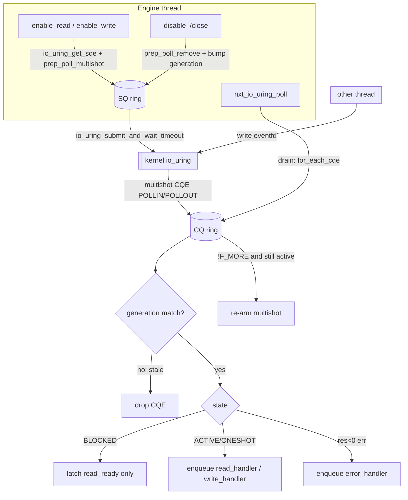
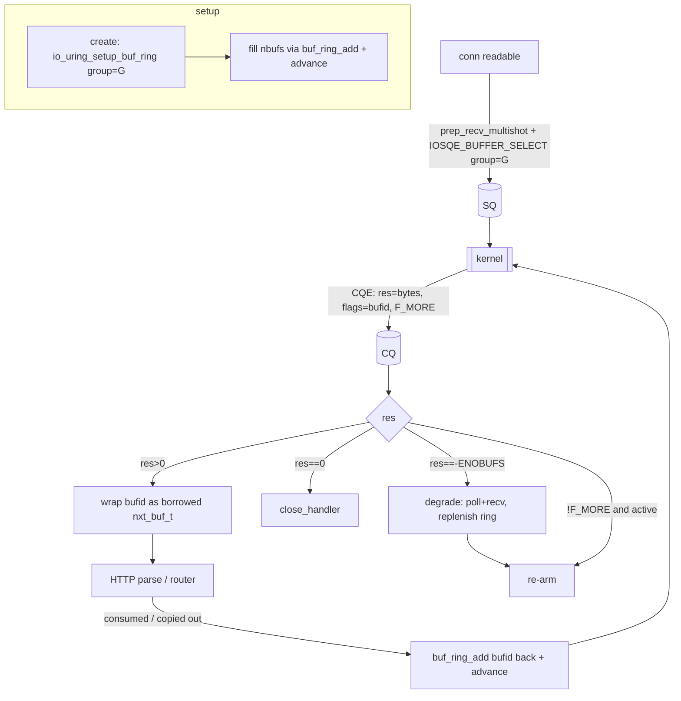

# io_uring event engine — design

Status: design draft. No source changes are proposed by this document; it is the
implementation plan for a new `nxt_io_uring_engine.c` and a later
`nxt_io_uring_conn_io`.

Motivation: reduce per-connection syscall overhead and improve C10K-class
scalability. The epoll engine issues one `epoll_ctl(2)` per readiness state
transition plus one `epoll_wait(2)` per loop, and one `recv(2)`/`accept(2)` per
ready event. io_uring lets us (Stage 1) collapse the control-plane churn into a
single `io_uring_enter(2)` per loop, and (Stage 2) additionally remove the
per-connection `recv`/`accept` syscalls and one buffer copy.

All codebase claims below are cited `file:line` against the tree as read.
liburing API names are verified against `/usr/include/liburing.h` (liburing
2.14, `IO_URING_VERSION_MINOR 14`). Kernel-version feature gates are stated as
tiers and probed at runtime — never by `uname` parsing.

---

## 0. Ground truth from the codebase

The engine vtable is `nxt_event_interface_t` (src/nxt_event_engine.h:23-167). A
new engine supplies the 18 function pointers plus an `nxt_conn_io_t *io`, a
`file_support` flag and a `signal_support` flag.

Per-engine state lives in the union `engine->u` (src/nxt_event_engine.h:422-441).
We add one arm: `nxt_io_uring_engine_t u.io_uring`.

Engines register in `nxt_services[]` (src/nxt_service.c:10-57). The runtime asks
for the default engine with a NULL name (src/nxt_runtime.c:285:
`nxt_service_get(rt->services, "engine", NULL)`), and `nxt_service_get()` returns
the FIRST entry whose `type=="engine"` (src/nxt_service.c:145-159). So the array
order in `nxt_services[]` decides the default. Today that first entry is
`{ "engine", "epoll", &nxt_epoll_edge_engine }` (src/nxt_service.c:16-17).

**Registration order is the only lever, and it also governs the router hot
path.** The router worker looks up its engine with a NULL name too
(src/nxt_router.c:1262), so router worker engines *always* use the
first-registered `"engine"` service — `rt->engine` does not reach that path.
This makes the "prepend io_uring in `nxt_services_init()`" fallback mechanism
(below) the single, sufficient lever for both the main process and every router
worker: reorder the service list and the entire process tree switches engines.
No per-worker plumbing is required.

**There is no fallback if `create()` fails.** `nxt_runtime_event_engines()` calls
`nxt_event_engine_create()` once and returns `NXT_ERROR` on NULL
(src/nxt_runtime.c:292-297); the process then fails to start. So an io_uring
engine that becomes the default MUST NOT hard-fail the process when io_uring is
unavailable — it must either degrade internally or the selection must fall back
to epoll. See §"Tiered feature detection & fallback".

The fd-event readiness state machine (src/nxt_fd_event.h:11-52):

| state | value | meaning |
|-------|-------|---------|
| `NXT_EVENT_INACTIVE` | 0 | not in kernel set |
| `NXT_EVENT_DISABLED` | 1 | in kernel, disabled after oneshot |
| `NXT_EVENT_BLOCKED`  | 2 | armed in kernel, but app suppresses delivery |
| `NXT_EVENT_ONESHOT`  | 3 | active oneshot |
| `NXT_EVENT_LEVEL`    | 4 | active level-triggered (eventport only) |
| `NXT_EVENT_DEFAULT`/`NXT_EVENT_ACTIVE` | 5 | active, engine-default trigger |

`nxt_fd_event_is_active(state) == (state >= NXT_EVENT_ONESHOT)` and
`nxt_fd_event_is_disabled(state) == (state < NXT_EVENT_ONESHOT)`
(src/nxt_fd_event.h:47-52).

**"block" vs "disable", from epoll (the semantics we must reproduce):**

- `block_read`/`block_write` (nxt_epoll_engine.c:509-524) make **no syscall**.
  They only flip the state to `NXT_EVENT_BLOCKED` (if it was not INACTIVE). In
  edge-triggered epoll the registration stays armed in the kernel; "blocked"
  merely means "when a completion arrives, set `read_ready` but do NOT dispatch
  the handler" (see the poll loop, nxt_epoll_engine.c:951-965: a `BLOCKED` fd in
  edge mode records readiness and drops the event). This matters: after the app
  consumes data it re-arms with `enable_read`, which for a still-registered fd is
  a no-op except state (nxt_epoll_engine.c:421-437 short-circuits when
  `ev->read == NXT_EVENT_BLOCKED`... actually it re-MODs; see below).
- `disable_read`/`disable_write` (nxt_epoll_engine.c:465-506) DO issue a syscall:
  either `EPOLL_CTL_DEL` (if the other direction is also idle) or `EPOLL_CTL_MOD`
  to drop just that direction. State goes to `NXT_EVENT_INACTIVE`.

So the invariant an io_uring engine must honour:

> **block = keep the kernel registration, stop dispatching. disable = tear the
> registration down.**

In io_uring multishot-poll terms: *block* keeps the multishot POLL_ADD armed and
just gates dispatch on the state byte; *disable* issues a POLL_REMOVE. This is a
good fit because re-arming multishot poll after a genuine remove costs an SQE,
whereas "block" costs nothing — exactly like epoll edge mode.

The conn I/O vtable is `nxt_conn_io_t` (src/nxt_conn.h:39-87); the epoll engine
overrides a few slots in `nxt_epoll_edge_conn_io` (nxt_epoll_engine.c:99-118) and
otherwise uses generic paths in `nxt_conn_read.c`, `nxt_conn_write.c`,
`nxt_conn_accept.c`. Read buffers are engine-pool buffers freed via
`nxt_event_engine_buf_mem_completion()` (src/nxt_event_engine.c:734-756) which
walks the buf chain and calls `nxt_event_engine_buf_mem_free()`. Today the
generic `recv` path allocates/uses `c->read` and the completion handler frees it;
Stage 2 must reproduce that ownership when buffers come from a provided ring.

Configure-time probes live in `auto/events` (epoll/signalfd/eventfd feature
tests, e.g. `NXT_HAVE_EPOLL` at auto/events:7-31). Sources are gated in
`auto/sources` (`NXT_LIB_EPOLL_SRCS` at auto/sources:135, added at 250-251).
`NXT_HAVE_EPOLL_EDGE` is hard-defined for Linux in src/nxt_unix.h:194. The opt
flag pattern is `auto/options` (`--openssl) NXT_OPENSSL=YES` at auto/options:114).

---

## Stage 1 — poll-mode drop-in engine (`nxt_io_uring_engine.c`)

Stage 1 keeps Unit's readiness model unchanged. io_uring is used purely as a
"better epoll": a multishot `IORING_OP_POLL_ADD` per armed direction feeds the
existing `read_ready`/`write_ready` + work-queue machinery, with synchronous
`recv`/`send` in handlers. Because multishot poll delivery is EDGE-like
(§1.7a), the engine ships its own `nxt_io_uring_conn_io` following the
`nxt_epoll_edge_conn_io` pattern (recvbuf EOF shim), not plain
`nxt_unix_conn_io`. This is the low-risk drop-in that lets us A/B against
epoll.

### 1.1 user_data encoding

Every SQE carries a 64-bit `user_data` returned verbatim in the CQE. We encode:

```
 63                                   3   2      1     0
+--------------------------------------+-----+------+-----+
|  index into fd-event side table (61b)| GEN | DIR  | ... |
+--------------------------------------+-----+------+-----+
```

Rather than pack a raw pointer (which cannot carry a generation counter and
cannot distinguish read vs write), we use a **side table** of slots (see 1.7) and
encode `{ slot_index, generation, tag }`. Concretely a 64-bit layout:

- bits `[0]`   `DIR`  — 0 = read poll, 1 = write poll.
- bits `[1]`   `KIND` — 0 = conn/fd poll, 1 = internal (eventfd/listen/cancel).
- bits `[2..15]` `GEN` — 14-bit generation counter for the slot (stale-CQE
  rejection, §1.6).
- bits `[16..63]` `IDX` — slot index (48 bits, ample).

The CQE handler recovers the slot, checks `slot.generation == GEN` (else the CQE
is stale — drop it), then dispatches on `DIR`. Encoding helpers:

```
#define nxt_iou_ud(idx, gen, dir, kind)                                       \
    ( ((uint64_t)(idx) << 16) | (((gen) & 0x3FFF) << 2)                       \
      | ((kind) << 1) | (dir) )
```

Internal, fd-less ops (NOP, POLL_REMOVE, ASYNC_CANCEL) use reserved sentinel
`user_data` values with `KIND=1` so their CQEs are recognised and swallowed.

### 1.2 vtable → SQE mapping (complete)

`R` = read direction poll, armed with mask `POLLIN|POLLRDHUP|POLLERR|POLLHUP`.
`W` = write direction poll, armed with `POLLOUT|POLLERR|POLLHUP`.
"multishot POLL_ADD" = `io_uring_prep_poll_multishot()`
(liburing.h:762-768, sets `IORING_POLL_ADD_MULTI`).

| vtable op | state effect | io_uring action |
|-----------|--------------|-----------------|
| `create` | — | `io_uring_queue_init_params()`, probe opcodes, arm eventfd poll (§1.5). |
| `free` | — | drain/cancel outstanding polls, `io_uring_queue_exit()`. |
| `enable` | read=write=ACTIVE | arm **R** multishot + **W** multishot (2 SQEs). Mirrors epoll `enable` adding `EPOLLIN|EPOLLOUT` (nxt_epoll_engine.c:360-368). |
| `disable` | read=write=INACTIVE | POLL_REMOVE **R** and **W** (whichever armed); bump slot gen. |
| `delete` | read=write=INACTIVE | same as `disable` (epoll `delete`≈`disable`, nxt_epoll_engine.c:384-394). |
| `close` | read=write=INACTIVE | POLL_REMOVE both **before** the caller closes the fd; bump gen; return `ev->changing`. Ordering is mandatory — see §1.4/§1.6. |
| `enable_read` | read=ACTIVE | if **R** not armed → arm R multishot; if it was BLOCKED, no SQE (already armed) — just set state. |
| `enable_write` | write=ACTIVE | symmetric to `enable_read` for **W**. |
| `disable_read` | read=INACTIVE | POLL_REMOVE **R**; bump gen. If **W** idle too this is the last removal. |
| `disable_write` | write=INACTIVE | POLL_REMOVE **W**; bump gen. |
| `block_read` | read=BLOCKED (if not INACTIVE) | **no SQE** — multishot R stays armed; dispatch gated on state. |
| `block_write` | write=BLOCKED (if not INACTIVE) | **no SQE** — as above. |
| `oneshot_read` | read=ONESHOT | arm a **non-multishot** `io_uring_prep_poll_add()` (POLLIN); one CQE, no `F_MORE`, auto-terminates. State→DISABLED on completion (mirrors epoll EPOLLONESHOT, nxt_epoll_engine.c:540-552). |
| `oneshot_write` | write=ONESHOT | non-multishot POLL_ADD (POLLOUT). |
| `enable_accept` | read=ACTIVE | Stage 1: arm **R** NON-multishot on the listen fd (POLLIN); the `!F_MORE` handler re-arm gives level emulation — see §1.7a. **Thundering-herd caveat — see §1.8.** |
| `enable_file` | — | `NULL` (no inotify support in Stage 1; `file_support=0`). |
| `close_file` | — | `NULL`. |
| `enable_post` | — | store handler; arm multishot POLL_ADD on an eventfd (§1.5). Returns `NXT_OK`/`NXT_ERROR`. |
| `signal` | — | `write(eventfd, 1)` — identical to epoll (nxt_epoll_engine.c:852-871). **Cross-thread safe** (§1.5). |
| `poll` | — | submit batched SQEs + wait; drain CQ; dispatch (§1.3). |

**"block" vs "disable" mapping** (the crux, per epoll study above): `block_*`
issues **no** io_uring op and leaves the multishot poll armed — a subsequent
completion is recorded as `read_ready=1` but not dispatched because the state is
`BLOCKED` (poll loop, §1.3). `disable_*`/`delete`/`close` issue a real
POLL_REMOVE and bump the generation counter so any in-flight CQE for that arming
is rejected. This exactly reproduces epoll edge semantics where a blocked fd
stays in the epoll set (no `epoll_ctl`) while a disabled fd is `EPOLL_CTL_DEL`'d.

Note on `enable_read` after `block_read`: epoll's `enable_read` re-issues
`EPOLL_CTL_MOD` even from BLOCKED in some paths (nxt_epoll_engine.c:421-437 only
skips when `read == NXT_EVENT_BLOCKED`). For io_uring we can be *cheaper*: if the
multishot R poll is still armed (which BLOCKED guarantees), `enable_read` is a
pure state write with zero SQEs. This is a strict syscall reduction over epoll.

### 1.3 poll() loop

```
nxt_io_uring_poll(engine, timeout):
    ring = &engine->u.io_uring.ring

    # 1. Flush any queued arming/removal SQEs AND block until >=1 completion
    #    or the timer expires — one syscall for the whole loop.
    ts = nxt_msec_to_kernel_timespec(timeout)     # NXT_INFINITE_MSEC -> NULL
    n  = io_uring_submit_and_wait_timeout(ring, &cqe, 1, ts, NULL)
    # submit_and_wait_timeout uses IORING_ENTER_EXT_ARG when
    # (ring->features & IORING_FEAT_EXT_ARG) [liburing.h:1828-1836]; that is
    # kernel >= 5.11, i.e. always true in our 5.13+ floor. No separate
    # timerfd is required.

    nxt_thread_time_update(engine->task.thread)

    if n < 0 and n != -ETIME:
        log; return                # EINTR/EAGAIN handled like epoll_wait err

    # 2. Drain the completion queue in one pass.
    head = 0
    io_uring_for_each_cqe(ring, head, cqe):        # liburing.h:473-490
        nxt_io_uring_handle_cqe(engine, cqe)
        count++
    io_uring_cq_advance(ring, count)               # batch-advance once

    # 3. Overflow recovery (§1.3.3).
    if io_uring_cq_has_overflow(ring):
        # kernel flushed backlog into CQ on the next enter; loop drains it.
        engine->u.io_uring.overflowed = 1
```

Per-CQE handler:

```
nxt_io_uring_handle_cqe(engine, cqe):
    ud = cqe->user_data
    if KIND(ud) == INTERNAL:
        return nxt_io_uring_internal_cqe(engine, cqe)   # eventfd / removes

    slot = &table[IDX(ud)]
    if slot->generation != GEN(ud) or slot->ev == NULL:
        return                       # STALE completion — drop (§1.6)

    ev  = slot->ev
    res = cqe->res
    more = (cqe->flags & IORING_CQE_F_MORE)

    if not more:
        # Multishot terminated: kernel dropped the arming (poll cancelled,
        # buffer/kernel pressure, fd closed, or oneshot). Mark unarmed so a
        # future enable_* re-issues an SQE instead of assuming it is live.
        nxt_io_uring_mark_unarmed(slot, DIR(ud))

    if res < 0:
        # -ECANCELED / -EBADF after close: swallow (fd gone). Otherwise an
        # error condition on the fd -> enqueue error_handler like epoll's
        # EPOLLERR/EPOLLHUP branch (nxt_epoll_engine.c:932-1006).
        if res == -ECANCELED or res == -EBADF: return
        ev->error = -res
        enqueue error_handler
        return

    # res >= 0 is the poll mask (POLLIN/POLLOUT/...) that fired.
    if DIR(ud) == READ and (res & POLLIN):
        ev->read_ready = 1
        if ev->read == NXT_EVENT_ONESHOT: ev->read = NXT_EVENT_DISABLED
        if ev->read != NXT_EVENT_BLOCKED:
            nxt_work_queue_add(ev->read_work_queue, ev->read_handler, ...)
        # BLOCKED: readiness latched, no dispatch (epoll parity)
    if DIR(ud) == WRITE and (res & POLLOUT):
        ... symmetric ...
    if res & (POLLERR|POLLHUP|POLLRDHUP):
        set ev->io_uring_eof / enqueue error_handler per state, as epoll does.
```

**Submit batching.** Like epoll batches `epoll_ctl` into `commit_changes` before
`epoll_wait` (nxt_epoll_engine.c:587-652, 888-890), we accumulate SQEs directly
in the SQ ring during `enable_*`/`disable_*` calls (each grabs an
`io_uring_get_sqe()` and preps it) and flush them all with the single
`io_uring_submit_and_wait_timeout()` at the top of `poll()`. No separate change
array is needed — the SQ ring *is* the batch. (Contrast epoll, which needs the
`nxt_epoll_change_t[]` array because `epoll_ctl` is one-fd-per-call.)

**Timeout mapping.** `timeout` is `nxt_msec_t`. `NXT_INFINITE_MSEC` → pass `NULL`
ts (wait forever). Otherwise convert ms → `struct __kernel_timespec`. We rely on
`IORING_FEAT_EXT_ARG` (kernel ≥ 5.11) so the wait timeout is native to the enter
syscall — verified in liburing's `__io_uring_flush_sq`/wait path
(liburing.h:1828-1836). Fallback if a kernel lacks EXT_ARG: use
`io_uring_wait_cqe_timeout()` (liburing.h:242) which internally arms an
`IORING_OP_TIMEOUT`. (Our 5.13 floor always has EXT_ARG, so this is defensive.)

**Multishot termination (re-arm).** A multishot poll CQE **without**
`IORING_CQE_F_MORE` means the kernel dropped the registration; the app must
re-arm (confirmed: man `io_uring_prep_poll_multishot(3)`; the kernel can
terminate multishot early, e.g. under completion pressure). Our handler flips the
slot's per-direction "armed" bit off on `!F_MORE`. The next `enable_read` sees it
unarmed and issues a fresh multishot SQE. If the fd is still logically ACTIVE and
we got `!F_MORE` with `res >= 0`, we **immediately re-arm** within the same poll
loop to avoid missing edges. This is the analogue of EPOLLONESHOT rearm but is
only needed on the rare early-termination path.

### 1.3.3 CQ overflow

With `IORING_FEAT_NODROP` (kernel ≥ 5.5, always in range) the kernel does **not**
drop completions on CQ-full; it queues them in an internal backlog and flushes
them into the CQ on the next `io_uring_enter`. So overflow is a throughput
concern, not a correctness one, as long as we keep draining. We still:

- Size the CQ generously (§1.3.4) so overflow is rare.
- Check `io_uring_cq_has_overflow(ring)` (liburing.h:1766) after each drain; if
  set, do not block on the next loop (pass a zero wait) so the backlog flushes
  promptly.

### 1.3.4 SQ/CQ sizing vs `engine->max_connections`

Each connection can have **both** an R and a W multishot poll armed → up to
`2 * max_connections` live pollers. Multishot pollers do not consume SQ slots
while armed (the SQ entry is consumed at submit time; the registration then lives
in the kernel), so the SQ only needs to hold a single loop's worth of
arm/remove churn. But the **CQ** can, in a thundering burst, receive one CQE per
armed poller. Sizing:

- `sq_entries` = `nxt_max(2048, roundup_pow2(engine->batch))` — bounded; SQ is
  drained every loop. Reuse `mchanges`-style bound.
- `cq_entries` via `IORING_SETUP_CQSIZE` (liburing.h / io_uring.h:171) set to
  `roundup_pow2(2 * max_connections + slack)` so a full readiness storm fits
  without overflow. `max_connections` is on the engine
  (src/nxt_event_engine.h:477).
- If `max_connections` is huge, clamp CQ to a ceiling and lean on NODROP backlog.

`params.cq_entries` requires `IORING_SETUP_CQSIZE`; set it in
`io_uring_queue_init_params()`.

### 1.4 SQ-full mid-arm and ordering

`io_uring_get_sqe()` returns `NULL` when the SQ ring is full (liburing.h:1918-).
An arm/remove that cannot get an SQE must **submit then retry**:

```
sqe = io_uring_get_sqe(ring)
if sqe == NULL:
    io_uring_submit(ring)          # frees SQ slots
    sqe = io_uring_get_sqe(ring)   # must succeed now
```

**Ordering guarantee needed: POLL_REMOVE must be submitted (and, for close,
observed) before `close(fd)`.** io_uring submission preserves SQE order within a
single `io_uring_enter`, but a POLL_REMOVE and a later `close()` done by Unit
outside the ring are not ordered by the ring. Since Unit calls
`nxt_fd_event_close()` and *then* `close(2)` on its own, our `close` op must:
1. issue POLL_REMOVE for both directions, 2. **submit immediately**
(`io_uring_submit`), 3. bump the slot generation so any race CQE is rejected.
We do NOT need to *wait* for the remove CQE — the generation counter (§1.6)
makes late CQEs harmless, and the kernel's POLL_REMOVE cancels the poll's
reference to the file. See §1.6 for why the generation counter is the real
safety net.

### 1.5 enable_post / signal (cross-thread wakeup)

Keep the epoll design verbatim: an `eventfd(2)` is armed with a **multishot
POLL_ADD (POLLIN)** in `enable_post` (replacing epoll's `EPOLL_CTL_ADD`
+`EPOLLET`, nxt_epoll_engine.c:759-811). `signal()` does `write(eventfd, 1)`
(nxt_epoll_engine.c:852-871), and the poll loop's eventfd CQE drains the counter
and calls `post_handler`.

**Cross-thread safety — stated explicitly:** a single `struct io_uring` is **not
thread-safe for submission**. Only the owning engine thread may touch the ring
(get_sqe/submit/enter). Other threads must never submit to another engine's ring.
The **only** safe cross-thread wakeup is the eventfd `write(2)` — which is a
kernel syscall, atomic, and independent of the ring. This is exactly why Unit's
existing `nxt_event_engine_signal()` → `engine->event.signal` → `write(eventfd)`
design (nxt_epoll_engine.c:852-871) carries over unchanged. Do **not** attempt to
have other threads post SQEs (e.g. a cross-ring NOP) — it is a data race on the
SQ ring.

### 1.6 fd lifecycle hazards (the #1 correctness risk)

**Problem.** A multishot poll holds a reference to the `struct file`. If Unit
closes the fd while the poll is armed, several bad things can happen depending on
kernel version and timing:

1. A CQE for the old arming may already be in the CQ, or land after `close()`.
2. The fd number may be **reused** by a subsequent `accept()`/`socket()` before
   we process that stale CQE — dispatching it would corrupt the *new*
   connection's state (classic fd-reuse race).
3. On some kernels the poll is not torn down until POLL_REMOVE completes, so the
   old `struct file` lingers.

Web-confirmed kernel behaviour: closing an fd under an armed multishot poll
terminates the poll with a completion carrying `res = -ECANCELED` or `-EBADF` and
**no** `IORING_CQE_F_MORE`; the kernel does not silently leak stale live pollers.
But a completion already produced *before* the close is still delivered.

**Mitigations (defence in depth):**

- **Generation counter per slot (primary).** Every arming encodes the slot's
  current 14-bit generation in `user_data` (§1.1). `disable`/`delete`/`close`
  **bump the generation**. Any CQE whose `GEN` != the slot's current generation
  is dropped unconditionally in the handler *before* touching `ev`. This makes
  late/stale CQEs — including those that arrive after the fd is closed and reused
  — provably harmless, regardless of kernel POLL_REMOVE timing.
- **Explicit POLL_REMOVE before close (secondary).** `close` op issues
  POLL_REMOVE for both directions and submits, so the kernel stops producing new
  CQEs promptly and releases the file reference (avoids `epmutex`-style lingering
  and unbounded stale-CQE storms). This is analogous to epoll deleting before
  close (nxt_epoll_engine.c:397-412 comment).
- **Slot not freed until quiesced.** A slot is only returned to the free list
  once its "armed" bits are both clear (i.e. we have seen the `!F_MORE`
  terminations or a POLL_REMOVE CQE), so the index cannot be reallocated to a new
  fd while a stale CQE is still in flight. The generation bump covers the window
  regardless, but keeping the slot reserved avoids even index aliasing.
- **`IORING_ASYNC_CANCEL_FD` fallback.** If a slot's polls cannot be individually
  removed (e.g. we lost the exact `user_data`), `io_uring_prep_cancel_fd()`
  (liburing.h:900-906, `IORING_ASYNC_CANCEL_FD|IORING_ASYNC_CANCEL_ALL`) cancels
  all requests on that fd. Used only on the `free`/shutdown path.

This generation-counter scheme is the load-bearing invariant. It must be
code-reviewed and fuzz-tested (see testing hook, and Stage-2 has the same
requirement for recv/accept armings).

### 1.7 struct definitions (pseudocode, nxt_ style)

Add one union arm and a small side table. **No new fields in `nxt_fd_event_t`**
(avoid ABI churn across all engines): the per-fd io_uring bookkeeping lives in a
side table keyed by slot index, and the slot index is recovered from
`user_data`, not stored on the event. The only thing we need on the event is a
mapping back to its slot; we store that in the slot itself
(`slot->ev`) and keep a reverse pointer transiently via `ev->data`? No — `ev->data`
is app-owned. Instead the slot index is derived when arming (allocated from the
free list) and cached in a **compact hash** `fd -> slot` OR, preferably, we
recover the slot purely from the CQE `user_data` and store the reverse link
`ev -> slot_index` in a single spare **byte-packed field reusing existing
padding**. The zero-ABI-churn option: keep an `nxt_lvlhsh_t fd_hash` (as the poll
/devpoll engines already do, src/nxt_event_engine.h:324) mapping `fd -> slot`.

```
typedef struct {
    nxt_fd_event_t   *ev;         /* NULL when slot free                    */
    uint16_t          generation; /* bumped on every disable/close          */
    uint8_t           read_armed;  /* multishot R live in kernel            */
    uint8_t           write_armed; /* multishot W live in kernel            */
} nxt_io_uring_slot_t;

typedef struct {
    struct io_uring        ring;

    uint32_t               sq_entries;
    uint32_t               cq_entries;

    /* Feature tier resolved at create() time (see fallback section).       */
    uint8_t                tier;         /* NXT_IOU_TIER_*                   */
    uint8_t                overflowed;   /* 1 bit                           */

    /* Side table of pollers; index encoded in user_data.                   */
    nxt_io_uring_slot_t    *slots;
    uint32_t               nslots;
    uint32_t               free_slot;    /* free-list head                  */

    nxt_lvlhsh_t           fd_hash;      /* fd -> slot index                 */

    /* enable_post / signal, mirrors nxt_epoll_engine_t.                    */
    nxt_work_handler_t     post_handler;
    nxt_fd_event_t         eventfd;

    /* Stage 2 only (unused in Stage 1):                                    */
    struct io_uring_buf_ring *buf_ring;
    void                   *buf_base;
    uint16_t               buf_group;
    uint16_t               nbufs;
    uint32_t               buf_size;
} nxt_io_uring_engine_t;
```

Add `nxt_io_uring_engine_t io_uring;` to the union in
src/nxt_event_engine.h:422-441, gated on `#if (NXT_HAVE_IO_URING)`.

### 1.7a Multishot poll is EDGE-like, not level (Phase-3 finding — supersedes level claims elsewhere)

Verified empirically on kernel 7.0 with raw-CQE tracing: multishot
`IORING_OP_POLL_ADD` posts **one CQE per wait-queue wakeup event** and does
NOT re-report a still-ready fd the way `epoll_wait` does in level mode. A
readiness indication consumed together with data (e.g. a response and FIN
arriving in one wakeup → single CQE with `POLLIN|POLLRDHUP`) is gone forever;
`enable_read` on the still-armed multishot produces no new CQE because no new
wakeup occurs. `POLL_ADD` does, however, evaluate readiness at submission
time — a fresh arm on an already-ready fd fires immediately.

Consequences for Stage 1 (all mirror the epoll EDGE engine's existing
solutions, per engine-contract.md mismatch items #5 and #8):

- The engine must use an edge-style conn_io: `nxt_io_uring_conn_io` with the
  `recvbuf` EOF shim (force `read_ready = 1` after a positive read when
  RDHUP/HUP is pending), exactly like `nxt_epoll_edge_conn_io_recvbuf`
  (nxt_epoll_engine.c:1166-1178). The CQE handler records RDHUP/HUP into the
  fd event's eof bit.
- Listener sockets cannot rely on multishot re-fire for a backlog burst:
  `enable_accept` arms a NON-multishot POLL_ADD with state ACTIVE so the
  handler's `!F_MORE` re-arm path re-arms after every event, and each re-arm
  re-checks the backlog at submission — correct level emulation at one SQE
  per accept batch.
- Safe-by-construction cases (no fix needed): full-buffer reads keep
  `read_ready = 1` and loop; write EAGAIN → later writability is a genuine
  new wakeup; enable after BLOCKED-disarm issues a fresh POLL_ADD which
  re-checks at submission.

This was found as a proxy-keepalive wedge (upstream `Connection: close`
responses coalescing data+FIN) that produced ~90% timeouts at any
concurrency; single-request and sequential-keepalive traffic never hits it.

### 1.8 Listen-socket thundering herd across worker rings (Gate-G1 finding)

Every router worker engine registers the **same** listen fd:
`nxt_router_listen_socket_create()` runs as a joint job on each worker engine
and calls `nxt_listen_event(task, ls)` with the shared `nxt_listen_socket_t`
(src/nxt_router.c:3752-3781; `ls->count++` tracks the sharing). With epoll,
`EPOLLEXCLUSIVE` (nxt_epoll_engine.c:579-581) makes the kernel wake only one
of the N worker epoll instances per incoming connection.

`IORING_OP_POLL_ADD` has **no EXCLUSIVE analogue**: N rings arming a poll on
the same listen fd all get a CQE for every connection, waking every worker
thread to race `accept4()` (N-1 lose with EAGAIN). Consequences and plan:

- **Stage 1 ships with the herd** and the benchmark harness must include a
  low/moderate-concurrency scenario where herd cost is visible (at saturation
  the backlog is rarely empty, so the herd mostly disappears; the damage is at
  low-to-mid load). Router thread count multiplies the cost.
- **Multishot accept fixes it structurally**: `IORING_OP_ACCEPT` is a
  *consuming* wake-one operation — N rings with multishot accepts on one fd
  behave like N threads blocked in `accept(2)`, each connection completing on
  exactly one ring. This strengthens the case for pulling multishot accept
  (tier ≥ ACCEPT, kernel 5.19+) forward for *listen sockets only*, even while
  the rest of Stage 2 waits — and counterweights §2.1's "keep listen sockets
  in poll mode" recommendation: that choice trades backpressure simplicity for
  the herd. Decision deferred to Stage-1 benchmark data (Gate G2).

### Stage 1 event flow



---

## Stage 2 — completion-mode conn_io (`nxt_io_uring_conn_io`)

Stage 2 replaces synchronous `recv`/`accept` in handlers with io_uring
completions, removing per-connection syscalls and one copy on the read path. It
is delivered as a distinct `nxt_conn_io_t` (a new `nxt_io_uring_conn_io`, chosen
in `create()` when the tier supports it) plus engine changes. Each feature
degrades **independently** back to the Stage-1 poll path.

### 2.1a Phase-4 finding: multishot accept starves workers on a shared listener

Implemented and benchmarked: multishot accept on the shared listen fd across N
worker rings is a **persistent wake-one registration** — the kernel keeps
completing every connection into the same (first-armed) ring's CQ regardless
of whether that ring's thread is busy. Measured: 32/32 connections of a c=32
load accepted by one worker thread, 7 of 8 workers idle; throughput capped at
the single-worker ceiling (oha ka_hi -58%, proxy -84% vs epoll) even though
router CPU/req improved everywhere. `EPOLLEXCLUSIVE` does not have this
pathology because it wakes only workers actually *waiting* — busy workers
organically shed load to idle ones.

**Resolution: ONESHOT `IORING_OP_ACCEPT` re-armed per completion.** Each
worker keeps at most one pending accept; the kernel distributes connections
among pending waiters like N threads blocked in `accept(2)` — herd-free
(accept is consuming) and load-balanced (a saturated worker re-arms late).
Multishot accept remains appropriate only for single-engine processes or a
future SO_REUSEPORT-per-worker listener design. The section below is kept for
the mechanics (flags, sockaddr, backpressure), which carry over to oneshot.

### 2.1 Multishot accept

`io_uring_prep_multishot_accept()` (liburing.h:863-869, `IORING_ACCEPT_MULTISHOT`,
kernel ≥ 5.19). One SQE on the listen fd yields a CQE **per** accepted
connection, each with `F_MORE` set and `res` = the new client fd. This removes
the per-accept `accept4(2)` syscall entirely (contrast nxt_epoll_engine.c:1011-
1046 which calls `accept4` per ready event).

Mapping onto `nxt_conn_accept.c` expectations:

- Today `nxt_conn_io_accept()` (nxt_conn_accept.c:136-) pulls one fd, then
  `nxt_conn_accept()` (nxt_conn_accept.c:198-241) sets up the conn and schedules
  the listen handler for the next. With multishot accept, each accept CQE feeds a
  new conn directly; we call an adapted `nxt_conn_accept()` per CQE. `lev->ready`
  batching (nxt_conn_accept.c:129) becomes "number of accept CQEs drained this
  loop".
- **`SOCK_NONBLOCK|SOCK_CLOEXEC`** must be passed as `accept_flags` so accepted
  fds match the current `accept4(... SOCK_NONBLOCK|SOCK_CLOEXEC)` contract
  (nxt_epoll_engine.c:1034; and the Linux nonblock note at
  nxt_conn_accept.c:182-190). This lets us also skip the per-conn
  `nxt_socket_nonblocking()` fixup.
- **ENFILE/EMFILE handling.** Today an accept error schedules a 100 ms retry
  timer via `nxt_conn_accept_error()` (nxt_conn_accept.c comment 11-17,
  nxt_conn_accept.c:164). A multishot accept that hits EMFILE/ENFILE returns a
  CQE with `res < 0` and **no `F_MORE`** — the multishot is terminated. We must:
  latch the error, arm the same 100 ms "listen timer" (reuse `lev->timer`,
  src/nxt_conn.h:112), and **re-arm** the multishot accept when the timer fires.
- **max_connections backpressure.** epoll stops accepting by not re-arming and by
  `nxt_conn_accept_close_idle` pressure. With multishot accept the socket keeps
  producing CQEs, so to stop we must actively **cancel** the multishot accept
  (`io_uring_prep_cancel()` on its `user_data`, or `prep_cancel_fd` on the listen
  fd) when `engine->connections >= engine->max_connections`, and re-arm when we
  drop below. This is the one place multishot accept is *harder* than epoll: we
  choose **cancel-based** backpressure (not socket-level `listen` backlog games)
  because it is deterministic and reversible. OPEN QUESTION: whether to instead
  keep the listen socket in **Stage-1 poll mode** and only do synchronous
  `accept4` — that keeps the existing backpressure logic verbatim at the cost of
  one syscall per accept. Recommendation: ship Stage 2 with listen sockets still
  in **poll mode** first (lowest risk), add multishot accept as a separate,
  independently-gated step.

### 2.2 Recv with provided buffer rings

`io_uring_setup_buf_ring()` (liburing.h:387, kernel ≥ 5.19) allocates a shared
buffer ring; `io_uring_prep_recv_multishot()` (liburing.h:1177-1183,
`IORING_RECV_MULTISHOT`, kernel ≥ 6.0) with `IOSQE_BUFFER_SELECT` posts a CQE per
received chunk, the kernel picking a buffer from the group. This removes the
per-read `recv(2)` (contrast nxt_conn_read.c:198-234) **and** the copy into
`c->read` when combined with the ring buffers.

Buffer group model:

- Allocate `nbufs` buffers of `buf_size` (e.g. 512 × 16 KiB) registered in a
  buf_ring for group `buf_group`. Populate with
  `io_uring_buf_ring_add()` + `io_uring_buf_ring_advance()`
  (liburing.h:1952-1972).
- On a recv CQE: `res` = bytes received; `cqe->flags >> IORING_CQE_BUFFER_SHIFT`
  = the buffer id the kernel used. We wrap that buffer as the conn's read data.
- **Lifetime / who frees.** Today read buffers are engine-pool `nxt_buf_t`s freed
  by `nxt_event_engine_buf_mem_completion()` (src/nxt_event_engine.c:734-756)
  after the consumer is done. With the ring, the *storage* is owned by the ring,
  not malloc'd per read. So the model inverts: we hand the ring buffer to the
  request pipeline as a borrowed `nxt_buf_t` whose completion handler, instead of
  freeing memory, **returns the buffer id to the ring**
  (`io_uring_buf_ring_add` + advance) so the kernel can reuse it. We wrap this in
  a new `nxt_io_uring_buf_completion()` that mirrors the signature of
  `nxt_event_engine_buf_mem_completion` but recycles instead of frees. This is
  the trickiest ownership change in Stage 2 — a buffer must not be recycled until
  the request processing (which may span async app I/O) has fully consumed it.
  OPEN QUESTION: Unit's router/app pipeline may hold the read buffer across a
  round-trip to the application process; pinning a ring buffer that long starves
  the ring. Mitigation: **copy out** of the ring buffer into a pooled `nxt_buf_t`
  at the HTTP-parse boundary for data that must outlive the recv completion, and
  only keep zero-copy for the transient parse. This partially defeats the
  zero-copy goal for bodies; recommend measuring header-only zero-copy first.
- **ENOBUFS.** If the ring is empty the multishot recv terminates with
  `res = -ENOBUFS` and no `F_MORE` (web-confirmed). Handler must: stop treating
  the conn as readable, replenish the ring as buffers are recycled, and **re-arm**
  the multishot recv for that conn. Under sustained pressure this degrades to the
  Stage-1 poll+`recv` path for that conn.
- **Short reads / EOF.** `res == 0` = peer EOF (mirror `recv()==0` →
  close_handler, nxt_conn_read.c). `res > 0 < buf_size` = short read, normal.
  `F_MORE` cleared with `res >= 0` and not EOF ⇒ re-arm.

### Stage 2 buffer-ring recv flow



### 2.3 Send path

**Recommendation: keep Stage 2 sends synchronous (`writev`/`sendmsg` with
`MSG_MORE`), do NOT move to `IORING_OP_SEND`/`SENDMSG` initially, and do NOT use
`send_zc` for typical responses.**

Reasoning:

- Unit's write path coalesces a small header iovec + body iovecs and calls
  `writev` (`nxt_conn_io_writev`, referenced from `nxt_epoll_edge_conn_io.writev`,
  nxt_epoll_engine.c:116). A synchronous `writev` from the write handler almost
  always completes fully for small responses in one syscall; converting it to an
  async `IORING_OP_WRITEV` adds an SQE + CQE round-trip and a completion-ordering
  burden for **no** syscall saving in the common case (the send would have
  succeeded inline). `MSG_MORE`/`TCP_CORK` batching of header+body is easy to keep
  with sync sends.
- `send_zc` (liburing.h:1126-1136, kernel ≥ 6.0) has a **fixed per-op overhead**:
  it pins user pages and posts **two** CQEs (completion + notification). For small
  responses (headers + a few KiB body) the pinning/notification cost exceeds the
  copy it saves — zero-copy wins only for large, long-lived buffers. Unit's
  responses are dominated by small payloads, so `send_zc` is **net negative** for
  the common path. Reserve it (if ever) for large static file bodies, which today
  already go through `sendfile` (nxt_epoll_engine.c:110-114), a better fit.
- Async send also complicates the write buffer lifetime (the buffer must stay
  valid until the send CQE), reintroducing pinning concerns for marginal benefit.

So: Stage 2 = async **recv/accept** in, **synchronous send** out. This asymmetry
is deliberate and matches where the syscalls actually are (many small reads, few
large-ish coalesced writes).

### 2.4 UDS port sockets (`nxt_port_socket.c`)

**Recommendation: keep port sockets in Stage-1 poll mode in Stage 2.** The port
sockets carry control/IPC messages with fd passing (`SCM_RIGHTS`) via
`sendmsg`/`recvmsg` with ancillary data (nxt_port_socket.c uses the same
fd-event API). Provided-buffer multishot recv does **not** support ancillary
data cleanly, and message framing/fd-passing correctness dwarfs any syscall
saving on this low-volume path. Leave them on the multishot-POLL_ADD readiness
path (Stage 1). Only client data-plane conns get `nxt_io_uring_conn_io`.

### 2.5 SINGLE_ISSUER + DEFER_TASKRUN

`IORING_SETUP_SINGLE_ISSUER` (io_uring.h:195, kernel ≥ 6.0) tells the kernel only
one task ever submits, enabling lock elision. `IORING_SETUP_DEFER_TASKRUN`
(io_uring.h:202, kernel ≥ 6.1) defers completion task-work to
`io_uring_enter`/`get_events` time instead of running it in random contexts —
this reduces IPI/latency jitter and is a strong win for a single-threaded event
loop.

Applicability: **each `nxt_event_engine_t` is owned by exactly one thread** — the
engine is stored per-thread (`thr->engine`, src/nxt_event_engine.h:524-531;
runtime sets `thread->engine = engine`, src/nxt_runtime.c:299-300) and the ring
is only ever touched by that thread (§1.5). So SINGLE_ISSUER's contract holds
naturally. DEFER_TASKRUN requires SINGLE_ISSUER and that the owning thread calls
`io_uring_enter` regularly — which our `poll()` does every loop. **Recommend
enabling both when the tier (kernel ≥ 6.1) supports them**, probed via
EINVAL-fallback on `io_uring_queue_init_params()` (drop the flags and retry).
Expected benefit: lower submission-lock overhead and less completion-latency
jitter; no behavioural change. Fallback: omit flags on < 6.1.

Caveat: with DEFER_TASKRUN, completions are only reaped inside
enter/get_events — our loop already blocks in `submit_and_wait_timeout`, so this
is fine, but any code path that expects CQEs to appear without an enter would
break. We have none.

**Stage-2 implementation finding (supersedes the recommendation above for the
router):** the kernel binds a SINGLE_ISSUER ring's permitted submitter task at
`io_uring_setup()` time (verified on 7.0: `-EEXIST` on any submit from another
task, even without DEFER_TASKRUN). Unit creates router-worker engines on the
router *main* thread (`nxt_router_engines_create`) and polls them on the
spawned worker thread — a different task — so enabling the flags by default
busy-loops every worker on `-EEXIST`. The flags are therefore implemented but
gated behind `NXT_IO_URING_SETUP_OPT=1`, safe only for same-thread processes
(main/controller/apps). Enabling them for the router requires creating the
ring on the polling thread, which conflicts with the create()-time epoll
fallback contract — deferred.

### 2.6 SQPOLL analysis — recommend AGAINST initially

`IORING_SETUP_SQPOLL` (io_uring.h:169) spawns a kernel thread that busy-polls the
SQ so submission needs no syscall. **Recommend against for the initial rollout:**

- **Dedicated-core cost.** The SQPOLL thread burns a core spinning (until it
  idles out after `sq_thread_idle` ms). On an 8-core box, one engine thread with
  SQPOLL costs ~1/8 = 12.5% of the machine to a busy-poller even at low load;
  with multiple engine threads it multiplies. Unit's value is handling many
  connections cheaply, not trading a core for syscall elision.
- **Wake latency.** When the SQPOLL thread has idled out, the first submit must
  wake it (`IORING_SQ_NEED_WAKEUP`), adding latency to the very requests we care
  about; benefit only materialises under sustained high submit rates, which our
  Stage-1/2 design specifically *minimises* (few SQEs per loop — multishot means
  we rarely submit).
- **Privilege / kernel version.** Pre-5.11 SQPOLL needed `CAP_SYS_NICE`/root and
  only worked with registered files; `IORING_FEAT_SQPOLL_NONFIXED` (io_uring.h:617,
  5.11) relaxed the fixed-file requirement. It still interacts poorly with our
  arbitrary-fd model and adds an affinity-tuning burden (`SQ_AFF`).
- Because multishot poll/recv/accept already collapse submissions to a handful
  per loop, SQPOLL's syscall-elision has little left to save here.

Revisit only if profiling shows `io_uring_enter` submit cost dominates — unlikely
given multishot.

---

## Tiered feature detection & fallback (hard requirement)

**Probe-based only. Never parse `uname`.** Two mechanisms:

1. **Opcode probe** — `io_uring_get_probe_ring()` /
   `io_uring_opcode_supported()` (liburing.h:201-217) to test
   `IORING_OP_POLL_ADD`, `IORING_OP_ACCEPT`, `IORING_OP_RECV`, etc.
2. **Feature flags** — `params.features` after `io_uring_queue_init_params()`
   (`IORING_FEAT_EXT_ARG`, `IORING_FEAT_NODROP`, ...).
3. **Setup-flag EINVAL fallback** — try `queue_init_params` with the desired
   `IORING_SETUP_*` flags; on `-EINVAL` drop the newest flag and retry. This is
   how we probe SINGLE_ISSUER/DEFER_TASKRUN/CQSIZE without version numbers.
4. **Multishot-poll functional probe** — opcode support for POLL_ADD does not by
   itself prove `IORING_POLL_ADD_MULTI` works (it is a `len` bit, not an opcode).
   Do a one-shot functional test at create() time: arm a multishot POLL_ADD on a
   throwaway pipe/eventfd, verify the CQE carries `IORING_CQE_F_MORE`. If not,
   the multishot-poll tier is unavailable → engine create() fails cleanly →
   epoll fallback.

### Tiers

| tier | requires | gives |
|------|----------|-------|
| `NXT_IOU_TIER_NONE` | — | io_uring unusable → fall back to epoll |
| `NXT_IOU_TIER_POLL` | multishot POLL_ADD (5.13) + EXT_ARG (5.11) | **Stage 1** drop-in engine |
| `NXT_IOU_TIER_ACCEPT` | + multishot accept (5.19) | Stage 2 accept |
| `NXT_IOU_TIER_RECV` | + buf_ring (5.19) + multishot recv (6.0) | Stage 2 zero-copy recv |
| `NXT_IOU_TIER_OPT` | + SINGLE_ISSUER (6.0) + DEFER_TASKRUN (6.1) | latency/lock opt |

Each Stage-2 feature degrades **independently** to the Stage-1 poll path: if
buf_ring is missing but multishot accept is present, we do accept via io_uring
and recv via poll+`recv`. The `tier` byte in the engine struct drives which
`conn_io` slots point at io_uring completions vs generic sync paths.

Gate rule: **no multishot poll ⇒ `create()` fails ⇒ epoll fallback.** Multishot
poll is the floor; without it there is no point.

### create()-failure fallback mechanism (recommended)

Because `nxt_runtime.c:285-297` has no retry loop, and adding one touches the
process-fatal path, the **minimal-diff, lowest-risk** mechanism is a
**registration-time reorder**: decide io_uring-vs-epoll **once**, early, and put
the winner first in the service list so `nxt_service_get(...,"engine",NULL)`
naturally returns it. This one reorder is sufficient for the whole process tree:
both the main process (src/nxt_runtime.c:285) and every router worker
(src/nxt_router.c:1262) select the engine by NULL-name lookup, i.e. the
first-registered `"engine"`, so reordering the service list flips them all at
once with no per-worker changes.

Recommended: a **wrapper `create()`** on a synthetic first engine entry, OR
simpler, a **registration-time probe** in `nxt_services_init()`
(src/nxt_service.c:60-89) that, when io_uring is compiled in and the runtime
probe (multishot-poll functional test) passes, inserts the io_uring engine ahead
of epoll; otherwise it is not inserted (or inserted after epoll). This keeps a
single decision point and leaves `nxt_runtime_event_engines()` untouched.

Concretely (diff sketch, NOT applied):

```
/* src/nxt_service.c — nxt_services_init(), after copying the static table */
#if (NXT_HAVE_IO_URING)
    if (nxt_io_uring_probe() == NXT_OK) {          /* runtime functional probe */
        /* prepend io_uring so the NULL-name lookup selects it as default */
        nxt_service_prepend(services,
            &(nxt_service_t){ "engine", "io_uring", &nxt_io_uring_engine });
    }
#endif
```

`nxt_io_uring_probe()` does a throwaway `io_uring_queue_init` + multishot-poll
functional test + `io_uring_queue_exit`, returning `NXT_ERROR` on any of the
"unsupported" conditions below. Advantages over the alternatives: (a) one probe
site, (b) no change to the fatal runtime path, (c) `--io-uring` and
`NXT_IO_URING_DEFAULT` (build integration) just tweak whether we prepend vs
append vs skip. Alternative "wrapper create() delegating to epoll" is viable but
splices two engines' state into one union arm — messier. Alternative "retry loop
in 4 call sites" touches more code and the fatal path — rejected.

Even with the probe, `nxt_io_uring_create()` must itself still fail cleanly (and,
ideally, the selection prefers epoll) if `queue_init` fails at real create time
(e.g. RLIMIT changed between probe and create) — but since the probe already
selected io_uring as default and there is no retry, the **belt-and-braces**
recommendation is: keep epoll as the *second* entry and add a **one-line retry**
to `nxt_runtime_event_engines()` that, on the first engine's create() returning
NULL, retries with the explicitly-named `"epoll"` engine. That single retry (≤5
lines) closes the probe-vs-create TOCTOU window. This is the ONE call-site change
recommended, scoped to just the fallback, e.g.:

```
/* src/nxt_runtime.c — nxt_runtime_event_engines() */
engine = nxt_event_engine_create(task, interface, ...);
if (nxt_slow_path(engine == NULL) && interface != epoll_iface) {
    interface = nxt_service_get(rt->services, "engine", "epoll");
    engine = nxt_event_engine_create(task, interface, ...);
}
```

### Treat all of these identically to "unsupported" (→ epoll)

`io_uring_setup(2)`/`queue_init` failing with:

- **EPERM** — seccomp filter blocking io_uring, or `kernel.io_uring_disabled`
  sysctl (kernel ≥ 6.6): `1` = restricted to `CAP_SYS_ADMIN`, `2` = fully
  disabled. Common on hardened distros/RHEL defaults. → epoll.
- **ENOSYS** — kernel too old / io_uring compiled out. → epoll.
- **EMFILE/ENFILE** — fd exhaustion creating the ring. → epoll (and it would
  fail elsewhere too).
- **ENOMEM** — including `RLIMIT_MEMLOCK` pressure. **Confirmed:** the memlock
  accounting for io_uring rings was removed in kernel 5.12; on **< 5.12** a low
  `RLIMIT_MEMLOCK` can make `io_uring_setup` fail with ENOMEM/EPERM, on ≥ 5.12 it
  is irrelevant. Since our floor is 5.13, memlock is *normally* a non-issue, but
  we still map ENOMEM → epoll defensively. → epoll.

All of these must be caught in `nxt_io_uring_probe()` / `create()` and turned
into a clean epoll fallback — never a process-fatal error.

### Kernel matrix

| kernel | typical distro | resolved tier | notes |
|--------|----------------|---------------|-------|
| < 5.13 | RHEL 8, old | `NONE` → epoll | no multishot poll |
| 5.13   | — | `POLL` | Stage 1 works |
| 5.15   | Ubuntu 22.04 LTS | `POLL` | Stage 1; no multishot accept/recv |
| 5.19   | — | `ACCEPT` | + multishot accept, + buf_ring (recv still oneshot) |
| 6.0    | — | `RECV` | + multishot recv, + SINGLE_ISSUER |
| 6.1    | Debian 12 | `RECV`+`OPT` | + DEFER_TASKRUN |
| 6.8    | Ubuntu 24.04 LTS | full | all tiers |
| 6.10+  | — | full | — |
| 7.x    | dev box | full | dev/testing kernel |

Note: `kernel.io_uring_disabled` (6.6) can drop any of the ≥6.6 rows to `NONE`
regardless of version — hence probe, not version, decides.

### Testing hook — force lower tiers

Add a debug override read at create() time:

```
NXT_IO_URING_FORCE_TIER = none|poll|accept|recv|opt
```

`nxt_io_uring_create()` reads the env var and **caps** the resolved tier at the
requested level (never above what the kernel supports). This lets the 7.0 dev
kernel exercise every degraded path: `=none` forces the epoll fallback, `=poll`
exercises Stage-1 with the Stage-2 conn_io disabled, `=accept` disables the
buf-ring recv path, etc. A companion `NXT_IO_URING_FEATURE_MASK` (bitmask) can
disable individual features (e.g. force ENOBUFS handling by shrinking the buf
ring to 1). These are debug-build-only knobs; document them in the engine source
header comment.

---

## Build integration

Mirror the `NXT_HAVE_EPOLL` (auto/events) + `NXT_OPENSSL` (auto/options) wiring.

**auto/events — liburing probe** (compile + link test):

```
# io_uring via liburing
if [ "$NXT_IO_URING" = "YES" ]; then
    nxt_feature="Linux io_uring (liburing)"
    nxt_feature_name=NXT_HAVE_IO_URING
    nxt_feature_run=no
    nxt_feature_incs=
    nxt_feature_libs="-luring"
    nxt_feature_test="#include <liburing.h>
                      int main(void) {
                          struct io_uring ring;
                          int r = io_uring_queue_init(8, &ring, 0);
                          if (r == 0) io_uring_queue_exit(&ring);
                          return 0;
                      }"
    . auto/feature
    if [ $nxt_found = yes ]; then
        NXT_HAVE_IO_URING=YES
        NXT_LIBS="$NXT_LIBS -luring"        # link libunit/unitd with -luring
    fi
fi
```

- `nxt_feature_run=no` (compile+link only; don't execute at configure time — the
  build host may lack a modern kernel, exactly like the openssl/epoll probes).
- Use `nxt_feature_libs="-luring"` so `auto/feature` link-tests against liburing;
  on success append `-luring` to the link line.

**auto/options — opt-in flag:**

```
NXT_IO_URING=NO                 # default OFF (opt-in)
...
--io-uring)          NXT_IO_URING=YES            ;;
--no-io-uring)       NXT_IO_URING=NO             ;;
```

Add a line to `auto/help`. Keep it **opt-in** initially (like `--openssl`) so
default builds are unchanged while we stabilise.

**Registration-order / A-B scheme:**

```
--io-uring-default)  NXT_IO_URING_DEFAULT=YES    ;;   # implies --io-uring
```

Emitting `#define NXT_IO_URING_DEFAULT 1` controls whether
`nxt_services_init()` **prepends** the io_uring engine (default build) vs
**appends** it (available as `"io_uring"` by name but epoll stays default). This
gives two build flavours for clean A/B benchmarking without code edits:

- default `--io-uring` build: io_uring available by name, epoll default.
- `--io-uring-default` build: io_uring default, epoll fallback.

**auto/sources:**

```
NXT_LIB_IO_URING_SRCS="src/nxt_io_uring_engine.c"
...
if [ "$NXT_HAVE_IO_URING" = "YES" ]; then
    NXT_LIB_SRCS="$NXT_LIB_SRCS $NXT_LIB_IO_URING_SRCS"
fi
```

mirroring the epoll block (auto/sources:135, 250-251).

**auto/summary:** add an `io_uring: YES/NO` line next to the existing feature
summary so configure output shows whether it was enabled/linked.

**src/nxt_event_engine.h:** guard the new union arm and `extern const
nxt_event_interface_t nxt_io_uring_engine;` under `#if (NXT_HAVE_IO_URING)`.

---

## Error handling & risk analysis

### Per-op CQE error handling

- **`res < 0` on a poll CQE:** `-ECANCELED`/`-EBADF` after remove/close → drop
  (fd gone). Other negatives → set `ev->error` and enqueue `error_handler`,
  matching epoll's EPOLLERR/EPOLLHUP path (nxt_epoll_engine.c:932-1006).
- **`res < 0` on accept CQE:** EMFILE/ENFILE → 100 ms listen timer + re-arm
  (§2.1); other → log + re-arm or degrade.
- **`res < 0` on recv CQE:** `-ENOBUFS` → replenish + degrade + re-arm (§2.2);
  `-ECONNRESET`/others → conn error handler; `res == 0` → EOF/close.
- **`!IORING_CQE_F_MORE`** on any multishot op → registration gone; mark unarmed;
  re-arm if still logically active.

### Risk register

| # | risk | mitigation |
|---|------|-----------|
| R1 | **fd-reuse / stale CQE after close** (the top risk) | generation counter in `user_data` + POLL_REMOVE-before-close + reserve slot until quiesced (§1.6). |
| R2 | **multishot termination storms** (kernel drops many pollers under pressure, all need re-arm) | re-arm lazily on next `enable_*` where possible; bounded re-arm per loop; NODROP means no lost events, only re-arm cost. |
| R3 | **CQ overflow** | `IORING_SETUP_CQSIZE` sized to `2*max_connections`; NODROP backlog; `cq_has_overflow` → non-blocking next loop (§1.3.3). |
| R4 | **provided-buffer lifetime** (ring buffer pinned across app round-trip starves ring) | copy-out at parse boundary for long-lived data; recycle promptly; ENOBUFS degrade to poll+recv (§2.2). |
| R5 | **cross-thread submission race** | only the owning thread touches the ring; cross-thread wake is eventfd `write` only (§1.5). |
| R6 | **memory pinning / RLIMIT_MEMLOCK** (< 5.12) | irrelevant at 5.13 floor; ENOMEM → epoll fallback anyway. |
| R7 | **probe-vs-create TOCTOU** | one-line epoll retry in `nxt_runtime_event_engines()` (§fallback). |
| R8 | **send buffer lifetime if async send adopted** | avoided — Stage 2 keeps sync sends (§2.3). |
| R9 | **consumed-wakeup readiness loss** (multishot poll is edge-like; data+RDHUP coalesced into one CQE loses the EOF) | edge conn_io with recvbuf EOF shim; non-multishot re-armed listener poll; per-case analysis in §1.7a. Found via proxy-keepalive wedge in Phase 3. |

### Incremental migration plan (PR-sized steps)

1. **Build plumbing** — `auto/events` probe, `--io-uring` opt-in,
   `NXT_HAVE_IO_URING`, `auto/sources`, `auto/summary`. No engine yet. (mergeable,
   inert)
2. **Stage-1 engine skeleton** — `nxt_io_uring_engine.c` with create/free/poll +
   union arm + registration (appended, not default). Multishot POLL_ADD for
   enable/disable/block, generation counters, eventfd post/signal. Selectable by
   name `"io_uring"` for testing.
3. **Fallback wiring** — `nxt_io_uring_probe()` + registration reorder +
   one-line runtime retry + `NXT_IO_URING_FORCE_TIER`. Now safe as default.
4. **A/B build flag** — `--io-uring-default` / `NXT_IO_URING_DEFAULT`.
5. **Stage-2 multishot accept** — `nxt_io_uring_conn_io.accept`, cancel-based
   backpressure, EMFILE timer. Independently gated (tier ACCEPT).
6. **Stage-2 buf-ring recv** — buffer ring, multishot recv, recycle completion,
   ENOBUFS degrade. Independently gated (tier RECV).
7. **Stage-2 opt flags** — SINGLE_ISSUER/DEFER_TASKRUN via EINVAL probe.

### Expected performance effects

- **Stage 1 removes:** all `epoll_ctl` churn (per state transition) — replaced by
  SQEs batched into the SQ ring and flushed with the *same* enter that waits;
  `epoll_wait` per loop → a single `io_uring_enter` (via
  `submit_and_wait_timeout`) that both submits and waits. Net: submit+wait fuse
  into one syscall/loop, and steady-state armed conns cost **zero** control
  syscalls (multishot stays armed; `block`/`enable` are pure state writes). The
  `recv`/`accept`/`send` syscalls are unchanged in Stage 1.
- **Stage 2 additionally removes:** the per-accept `accept4(2)` (multishot
  accept), the per-read `recv(2)` (multishot recv), and one **copy** on the read
  path (kernel writes into ring buffers we read directly). Send stays synchronous
  by design. Under C10K with many small reads, the dominant remaining syscall
  becomes the periodic `io_uring_enter` per loop.

### OPEN QUESTIONS

- **OQ1** (§2.1) Multishot accept backpressure vs keeping listen sockets in poll
  mode — recommend poll-mode listen first; confirm with load testing whether
  cancel/re-arm churn under max_connections thrash is acceptable.
- **OQ2** (§2.2) How long the router/app pipeline pins a read buffer
  (`c->read`) across the trip to the application process — determines whether
  zero-copy recv is viable for bodies or only for headers. Trace
  `nxt_event_engine_buf_mem_completion` consumers in the router before committing
  to zero-copy body handling.
- **OQ3** Whether Unit ever runs multiple engine threads sharing work such that a
  conn's fd migrates between engines/rings — if so, `delete` (move-between-sets,
  src/nxt_event_engine.h:52-57) needs a POLL_REMOVE on the source ring and re-arm
  on the destination ring; confirm no fd is ever polled by two rings at once.
