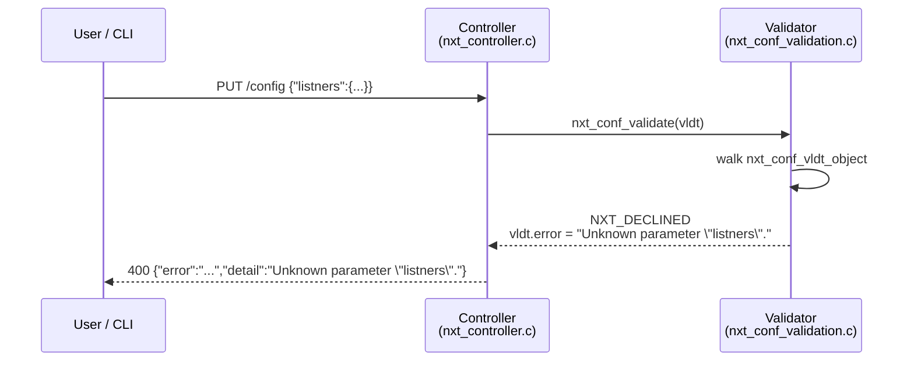
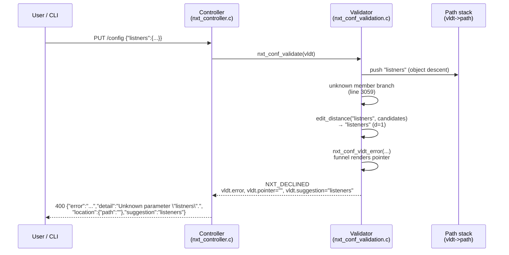
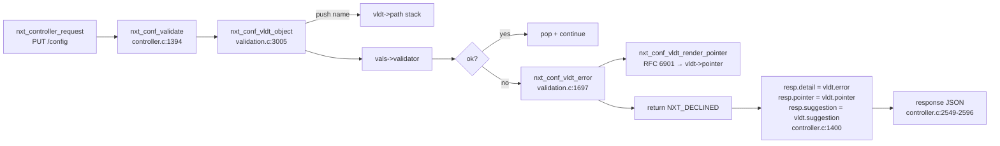
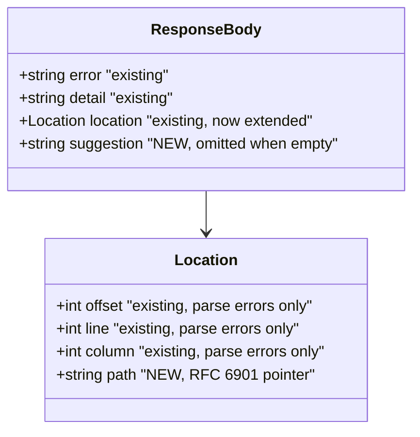
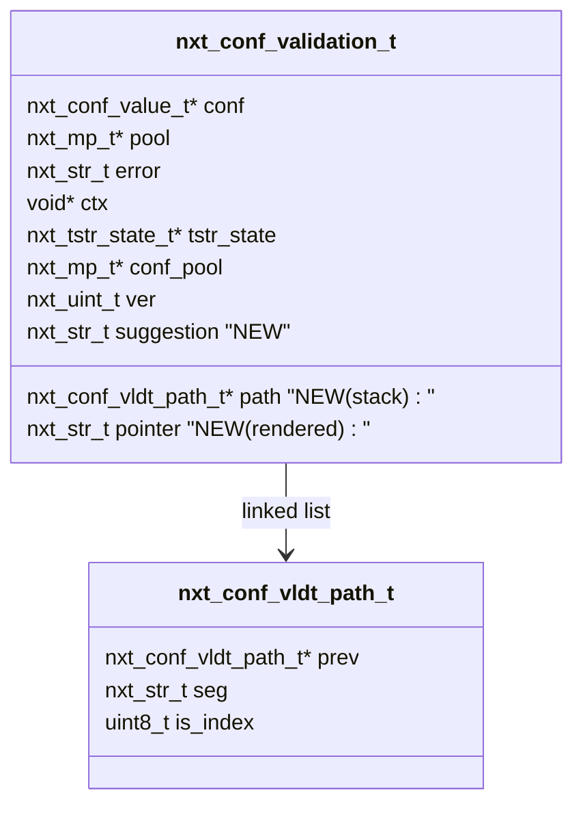

# Plan: Debuggable config errors (roadmap D5)

## Context

Unit's `src/nxt_conf_validation.c` emits terse, location-free error messages
(e.g. `"Unknown parameter \"foo\"."`). When a config PUT fails, the user gets
no indication *where* in a deeply-nested JSON document the problem is, and no
hint about typos. This is roadmap item **D5** in
`roadmap/unit-roadmap.md:141-144` ("~1 week, high user-visible value").

The goal is to add, **strictly additively**:

1. An RFC 6901 **JSON Pointer** to the failing location in the response.
2. A **"did you mean X"** suggestion when an unknown member is close to a
   known one (Damerau–Levenshtein distance).
3. **New pytest coverage** dedicated to config validation error ergonomics.

All existing response fields (`error`, `detail`, `location.offset`,
`location.line`, `location.column`) and all existing error-message wording
stay byte-for-byte unchanged, so downstream tooling (CLI wrappers, Terraform
providers, etc.) continues to parse responses as before.

## Workflow

1. Commit this plan document to the repo (`roadmap/plan-config-errors.md`)
   on the feature branch `claude/improve-config-parsing-nQ9bV`.
2. Open a draft PR against `andypost/unit` with a short description so the
   change is reviewable from day one.
3. Implement the C-side and controller changes.
4. Implement the pytest coverage.
5. Build (`./configure && make -j`) and run the new test file
   (`pytest test/test_config_validation_errors.py -v`) plus the
   existing config tests for backward-compat regression smoke.
6. Push incrementally to the PR.

## Architectural flow

### Before: opaque error



The user learns *what* is wrong but not *where* in a nested config, and
gets no hint about the correct spelling.

### After: JSON Pointer + suggestion



### Validation data flow



### Response JSON shape (additive)



### nxt_conf_validation_t extension



## Design

### C-side: JSON Pointer path threading

Extend `nxt_conf_validation_t` in `src/nxt_conf.h:71-79` with three additive
fields (struct is not `NXT_EXPORT`-ed, so no ABI break):

- `nxt_conf_vldt_path_t *path;`   — current stack of segments
- `nxt_str_t             pointer;` — serialized RFC 6901 string
- `nxt_str_t             suggestion;` — "did you mean" target

Push/pop the segment around each recursive descent at three sites already
in `src/nxt_conf_validation.c`:

- `nxt_conf_vldt_object` (line 3005) — push `vals->name` before
  `vals->validator(...)`.
- `nxt_conf_vldt_object_iterator` (line 3210) — push `&name` before
  `validator(...)`.
- `nxt_conf_vldt_array_iterator` (line 3237) — push decimal `index` before
  `validator(...)`.

Nodes live on the C stack of the recursive call — no pool allocations during
the hot path.

### Serialization

Fold a single call to a new `static nxt_conf_vldt_render_pointer(vldt)` into
the existing funnel `nxt_conf_vldt_error` at
`src/nxt_conf_validation.c:1697`, so **every** validation error picks up a
pointer for free without modifying any of the ~65 error call-sites or their
message strings. The renderer walks `vldt->path` tail-to-head, builds
`/seg0/seg1/...`, and escapes per RFC 6901 (`~`→`~0`, `/`→`~1`, in that
order). Uses `vldt->pool`; on allocation failure, leaves `pointer` empty —
never turns a validation failure into a worse error.

### "Did you mean" suggestions

Replace the `nxt_conf_vldt_error(..., "Unknown parameter ...")` call at
`src/nxt_conf_validation.c:3059` with a helper
`nxt_conf_vldt_unknown_member(vldt, &name, vals)` that:

1. Iterates the members table `vals` already in scope (≤ a few dozen entries).
2. Computes Damerau-Levenshtein via a `static` helper
   `nxt_str_edit_distance(a, b)` kept local to `nxt_conf_validation.c`
   (≈40 lines; no new file; `auto/sources:81` already lists the validator).
3. Accepts the best match only when
   `best <= max(2, name.length / 3)` **and** uniquely best (second-best
   strictly larger) — prevents misleading hints.
4. Stores the winner in `vldt->suggestion` (additive field).
5. Calls the **unchanged** `nxt_conf_vldt_error` with the **unchanged**
   message `"Unknown parameter \"%V\"."` — so existing message text is
   preserved verbatim.

### Controller response

Extend `nxt_controller_response_t` at `src/nxt_controller.c:30-41` with:

- `nxt_str_t  pointer;`
- `nxt_str_t  suggestion;`

At the PUT validation failure site `src/nxt_controller.c:1400`, copy both
from `vldt`. A second site at line 1483 (PUT to subtree) gets the same
treatment.

In the response serializer at `src/nxt_controller.c:2549-2596`:

- Bump the top-level object size `n` by `(resp->suggestion.length != 0)`.
- Add a parallel gate for `resp->pointer.length != 0` that makes the
  `location` object be created even when `resp->offset == -1` (semantic
  errors have no offset but do have a pointer).
- Emit `location.path` (RFC 6901 string; root is `""`) alongside existing
  `offset`/`line`/`column` — additive member.
- Emit top-level `"suggestion"` when populated — additive member.

### Backward compatibility

- No existing error message wording changes.
- No existing response field changes or renames.
- No changes to any exported C API (`NXT_EXPORT` prototypes in
  `src/nxt_conf.h` are untouched).
- New fields are omitted when empty, so silent for clients that parse
  strictly.
- `auto/sources:81` already registers `nxt_conf_validation.c`; no new `.c`
  file is introduced, so no build system churn.

## Files to modify

- `src/nxt_conf.h` — add `nxt_conf_vldt_path_t` fwd-decl + `path`,
  `pointer`, `suggestion` fields on `nxt_conf_validation_t`.
- `src/nxt_conf_validation.c` — path struct, push/pop at the three iterator
  sites above, RFC 6901 serializer, `nxt_str_edit_distance`,
  `nxt_conf_vldt_unknown_member`; fold serializer into
  `nxt_conf_vldt_error` (line 1697).
- `src/nxt_controller.c` — two new fields on `nxt_controller_response_t`
  (line 30-41); copy them at lines 1400 and 1483; extend serializer at
  lines 2549-2596 to emit `location.path` and top-level `suggestion`.
- `test/test_config_validation_errors.py` — **new** file (pattern from
  `test/test_configuration.py:22-23`; uses `Control()` from
  `test/unit/control.py`).
- `roadmap/plan-config-errors.md` — **this plan**, committed for review.

## Tests

New file `test/test_config_validation_errors.py`:

1. **Unknown top-level key** — `{"foo": 1}` → `error` present, `detail`
   contains `"foo"`, `location.path == ""`.
2. **Misspelled `listeners`** — `{"listners": {}}` →
   `suggestion == "listeners"`.
3. **Misspelled `applications`** — analogous; covers a second well-known
   key so one hardcoded match doesn't pass by accident.
4. **Nested unknown key** — valid skeleton with an unknown member under
   `applications.myapp`; asserts `location.path == "/applications/myapp"`
   and a plausible suggestion.
5. **Array-element path** — invalid member inside `routes[2].action`;
   asserts `location.path` starts with `/routes/2`.
6. **Type error carries path** — number where string expected, deep in
   config; `location.path` non-empty and points to offender.
7. **RFC 6901 escaping** — application name containing `~` and `/`
   (e.g. `"a/b~c"`); `location.path` contains `~1` and `~0`.
8. **No suggestion when far** — `{"zzzzzzz": 1}` → `'suggestion'` key
   absent (threshold guard).
9. **Backward compat: success** — valid config still returns `success`
   with no new fields forced.
10. **Backward compat: error shape** — invalid config still has `error`
    and `detail`; no renames; new fields are extras.

Existing validator helpers reused (no new utility):

- `test/unit/control.py:32-47` — `Control.conf(...)` PUT wrapper.
- `test/test_configuration.py:22-23` — assertion style.

## Verification

1. Build: `cd /home/user/unit && ./configure && make -j$(nproc)`.
2. Targeted tests:
   `cd /home/user/unit/test && python3 -m pytest test_config_validation_errors.py -v`
3. Regression smoke:
   `cd /home/user/unit/test && python3 -m pytest test_configuration.py -v`
4. Manual sanity:
   ```
   curl -X PUT --data-binary '{"listners":{}}' \
        --unix-socket /path/to/control.unit.sock \
        http://localhost/config
   ```
   Expect JSON body with `error`, `detail`, `location.path`, and
   `suggestion: "listeners"`.

## Sequencing

1. Commit plan + open draft PR against `andypost/unit`.
2. Land path plumbing + RFC 6901 serializer + `location.path` in response.
   Tests 1, 4, 5, 6, 7, 9, 10 (partial) pass.
3. Land Damerau-Levenshtein + `suggestion` field. Tests 2, 3, 8 pass;
   test 10 fully passes.
4. Build + run tests; push all commits; mark PR ready.
