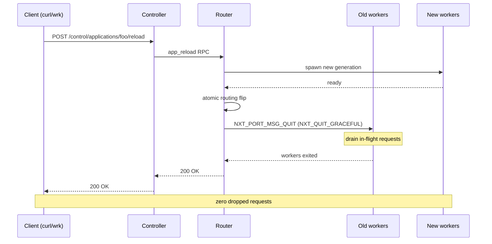
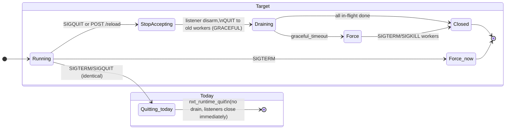
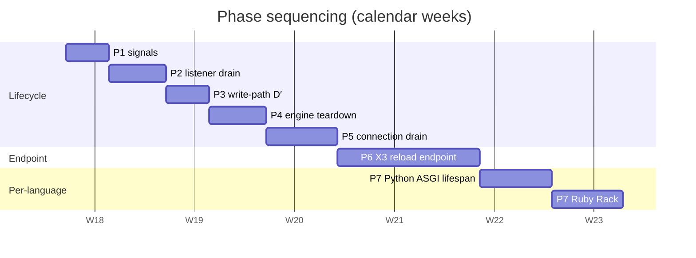
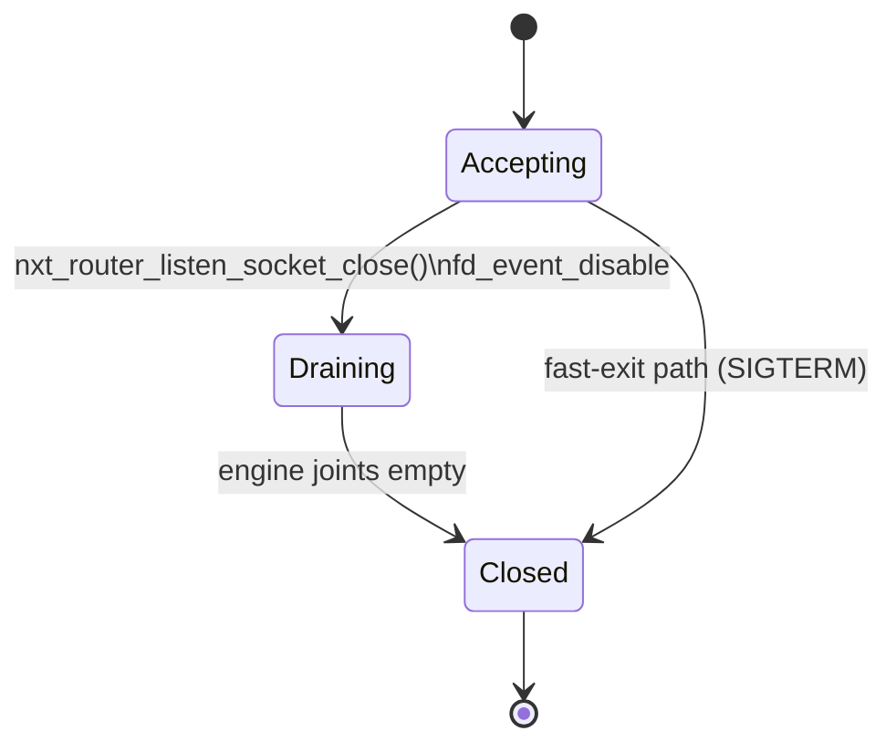
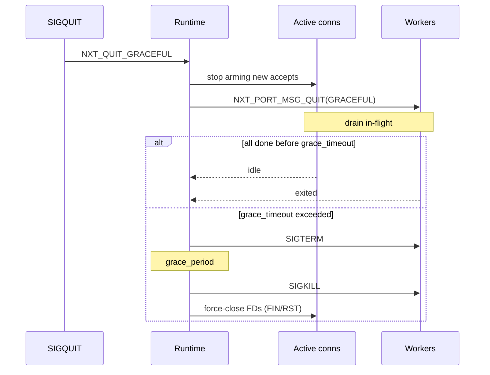
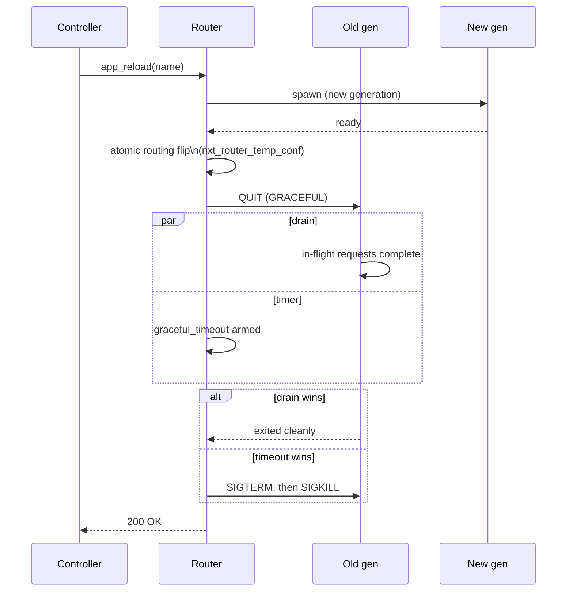

# Graceful Shutdown / Graceful Reload — Implementation Plan

Sibling to [plan-run.md](plan-run.md). Realises [unit-roadmap.md](unit-roadmap.md) **X3** (graceful reload endpoint) and [unit-todos.md](unit-todos.md) **Pattern D** (graceful shutdown) and **Pattern D′** (write-path contract) using primitives that already exist in the tree.

## Why this plan

FreeUnit inherits an unfinished lifecycle from upstream NGINX Unit (archived 2025-10-08). The two SIGTERM/SIGQUIT handlers in `src/nxt_main_process.c:841,855` are stub-identical despite their `/* TODO: fast exit */` and `/* TODO: graceful exit */` comments; listeners close immediately on reconfiguration; engine teardown has open TODOs in `src/nxt_lib.c:149` and `src/nxt_event_engine.c:459`.

The hardest piece — per-context request draining — is **already implemented** in libunit (`NXT_QUIT_GRACEFUL` in `src/nxt_unit.c:5753-5843`), but the rest of the lifecycle never plumbs that mode through, so per-app workers cannot tell whether the parent is asking for a fast or a graceful exit. PR #11 (merged Apr 2026) established the per-SAPI hook precedent (`nxt_php_quit_handler`); PR #54 (merged) gave us the canonical write-path error contract.

This plan threads existing primitives into a delivered feature across **7 phases (~7–8 weeks)**. It does not invent new abstractions.

## What "done" looks like

The first 5 phases build the lifecycle skeleton this diagram presupposes. P6 wires the endpoint. P7 lets each language (Python, Ruby) observe the drain.

## Lifecycle today vs target

## Phase ordering

Naive order — write-path contract → signals → listener drain → engine teardown → connection drain → reload → per-language — has two pitfalls:

1. **Pattern D′ (write-path contract)** must come *after* the lifecycle skeleton exists, not before. Generalising an error contract whose only caller is the steady-state path risks regressions; a proper "graceful exit in progress" state needs to be the meaningful caller.
2. **Engine teardown TODOs** should land *before* connection drain. Connection drain holds engine resources longer and stresses teardown paths. Fix the leaks first.

Final order: **P1 signals → P2 listener drain → P3 write-path (D′) → P4 engine teardown → P5 connection drain → P6 reload endpoint → P7 per-language**.

---

## P1 — Differentiate fast vs graceful exit (signal split)

**Scope:** 1 PR.

**Edits:**
- `src/nxt_main_process.c:841` (SIGTERM): set `rt->quit_mode = NXT_QUIT_NORMAL`, call `nxt_runtime_quit(task, status)`.
- `src/nxt_main_process.c:855` (SIGQUIT): set `rt->quit_mode = NXT_QUIT_GRACEFUL`, call `nxt_runtime_quit(task, status)`.
- `src/nxt_runtime.c:431-465` `nxt_runtime_quit()`: read `rt->quit_mode`, propagate to `nxt_runtime_stop_all_processes()` and `nxt_runtime_stop_app_processes()`.
- `src/nxt_runtime.c:495,521`: encode `quit_param` byte in the `NXT_PORT_MSG_QUIT` payload. libunit at `src/nxt_unit.c:1056-1070` already parses exactly this byte.

**Reuse:** `NXT_QUIT_NORMAL`/`NXT_QUIT_GRACEFUL` enum from `src/nxt_unit.c:27-30`; existing `nxt_port_socket_write(... NXT_PORT_MSG_QUIT ...)` API.

**Acceptance:** SIGQUIT routes `NXT_QUIT_GRACEFUL` end-to-end down to libunit's `nxt_unit_quit()`; SIGTERM remains immediate. Steady-state traffic unaffected.

**Risks:** Wire-format compatibility — some QUIT message paths today carry no payload. All readers must tolerate the new optional byte. Audit every `NXT_PORT_MSG_QUIT` send site.

**Tests:** New `test/test_graceful_reload.py::test_sigquit_drains_inflight`, `::test_sigterm_immediate`. Extend `test/test_php_trueasync.py` with a SIGTERM-still-kills regression guard.

**Effort:** ~3 days.

---

## P2 — Listener drain (two-phase close)

**Scope:** 1 PR.

**Edits:**
- `src/nxt_router.c:3897-3928` `nxt_router_listen_socket_close()`: restructure into a 2-phase state machine.
  1. Disarm `accept(2)` via `nxt_fd_event_disable` on the listen event; mark `lev->draining = 1`.
  2. Close the FD only when the engine has no in-flight handshakes for this listener (mirror `nxt_router_worker_thread_quit()` at `:3881-3894`'s `engine->shutdown` + `nxt_queue_is_empty(&engine->joints)` check).
- Add `draining` flag on `nxt_listen_event_t`.

**Reuse:** `engine->shutdown` flag pattern; `nxt_queue` traversal idiom; existing `nxt_router_listen_socket_release()` for FD release.

**Acceptance:** Reconfiguration on a busy listener no longer ECONNRESETs in-flight TLS handshakes; `accept(2)` is disarmed before close.

**Risks:** Upstream PR #649 (rejected) tried to remove stale UNIX-domain socket files without verifying the inode. For UNIX sockets in `nxt_router_listen_socket_release()`, do **not** `unlink(2)` without `stat(2)` confirming inode identity.

**Tests:** New `test/test_graceful_reload.py::test_listener_drain_no_econnreset`. Extend `test/test_tls.py` with reconfigure-during-handshake.

**Effort:** ~4 days.

---

## P3 — Pattern D′: write-path contract for non-TLS

**Scope:** 1 PR.

**Edits:**
- `src/nxt_h1proto.c` write loop: distinguish peer-close-on-write from read-side EOF; return `NXT_ERROR` on the former (mirror PR #54 shape).
- `src/nxt_port_socket.c:749,892,1345`: three write call sites flagged in [unit-todos.md](unit-todos.md). Disable event on buffer-alloc failure rather than re-arming.
- `src/nxt_router.c:5898,5914`: `get_mmap_handler` and app response handler — switch incomplete-state success returns to error returns, log at INFO.

**Reuse:** PR #54's `nxt_openssl_conn_test_error()` write-path branches at `src/nxt_openssl.c:1592-1616` as the canonical shape. Keep the same logging severity (NXT_LOG_INFO for ECONNRESET-class).

**Acceptance:** Writes to a half-closed peer fail fast with the same shape as the TLS path. No silent graceful-EOF on writes.

**Risks:** Behavioural change for clients depending on lenient writes. Upstream PR #1556 review surfaced epoll/kqueue divergence in `EPOLLRDHUP` handling — verify the contract holds on both backends in CI.

**Tests:** Mirror `test/test_tls.py::test_tls_write_abrupt_close` for plain HTTP in `test/test_idle_close_wait.py::test_http_write_abrupt_close`.

**Effort:** ~3 days.

---

## P4 — Engine teardown TODOs

**Scope:** 1 PR.

**Edits:**
- `src/nxt_lib.c:149` — implement "stop engines": iterate `rt->engines`, call existing engine-stop primitive before `nxt_runtime_exit`.
- `src/nxt_event_engine.c:459` — free pending timers: walk the timer rbtree and release each. Capture `next` *before* mutation to avoid the pattern fixed by upstream PR #334.
- `src/nxt_unit.c:6014-6019` — make the FIXME alert level conditional on `quit_param != NXT_QUIT_GRACEFUL`. During graceful shutdown, sendmsg failures are expected (peer is going away); during steady state they remain alerts.

**Reuse:** Existing `nxt_event_engine_destroy()` skeleton, `nxt_queue` and rbtree traversal idioms.

**Acceptance:** Valgrind / ASan clean on SIGQUIT path. No timer-fire-after-free.

**Risks:** Timer free-during-fire races. Follow PR #334's defensive traversal: capture next pointer before any mutation.

**Tests:** Run full suite under `valgrind --leak-check=full --error-exitcode=1` with SIGQUIT teardown. Add a CI job for ASan + SIGQUIT.

**Effort:** ~4 days.

---

## P5 — Connection drain with timeout escalation

**Scope:** 1 PR.

**Edits:**
- `src/nxt_runtime.c:467-491` — extend `nxt_runtime_close_idle_connections()` (or add sibling `nxt_runtime_drain_active_connections()`) to:
  1. Track active connections separately from idle.
  2. Arm a `graceful_timeout` timer (config-driven, default 30s — matches [plan-run.md](plan-run.md) scheduler convention).
  3. On expiry, escalate to forced close.
- Surface `graceful_timeout` via existing config plumbing — do not invent a new config subsystem.

State machine (per [plan-run.md](plan-run.md)):

**Reuse:** `engine->shutdown` flag from `nxt_router.c:3886`; existing timer infrastructure (`nxt_timer_t`); per-engine work queues for ordered closure.

**Acceptance:** In-flight HTTP/1.1 keep-alive connections complete current request and close cleanly within `graceful_timeout`; otherwise the FD is force-closed and counted in a metric. FIN, not RST.

**Risks:** Upstream PR #1556 review surfaced request-hash-table cleanup races during shutdown. Verify both event backends (epoll, kqueue) drain cleanly in CI; ASGI request tracking timing is non-obvious.

**Tests:** `test/test_graceful_reload.py::test_inflight_http_completes`, `::test_drain_timeout_escalates`. Extend `test/test_asgi_lifespan.py` to assert lifespan shutdown event fires before connection close.

**Effort:** ~5 days.

---

## P6 — X3: `POST /control/applications/<name>/reload` endpoint

**Scope:** 1 PR (large) or 2 PRs split as (a) endpoint + (b) routing-flip atomicity hardening.

**Edits:**
- `src/nxt_controller.c:2310-2432` — add `reload` action alongside `restart`. Structurally clone the existing `restart` handler. Path: `POST /control/applications/{app-name}/reload`.
- `src/nxt_router.c:858-953` — `nxt_router_app_restart_handler()` is the structural template for a new `nxt_router_app_reload_handler()` that:
  1. Spawns a new generation while holding old workers.
  2. Sends `NXT_QUIT_GRACEFUL` to old proto/shared ports (uses P1 plumbing).
  3. Flips routing atomically once the new generation is `ready` (use existing `nxt_router_temp_conf` machinery — do not invent a new conf swap).
  4. Drains old workers within `graceful_timeout` (uses P5 plumbing); escalates on timeout.

**Watch-file** (`reload_on_touch: "tmp/restart.txt"`) is **deferred** to a small follow-up PR after this one lands.

**Reuse:** `nxt_router_app_restart_handler()` structure; `nxt_router_temp_conf` for routing flip; QUIT-message plumbing from P1; per-app generation tracking already in `app->generation` (`src/nxt_router.c:4543`).

**Acceptance:** `curl -X POST .../reload` returns 200 once the new generation is serving. Zero dropped requests in a `wrk -t4 -c100 -d60s` run with reload triggered every 10s. PIDs of old workers rotate. OpenTelemetry span event annotates the reload boundary (when X7 is plumbed).

**Risks:**
- Routing flip atomicity — joint queue must not be torn between old/new generation visibility. Reuse `nxt_router_temp_conf`; do not invent.
- Upstream issue #1448 (socket cleanup on unclean termination) — make the reload handler robust against an old generation that fails to exit cleanly. Force-kill after `graceful_timeout`.

**Tests:** New `test/test_graceful_reload.py::test_reload_endpoint_zero_drop`, `::test_reload_during_traffic`, `::test_reload_timeout_escalates`. Extend `test/test_procman.py::test_python_restart` with a sibling `test_python_reload`.

**Effort:** ~10 days (the roadmap anchor).

---

## P7 — Per-language hooks (Python, Ruby; PHP already done)

**Scope:** 2 PRs (one per language).

**Edits:**
- **Python:** extend `src/python/nxt_python_asgi.c` to fire ASGI `lifespan.shutdown` event when libunit invokes the quit callback with `quit_param == NXT_QUIT_GRACEFUL`. Await `lifespan.shutdown.complete` up to `graceful_timeout`. WSGI: best-effort response flush. Mirror the shape of `nxt_php_quit_handler` (PR #11 precedent).
- **Ruby:** hook into Rack handler shutdown path; same shape.
- Reuse libunit's existing `cb->quit` callback wiring at `src/nxt_unit.c:5811`.

**Acceptance:** ASGI apps observe `lifespan.shutdown` event before worker exits; `lifespan.shutdown.complete` is awaited up to `graceful_timeout`. Rack apps observe equivalent.

**Risks:** Per-language event-loop integration (asyncio in particular). Keep timeout enforcement in C, not in Python — the Python interpreter may be blocked.

**Tests:** Extend `test/test_asgi_lifespan.py` with `test_asgi_lifespan_shutdown_on_reload`, `test_asgi_lifespan_timeout_escalates`. Mirror PR #11's four PHP test cases per language.

**Effort:** ~5 days per language.

---

## Verification per phase

| Phase | Command / observable |
|---|---|
| P1 | `kill -QUIT $(pidof unitd)` mid-`wrk` → in-flight 200s, no resets. `kill -TERM` → in-flight dropped (baseline). |
| P2 | `wrk` against TLS endpoint; `unitctl edit` to change listener; assert no handshake errors client-side. |
| P3 | `nc` half-close mid-response; assert log shows `NXT_ERROR`, not graceful-EOF; no busy-loop. |
| P4 | Full suite under `valgrind --leak-check=full` with SIGQUIT teardown — clean. |
| P5 | `wrk -d 60s` keep-alive; SIGQUIT at 30s; all responses 200, FIN not RST, exit within `graceful_timeout`. |
| P6 | `curl -X POST .../reload` during `wrk`; zero non-2xx, PIDs rotate, new workers serve. |
| P7 | ASGI app logs `lifespan.shutdown` before exit on reload; Rack equivalent. |

## Critical files

| Path | Phase |
|---|---|
| `src/nxt_main_process.c` | P1 |
| `src/nxt_runtime.c` | P1, P5 |
| `src/nxt_router.c` | P2, P6 |
| `src/nxt_h1proto.c` | P3 |
| `src/nxt_port_socket.c` | P3 |
| `src/nxt_lib.c` | P4 |
| `src/nxt_event_engine.c` | P4 |
| `src/nxt_unit.c` | P1, P4 |
| `src/nxt_controller.c` | P6 |
| `src/nxt_openssl.c:1592-1616` | reference (P3 template) |
| `src/python/nxt_python_asgi.c` | P7 |
| `test/test_graceful_reload.py` | new (P1, P2, P5, P6) |
| `test/test_idle_close_wait.py` | P3 |
| `test/test_procman.py` | P6 |
| `test/test_asgi_lifespan.py` | P5, P7 |
| `test/test_php_trueasync.py` | P7 reference |

## Effort summary

| Phase | Effort | Cumulative |
|---|---:|---:|
| P1 signals | 3 d | 3 d |
| P2 listener drain | 4 d | 7 d |
| P3 write-path D′ | 3 d | 10 d |
| P4 engine teardown | 4 d | 14 d |
| P5 connection drain | 5 d | 19 d |
| P6 reload endpoint (X3) | 10 d | 29 d |
| P7 Python | 5 d | 34 d |
| P7 Ruby | 5 d | 39 d |
| **Total** | **~7–8 weeks** | |

## Branching

Each phase is its own feature branch off `master`, opened as a PR to `freeunitorg/freeunit`. Stack only when an unmerged dependency forces it (e.g. P6 on top of P5).

## Out of scope (deferred follow-ups)

- `reload_on_touch: "tmp/restart.txt"` watch-file convention — small follow-up after P6 lands.
- HTTP/2 lifecycle (D2) — separate roadmap item; P3 D′ is its foundation.
- OpenTelemetry span event for reload boundary (X7) — surface a hook in P6, but don't implement until X7 lands.

## Cross-references

- [unit-roadmap.md](unit-roadmap.md) **X3** — Graceful reload endpoint (this plan delivers it).
- [unit-todos.md](unit-todos.md) **Pattern D** — Graceful shutdown (P1, P2, P4, P5 close it).
- [unit-todos.md](unit-todos.md) **Pattern D′** — Silent fall-through on writes (P3 closes it).
- [unit-php.md](unit-php.md) **P6** — already delivered upstream of this plan via PR #11.
- [unit-python.md](unit-python.md) **P7** — closed by P7 Python in this plan.
- [unit-ruby.md](unit-ruby.md) **P7** — closed by P7 Ruby in this plan.
- [plan-run.md](plan-run.md) — sibling plan; reuses the same drain state-machine template.
