# FreeUnit `/run` Endpoint & Scheduler — Implementation Plan

Extension point analysis and implementation details for the task execution primitive,
built-in scheduler, and WASM task integration.

---

## Table of Contents

1. [Architecture Overview](#architecture-overview)
2. [Phase 1: `POST /control/applications/<name>/run`](#phase-1-post--controlapplicationsnamerun)
3. [Phase 2: In-Process Scheduler](#phase-2-in-process-scheduler)
4. [Phase 3: Observability & Lifecycle](#phase-3-observability--lifecycle)
5. [WASM Integration: `was/run`](#wasm-integration-wasrun)
6. [Config Schema](#config-schema)
7. [Status API](#status-api)
8. [Language Presets](#language-presets)
9. [File Layout](#file-layout)
10. [Risk Register](#risk-register)

---

## Architecture Overview

### Current Process Model

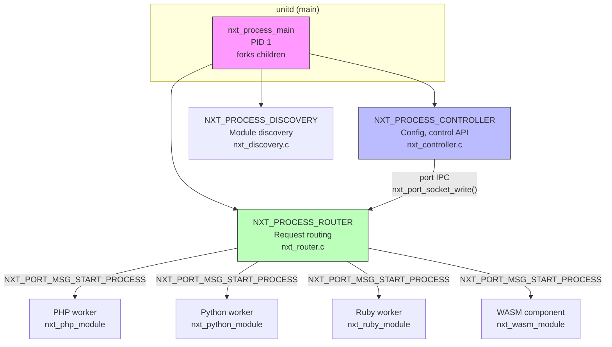

### Proposed Extension — Scheduler Layer

```mermaid
graph TB
    subgraph "Control Plane"
        CTRL[NXT_PROCESS_CONTROLLER<br/>Owns cron state<br/>Timer wheel via nxt_timer_t]
        SCH[nxt_scheduler.c<br/>Cron parser + dispatch<br/>Ring buffer for status]
    end

    subgraph "Data Plane"
        ROUTER[NXT_PROCESS_ROUTER<br/>Spawns workers<br/>Handles IPC]
    end

    subgraph "New Endpoints"
        RUN["POST /control/applications/&#60;name&#62;/run<br/>One-shot task execution"]
        RUNS["GET /control/runs/&#60;id&#62;<br/>Poll run status"]
        SCHED_STATUS["GET /status/applications/&#60;app&#62;/schedules<br/>Schedule status"]
    end

    subgraph "Workers"
        W_PHP[PHP worker<br/>+task_handler callback]
        W_PY[Python worker<br/>+task_handler callback]
        W_WASM[WASM component<br/>single-invocation instantiation]
    end

    CTRL --> SCH
    RUN --> CTRL
    RUNS --> CTRL
    SCHED_STATUS --> CTRL

    CTRL -- "NXT_PORT_MSG_RUN_TASK<br/>+cmd +env +cwd" --> ROUTER
    SCH -- "fires → POST /run<br/>or direct IPC" --> CTRL

    ROUTER -- "spawn one-shot<br/>or dispatch to pool" --> W_PHP
    ROUTER -- "spawn one-shot<br/>or dispatch to pool" --> W_PY
    ROUTER -- "instantiate component<br/>µs cold start" --> W_WASM

    style SCH fill:#ff9,stroke:#333
    style RUN fill:#fdd,stroke:#333
    style W_WASM fill:#dfd,stroke:#333
```

### Message Flow: `/run` Request

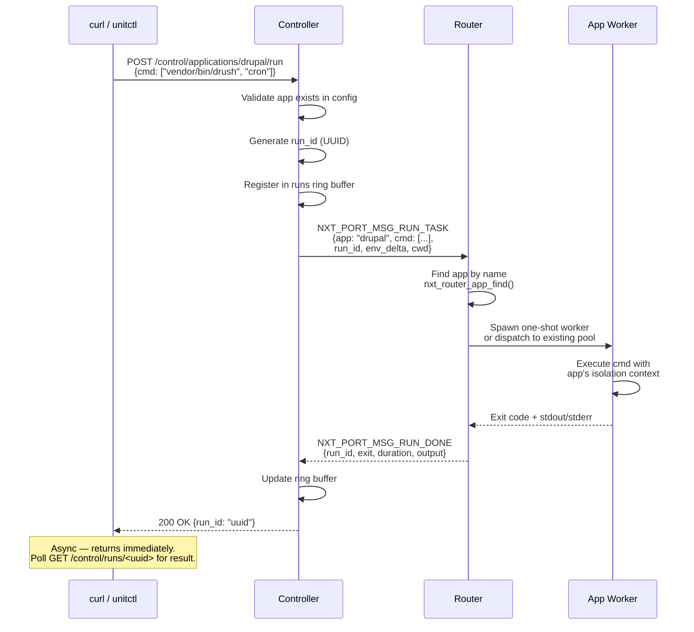

### Message Flow: Scheduled Cron Fire

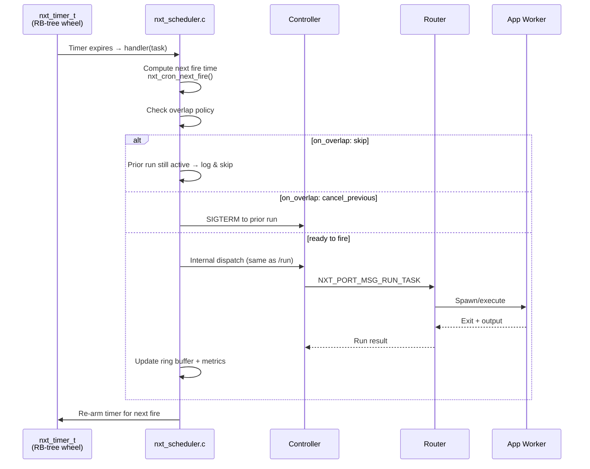

---

## Phase 1: `POST /control/applications/<name>/run`

**Effort:** ~1 week | **Deliverable:** One-shot task execution via control API

### Control API Path Routing

The endpoint plugs into `nxt_controller_process_request()` at `src/nxt_controller.c:1178`,
right next to the existing `/control/applications/<name>/restart` handler.

```c
// src/nxt_controller.c — nxt_controller_process_control() modification

static void
nxt_controller_process_control(nxt_task_t *task,
    nxt_controller_request_t *req, nxt_str_t *path)
{
    static const nxt_str_t applications = nxt_string("applications");
    static const nxt_str_t restart_suffix = nxt_string("/restart");
    static const nxt_str_t run_suffix = nxt_string("/run");

    // ... existing restart logic ...

    // NEW: /control/applications/<name>/run
    if (nxt_str_start(path, "applications/", 13)
        && path->length > 13 + 4
        && nxt_str_start(path->start + path->length - 4, "/run", 4))
    {
        path->start += 13;
        path->length -= 13 + 4;
        nxt_controller_process_run(task, req, path);
        return;
    }

    // ... existing not_found ...
}
```

### New Handler: `nxt_controller_process_run()`

```c
// src/nxt_controller.c

static void
nxt_controller_process_run(nxt_task_t *task,
    nxt_controller_request_t *req, nxt_str_t *app_name)
{
    nxt_buf_t                  *b, *body;
    nxt_int_t                   rc;
    nxt_str_t                   cmd_str;
    nxt_port_t                  *router_port, *controller_port;
    nxt_runtime_t               *rt;
    nxt_conf_value_t            *value, *app_conf;
    nxt_controller_response_t   resp;
    nxt_port_msg_type_t         msg_type;

    // Only POST allowed
    if (!nxt_str_eq(&req->parser.method, "POST", 4)) {
        resp.status = 405;
        resp.title = (u_char *) "Method not allowed.";
        nxt_controller_response(task, req, &resp);
        return;
    }

    // Validate app exists
    value = nxt_controller_conf.root;
    value = nxt_conf_get_object_member(value, &applications, NULL);
    app_conf = nxt_conf_get_object_member(value, app_name, NULL);
    if (app_conf == NULL) {
        resp.status = 404;
        resp.title = (u_char *) "Application not found.";
        nxt_controller_response(task, req, &resp);
        return;
    }

    // Parse request body: {cmd, env, cwd}
    // ... JSON parse ...

    // Generate run_id
    nxt_str_t run_id = generate_uuid();

    // Send NXT_PORT_MSG_RUN_TASK to router
    rt = task->thread->runtime;
    router_port = rt->port_by_type[NXT_PROCESS_ROUTER];
    controller_port = rt->port_by_type[NXT_PROCESS_CONTROLLER];

    stream = nxt_port_rpc_register_handler(task, controller_port,
                                           nxt_controller_run_done_handler,
                                           nxt_controller_run_done_handler,
                                           router_port->pid, req);

    msg_type = NXT_PORT_MSG_RUN_TASK;
    // Attach app_name + cmd + run_id as buffer

    rc = nxt_port_socket_write(task, router_port, msg_type,
                               -1, stream, 0, b);

    // Return 202 Accepted with run_id immediately
    resp.status = 202;
    resp.title = (u_char *) "Run started.";
    // resp.body = {"run_id": "uuid"}
    nxt_controller_response(task, req, &resp);
}
```

### New Port Message Type

```c
// src/nxt_port.h — add to nxt_port_handlers_t

typedef struct {
    // ... existing handlers ...
    nxt_port_handler_t  app_restart;
    nxt_port_handler_t  run_task;      /* NEW: task execution */
    nxt_port_handler_t  run_done;      /* NEW: task completion */
    nxt_port_handler_t  status;
    // ...
} nxt_port_handlers_t;

// New message types
_NXT_PORT_MSG_RUN_TASK     = nxt_port_handler_idx(run_task),
_NXT_PORT_MSG_RUN_DONE     = nxt_port_handler_idx(run_done),
```

### Router Side: `nxt_router_run_task_handler()`

```c
// src/nxt_router.c — mirrors nxt_router_app_restart_handler()

static void
nxt_router_run_task_handler(nxt_task_t *task, nxt_port_recv_msg_t *msg)
{
    nxt_app_t       *app;
    nxt_str_t       app_name, cmd;
    nxt_port_t      *reply_port;

    // Parse app_name from msg->buf
    app_name.start = msg->buf->mem.pos;
    app_name.length = nxt_buf_mem_used_size(&msg->buf->mem);

    app = nxt_router_app_find(&nxt_router->apps, &app_name);
    if (app == NULL) {
        nxt_alert(task, "run_task: app '%V' not found", &app_name);
        return;
    }

    // Spawn one-shot worker with cmd override
    // Uses existing nxt_router_start_app_process() with:
    //   - app->conf (isolation, user, env)
    //   - overridden argv from cmd
    //   - working_directory from request or app config

    // Register run_id in tracker for later result correlation
    nxt_run_tracker_register(run_id, app);

    // When worker exits:
    //   nxt_router_run_done_handler() collects exit code,
    //   stdout/stderr, duration, sends RUN_DONE back to controller
}
```

### Port Handler Registration

```c
// src/nxt_router.c — update router port handlers

static const nxt_port_handlers_t  nxt_router_process_port_handlers = {
    // ... existing ...
    .app_restart  = nxt_router_app_restart_handler,
    .run_task     = nxt_router_run_task_handler,    /* NEW */
    .run_done     = nxt_router_run_done_handler,    /* NEW */
    .status       = nxt_router_status_handler,
    // ...
};
```

### `nxt_run_tracker_t` — Run State Tracking

```c
// src/nxt_scheduler.h

#define NXT_RUN_ID_SIZE  37  /* UUID string with NUL */

typedef enum {
    NXT_RUN_PENDING,
    NXT_RUN_RUNNING,
    NXT_RUN_SUCCEEDED,
    NXT_RUN_FAILED,
    NXT_RUN_TIMEOUT,
    NXT_RUN_CANCELLED,
} nxt_run_state_t;

typedef struct {
    char                run_id[NXT_RUN_ID_SIZE];
    nxt_str_t           app_name;
    nxt_str_t           schedule_name;  /* empty for one-shot /run */
    nxt_run_state_t     state;
    pid_t               pid;
    nxt_msec_t          start_time;
    nxt_msec_t          end_time;
    int                 exit_code;
    nxt_str_t           stdout_preview;  /* last 4KB */
    nxt_str_t           stderr_preview;
} nxt_run_record_t;

/* Ring buffer: N=20 most recent runs per schedule */
#define NXT_RUN_RING_SIZE  20

typedef struct {
    uint32_t            head;
    uint32_t            count;
    nxt_run_record_t    runs[NXT_RUN_RING_SIZE];
} nxt_run_ring_t;
```

### Phase 1 API Summary

```mermaid
graph LR
    subgraph "Phase 1 Endpoints"
        A["POST /control/applications/&#60;name&#62;/run<br/>Body: {cmd, env?, cwd?}<br/>Returns: 202 {run_id}"]
        B["GET /control/runs/&#60;id&#62;<br/>Returns: {state, exit_code,<br/>duration_ms, stdout_preview}"]
    end

    subgraph "Internal"
        C["NXT_PORT_MSG_RUN_TASK<br/>Controller → Router"]
        D["nxt_run_tracker<br/>In-memory run state"]
    end

    A --> C --> D --> B

    style A fill:#fdd,stroke:#333
    style B fill:#fdd,stroke:#333
```

---

## Phase 2: In-Process Scheduler

**Effort:** ~3-4 weeks | **Deliverable:** Cron scheduling with status API

### Scheduler Architecture

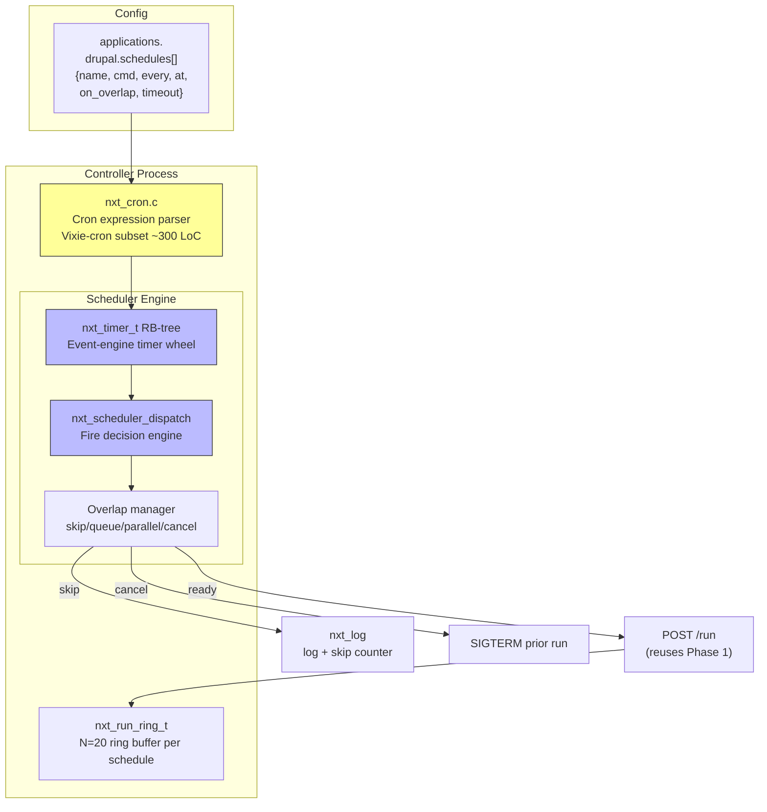

### Cron Parser Design

```c
// src/nxt_cron.h

typedef struct {
    uint8_t  minute[60];    /* bitset: 0-59 */
    uint8_t  hour[24];      /* bitset: 0-23 */
    uint8_t  dom[31];       /* bitset: 1-31 */
    uint8_t  month[12];     /* bitset: 0-11 */
    uint8_t  dow[7];        /* bitset: 0-6 (Sun-Sat) */
} nxt_cron_expr_t;

/*
 * Parse Vixie-cron subset:
 *   "*/5 * * * *"        every 5 minutes
 *   "0 3 * * *"          daily at 3 AM
 *   "30 2 1,15 * *"      1st and 15th at 2:30
 *
 * Also supports shorthand:
 *   "@hourly"   →  "0 * * * *"
 *   "@daily"    →  "0 0 * * *"
 *   "@weekly"   →  "0 0 * * 0"
 *   "@reboot"   →  fire once on daemon start
 */
nxt_int_t nxt_cron_parse(nxt_str_t *expr, nxt_cron_expr_t *cron);

/*
 * Compute next fire time in milliseconds from now.
 * Returns 0 if schedule has no future fire (e.g., invalid).
 */
nxt_msec_t nxt_cron_next_fire(nxt_cron_expr_t *cron, time_t now,
                               const char *tz);
```

### Interval Shorthand

```c
// src/nxt_cron.h

typedef enum {
    NXT_SCHED_INTERVAL,
    NXT_SCHED_CRON,
    NXT_SCHED_ANCHOR,
} nxt_sched_type_t;

/* "every": "5m" | "30s" | "1h" | "12h" */
nxt_msec_t nxt_cron_parse_interval(nxt_str_t *s);

/* "at": "@daily" | "@hourly" | "@weekly" | "@reboot" | "@midnight" */
nxt_cron_expr_t nxt_cron_parse_anchor(nxt_str_t *s);
```

### Scheduler Config Validation

```c
// src/nxt_conf_validation.c — additions

static nxt_conf_vldt_object_t  nxt_conf_vldt_schedule_members[] = {
    { nxt_string("name"),
      NXT_CONF_VLDT_STRING },

    { nxt_string("cmd"),
      NXT_CONF_VLDT_ARRAY },

    { nxt_string("every"),
      NXT_CONF_VLDT_STRING,
      &nxt_conf_vldt_schedule_interval },

    { nxt_string("at"),
      NXT_CONF_VLDT_STRING,
      &nxt_conf_vldt_schedule_at },

    { nxt_string("on_overlap"),
      NXT_CONF_VLDT_STRING,
      &nxt_conf_vldt_schedule_overlap },
      /* Must be: skip | queue | parallel | cancel_previous */

    { nxt_string("timeout"),
      NXT_CONF_VLDT_STRING,
      &nxt_conf_vldt_schedule_timeout },

    { nxt_string("grace_period"),
      NXT_CONF_VLDT_STRING,
      &nxt_conf_vldt_schedule_grace_period },

    { nxt_string("retry"),
      NXT_CONF_VLDT_OBJECT,
      &nxt_conf_vldt_schedule_retry },

    { nxt_string("tz"),
      NXT_CONF_VLDT_STRING },
      /* IANA timezone: "Europe/Amsterdam", "UTC" */

    { nxt_string("log"),
      NXT_CONF_VLDT_STRING },
      /* Optional per-task log file */

    NXT_CONF_VLDT_NULL
};

static nxt_conf_vldt_object_t  nxt_conf_vldt_retry_members[] = {
    { nxt_string("attempts"),  NXT_CONF_VLDT_INTEGER },
    { nxt_string("backoff"),   NXT_CONF_VLDT_STRING },
    { nxt_string("max_delay"), NXT_CONF_VLDT_STRING },
    NXT_CONF_VLDT_NULL
};
```

### Per-Schedule State Machine

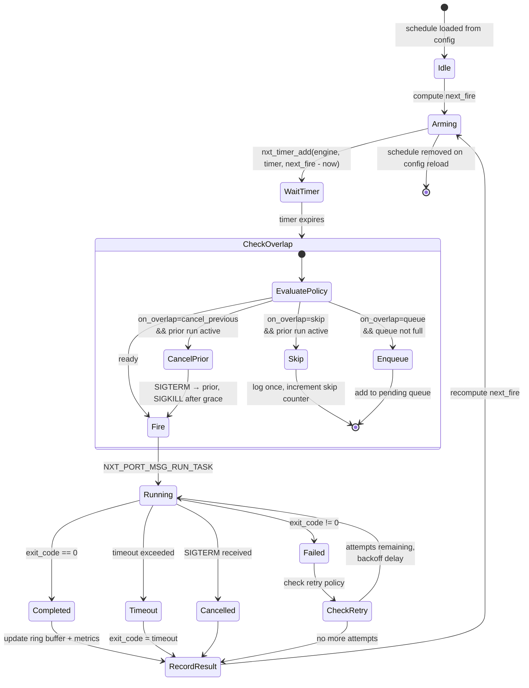

### Interaction with Config Reload

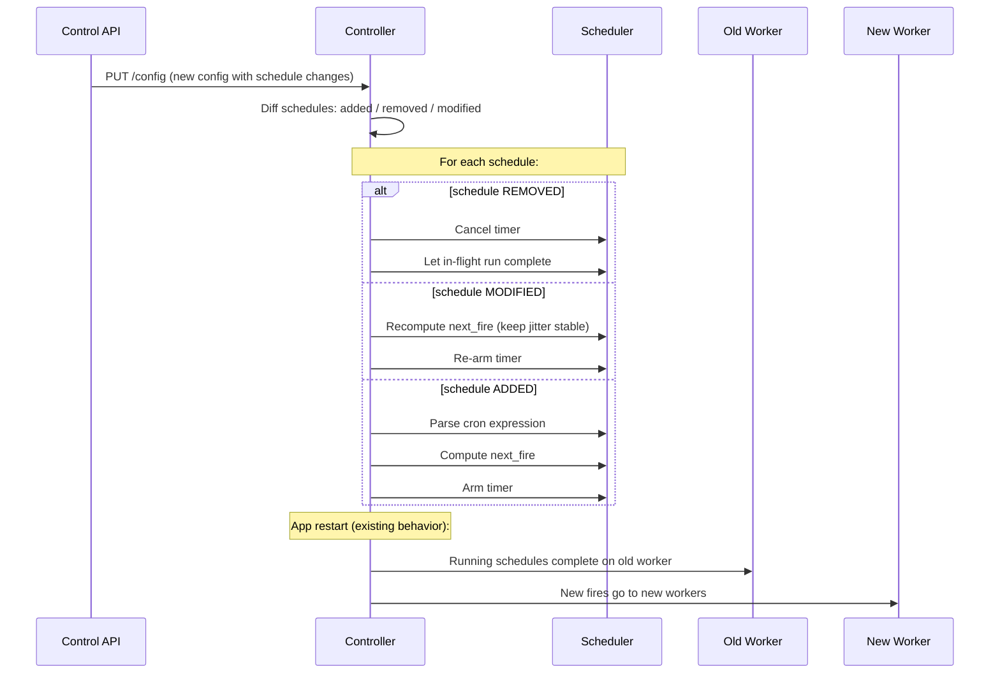

---

## Phase 3: Observability & Lifecycle

**Effort:** ~2 weeks

### OpenTelemetry Integration

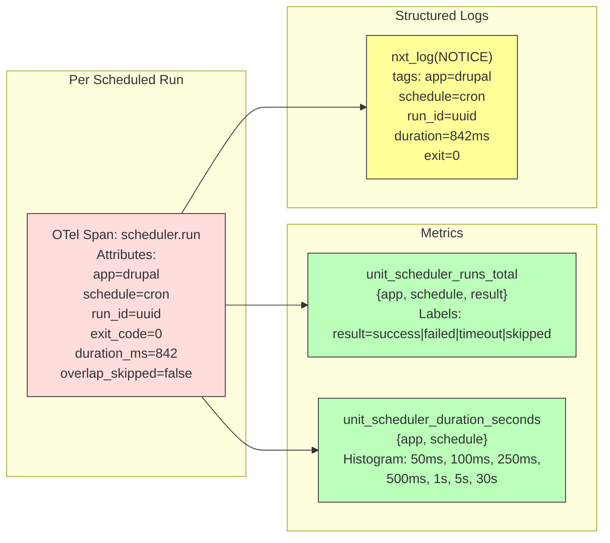

### Graceful Shutdown

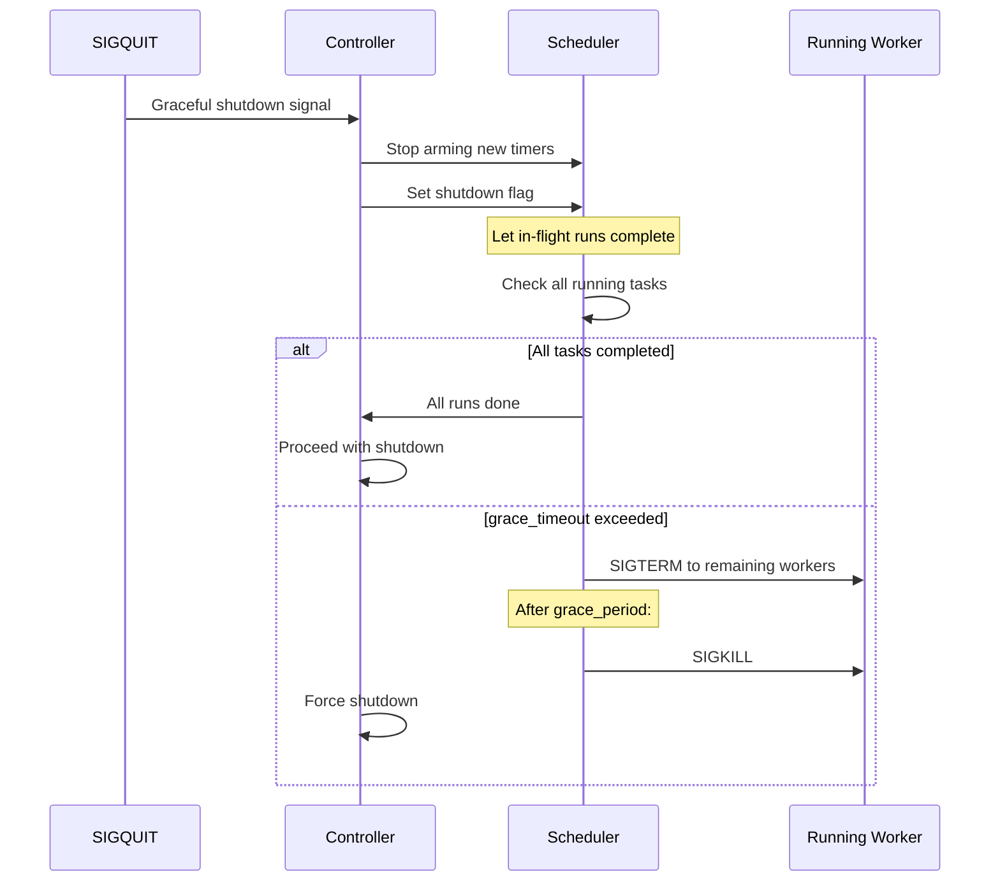

---

## WASM Integration: `was/run`

### Why WASM Is Special

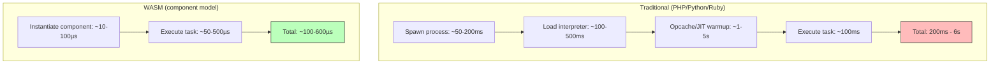

### WASM Task Execution Flow

```mermaid
graph TB
    subgraph "Phase 1: Fresh Process (fallback)"
        W1A["WASM app config"] -->|"no task_handler"| W2A["Spawn new process"]
        W2A --> W3A["Instantiate component"]
        W3A --> W4A["Execute"]
        W4A --> W5A["Exit"]
    end

    subgraph "Phase 2: In-Process (optimal)"
        W1B["WASM app config"] -->|"task_handler"| W2B["Reuse existing runtime"]
        W2B --> W3B["Single-invocation instantiation"]
        W3B --> W4B["Execute"]
        W4B --> W5B["Drop instance<br/>(linear memory freed)"]
    end

    style W5B fill:#bfb,stroke:#333
```

### WASM-Specific Advantages for Scheduling

| Feature | Traditional Runtimes | WASM |
|---------|---------------------|------|
| Cold start | 200ms - 6s | 10-100µs |
| Memory isolation | process-level | linear memory (free on drop) |
| Security | cgroups + seccomp | WASI capability model |
| Language coupling | per-language SAPI | any lang → .wasm |
| High-frequency cron | impractical | "every 1s" is cheap |
| ML inference | external sidecar | wasi-nn in-process |
| Storage | none | wasi-keyvalue, wasi-sqlite |

### wasi-nn for Scheduled Inference

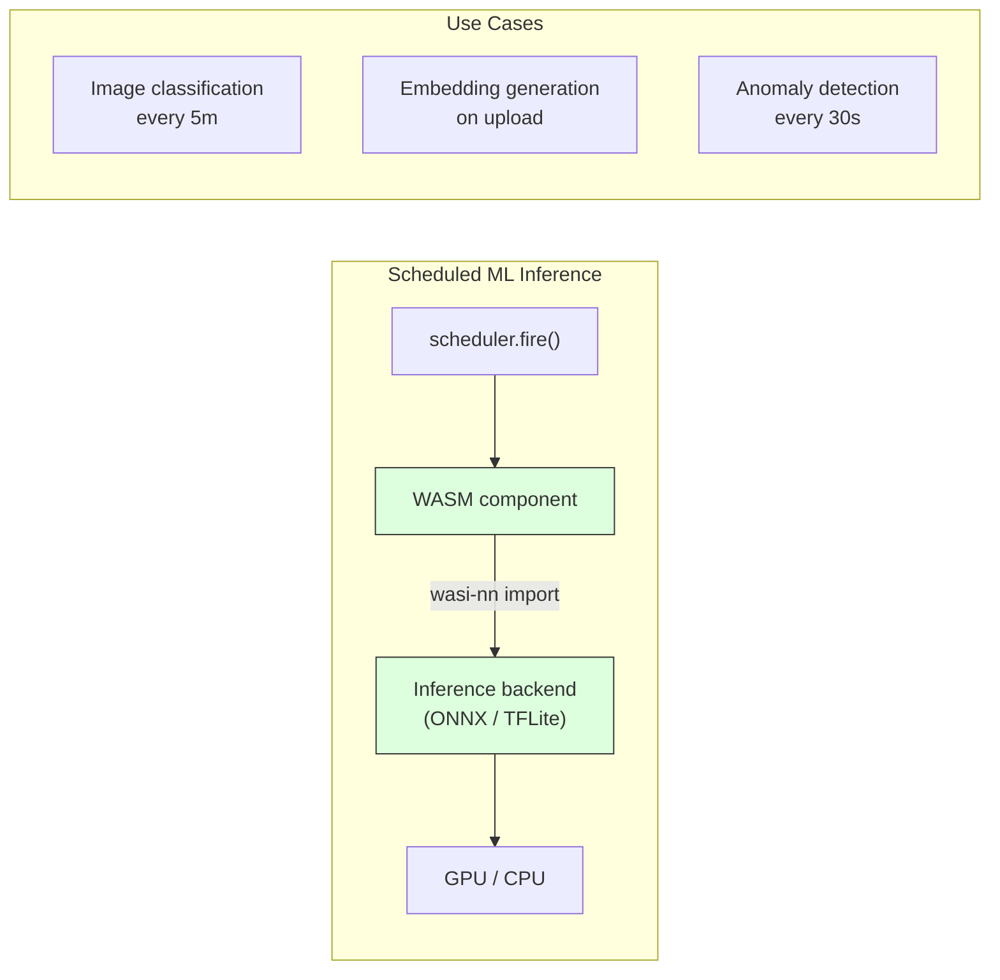

---

## Config Schema

### Full Schedule Config

```json
{
  "applications": {
    "drupal": {
      "type": "php",
      "root": "/var/www/drupal",
      "user": "www-data",
      "isolation": {
        "namespaces": { "mount": true, "pid": true },
        "rootfs": "/var/www/drupal"
      },
      "processes": {
        "max": 8
      },
      "schedules": {
        "cron": {
          "cmd": ["vendor/bin/drush", "cron"],
          "every": "5m",
          "on_overlap": "skip",
          "timeout": "5m",
          "grace_period": "10s",
          "retry": {
            "attempts": 3,
            "backoff": "exponential",
            "max_delay": "10m"
          },
          "tz": "UTC",
          "on_failure": {
            "exec": ["/usr/local/bin/alert.sh"],
            "after_consecutive": 3
          }
        },
        "nightly-backup": {
          "cmd": ["vendor/bin/drush", "sql:dump", "--result-file=/tmp/dump.sql"],
          "at": "0 3 * * *",
          "timeout": "30m"
        },
        "queue-default": {
          "cmd": ["vendor/bin/drush", "queue:run", "default"],
          "every": "1m",
          "on_overlap": "skip"
        }
      }
    }
  }
}
```

### `POST /control/applications/<name>/run` Request Body

```json
{
  "cmd": ["vendor/bin/drush", "updb", "-y"],
  "env": {
    "DRUSH_OPTIONS_URI": "https://example.com"
  },
  "cwd": "/var/www/drupal"
}
```

All fields optional except `cmd`. Missing fields inherit from app config.

---

## Status API

### `GET /status/applications/<app>/schedules`

```json
{
  "cron": {
    "last_run": "2026-04-17T14:05:03Z",
    "last_exit": 0,
    "last_duration_ms": 842,
    "next_run": "2026-04-17T14:10:03Z",
    "runs_total": 2881,
    "failures_total": 3,
    "skipped_total": 12,
    "recent_runs": [
      {
        "run_id": "uuid-1",
        "started": "2026-04-17T14:05:03Z",
        "finished": "2026-04-17T14:05:04Z",
        "exit_code": 0,
        "duration_ms": 842,
        "trigger": "schedule",
        "overlap_skipped": false,
        "stdout_preview": "Successfully ran cron"
      },
      {
        "run_id": "uuid-2",
        "started": "2026-04-17T14:04:03Z",
        "finished": "2026-04-17T14:04:04Z",
        "exit_code": 1,
        "duration_ms": 3201,
        "trigger": "schedule",
        "overlap_skipped": false,
        "stderr_preview": "Database connection failed"
      }
    ]
  }
}
```

### `GET /control/runs/<id>`

```json
{
  "run_id": "uuid-1",
  "app": "drupal",
  "schedule": "cron",
  "state": "succeeded",
  "started": "2026-04-17T14:05:03Z",
  "finished": "2026-04-17T14:05:04Z",
  "duration_ms": 842,
  "exit_code": 0,
  "trigger": "api",
  "stdout_preview": "Successfully ran cron",
  "stderr_preview": ""
}
```

---

## Language Presets

### Preset Resolution

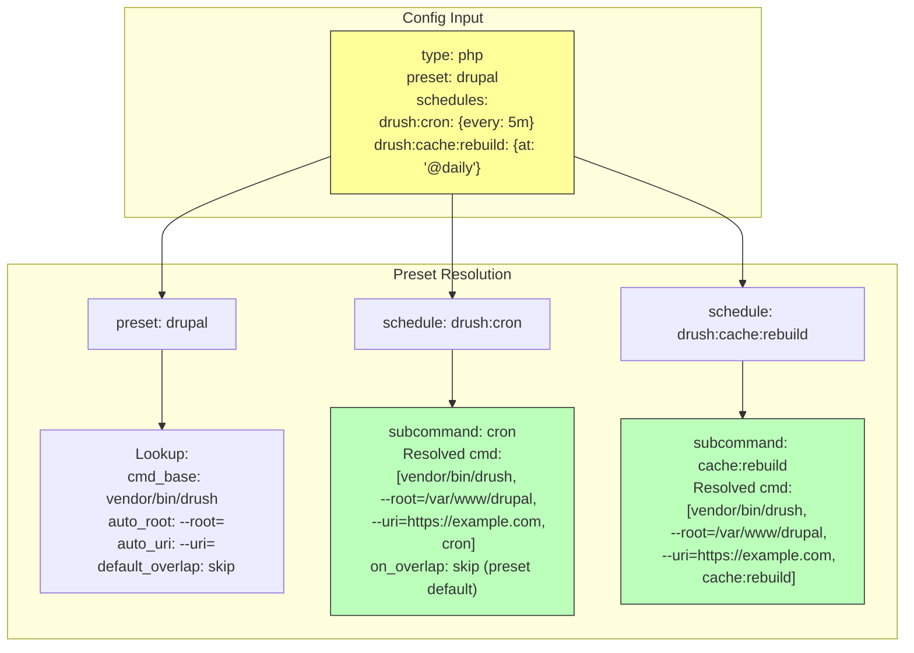

### Supported Presets

| Preset | Type | Resolves To | Auto-populate |
|--------|------|-------------|---------------|
| `drupal` | php | `vendor/bin/drush --root=<root> --uri=<listener> <sub>` | `--root`, `--uri`, `on_overlap: skip` |
| `artisan` | php | `php artisan <sub>` | working directory from `root` |
| `manage` | python | `python manage.py <sub>` | `DJANGO_SETTINGS_MODULE` from env |
| `rake` | ruby | `bundle exec rake <sub>` | `BUNDLE_GEMFILE` from root |
| `sidekiq` | ruby | `bundle exec sidekiq <sub>` | `REDIS_URL` from env |

---

## File Layout

### New Files

```
src/nxt_scheduler.c            # Scheduler engine: timer wheel, dispatch, overlap
src/nxt_scheduler.h            # Public types: nxt_run_record_t, nxt_run_ring_t
src/nxt_cron.c                 # Cron expression parser + next-fire math
src/nxt_cron.h                 # nxt_cron_expr_t, parse/next_fire API
test/test_scheduler.py         # pytest fixtures for /run + schedules
test/test_cron.py              # Unit tests for cron parser
```

### Modified Files

```
src/nxt_controller.c           # + /control/applications/*/run handler
                                # + /control/runs/<id> handler
                                # + /status/applications/*/schedules
src/nxt_controller.h           # + run_tracker declarations
src/nxt_conf_validation.c      # + "schedules" schema validation
src/nxt_conf.c                 # + schedule config parsing into structs
src/nxt_port.h                 # + NXT_PORT_MSG_RUN_TASK, RUN_DONE types
src/nxt_port_handlers.h        # (auto-generated from nxt_port.h)
src/nxt_router.c               # + run_task, run_done port handlers
src/nxt_router.h               # + run tracker accessor
src/nxt_unit.h                 # + nxt_unit_task_handler_t (Phase 2 callback)
src/nxt_unit.c                 # + task dispatch to language SAPIs
src/php/nxt_php_sapi.c         # + task_handler: php_execute_script override
src/python/nxt_python.c        # + task_handler: reuse interpreter, exec entry point
src/ruby/nxt_ruby.c            # + task_handler: rb_load_protect
```

---

## Risk Register

| Risk | Impact | Mitigation |
|------|--------|------------|
| In-process side effects (leaked globals, FD drift) | Worker contamination | Phase 1 uses fresh process spawn; Phase 2 adds task_handler only after validation |
| Opcache poisoning from scheduled tasks | Web requests serve stale/wrong code | Separate opcache instance for task workers, or fresh process fallback |
| Worker pool saturation blocks web traffic | User-visible latency | Document `processes.max: 1` risk; recommend separate pool app; report `skipped_saturation` |
| SAPI ABI bump rollout | Coordination across all language modules | Phase 1 requires no SAPI changes; Phase 2 is opt-in per SAPI with fresh-process fallback |
| Distributed cron (multiple Unit instances) | Duplicate task execution | MVP: document single-host requirement; future: `"leader_election": {backend: "file"}` |
| Timer drift after long GC/sleep | Missed or double-fire | Compute next-fire from wall clock, not interval accumulation; configurable `catchup` policy |

---

## Implementation Timeline

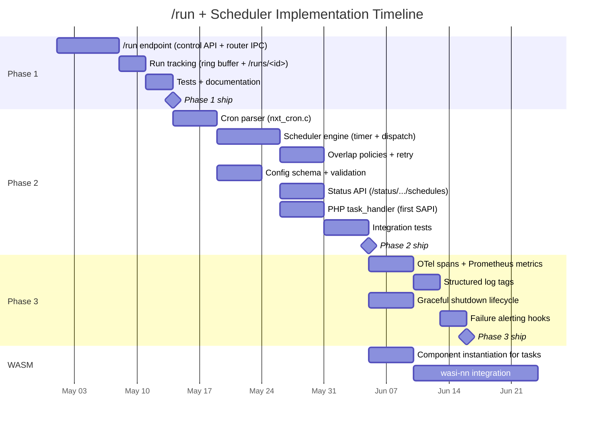

### Key Dependency Chain

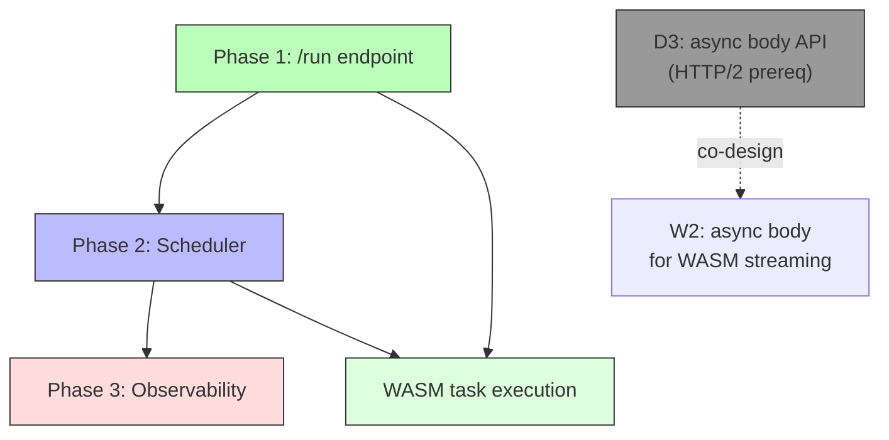
