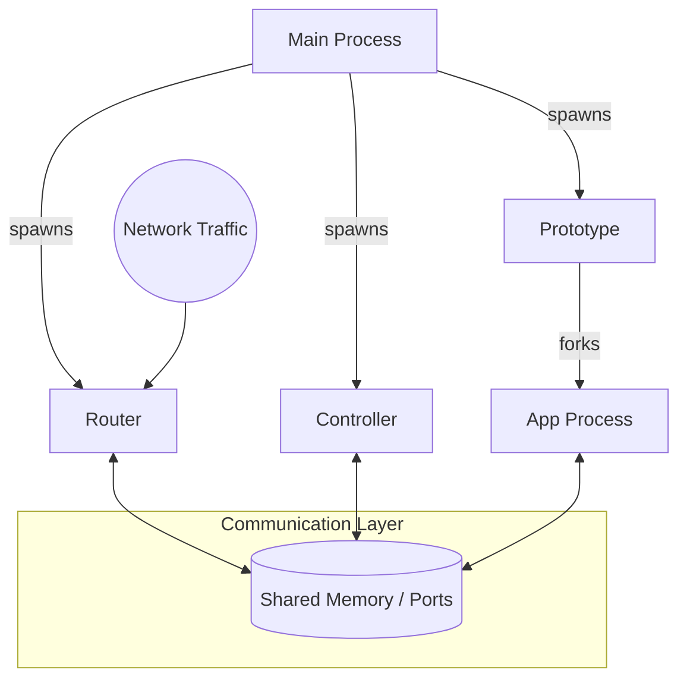

# Debug Plan: NGINX Unit / FreeUnit Tests on armhf/armv7

## Objective
Investigate and resolve the issue where the CI pipeline hangs and tests fail with `AssertionError: alert(s)` on 32-bit ARM architectures (`armhf`, `armv7`).

## Architecture Overview
NGINX Unit (FreeUnit) uses a multi-process architecture where processes communicate via **Ports** backed by **Shared Memory (SHM)**.

- **Main Process**: The master process that manages the lifecycle of all other processes.
- **Controller Process**: Handles the configuration API (JSON over Unix socket/HTTP).
- **Router Process**: The "front-end" that handles ingress traffic, TLS termination, and routes requests to applications. **This is where the SIGBUS usually occurs.**
- **Prototype Processes**: Serve as templates for spawning application processes.
- **Application Processes**: Run the actual language runtimes (PHP, Python, Ruby, etc.).

### Process Interaction Diagram


## Background & Motivation
CI logs for `armhf` show a `pytest` INTERNALERROR:
```
INTERNALERROR> AssertionError: alert(s)
```
This is raised by `Log.check_alerts()` in `test/unit/log.py`. It means `unitd` logged a critical "alert" level message (usually a crash or a failed assertion) during the pre-test initialization.

## Local Debugging Strategy via official CI environment
We will replicate the CI environment and focus on capturing the raw `unit.log` to see the actual error message hidden behind the `AssertionError`.

### Implementation Steps

#### 1. Setup QEMU Multiarch Support
```sh
sudo apt install qemu-user-static
docker run --rm --privileged multiarch/qemu-user-static --reset -p yes
```

#### 2. Start the CI Container (Exact CI Mirror)
```sh
docker run --platform linux/arm/v7 -it --rm \
  -e APORTSDIR=/mnt \
  -v $(pwd):/mnt \
  --ulimit nofile=65536:65536 \
  registry.alpinelinux.org/alpine/infra/docker/alpine-gitlab-ci:latest \
  sh -c "sleep infinity"
```

#### 3. Attach and Prepare
```sh
docker exec -it --user buildozer <container_id> ash
```

#### 4. Build and Reproduce the Alert
Navigate to the package and run the build. If `abuild` fails the check phase, we need to find the logs.
```sh
cd /mnt/community/freeunit
abuild checksum
abuild -r
```

#### 5. Isolate the Alert Message
If the build fails with `alert(s)`, the tests likely left a `unit.log` in the build directory. We need to find it and read the "alert" messages.
```sh
# Search for the log file generated by the tests
find src/freeunit-1.35.3/ -name "unit.log"

# Read the alerts (look for lines containing [alert])
grep "\[alert\]" src/freeunit-1.35.3/test/unit.log
```

#### 6. Debug with GDB
Since `alert(s)` often means a child process crashed (SIGSEGV), use GDB to catch it:
```sh
cd src/freeunit-1.35.3/test
# Run pytest with --unit-log to see where it puts it
# or use GDB on unitd itself if it crashes on start
gdb --args ../build/sbin/unitd --no-daemon --log /tmp/unit.log --control unix:/tmp/control.sock
```

## Current Findings (Local Repro on armv7)
- **Error**: `AssertionError: alert(s)` triggered by `Log.check_alerts()`.
- **Cause**: The `router` process crashes with **SIGBUS (signal 7)** immediately after logging the OpenSSL version during startup.
- **Architectural Root Cause (ARMv7 vs x86)**: 
  - On 32-bit ARM architectures (`armhf`, `armv7`), accessing 64-bit values (like `time_t` which is now 64-bit on Alpine, `uint64_t`, or `int64_t`) requires strict 8-byte memory alignment.
  - If a 64-bit value is located at an address that is only 4-byte aligned (e.g., due to struct packing, padding, or stack allocation), the compiler-generated `LDRD`/`STRD` (Load/Store Register Dual) instructions will trigger a hardware exception: `SIGBUS`.
  - **Why x86 doesn't fail**: The 32-bit x86 architecture natively handles unaligned memory accesses at the hardware level (albeit with a minor performance penalty). Thus, the exact same unaligned memory layout simply works on x86, but fatally crashes on ARM.
- **Deadlock Issue**: nginx/unit#1600 reports a deadlock in `nxt_event_engine_destroy()` on 32-bit ARM, specifically affecting `test_tls_certificate_change`.

## Useful Patterns for Debugging Alignment
Use these patterns with `grep` or `ag` to find potential trouble spots in the C source:

```sh
# Find all 64-bit integers (candidates for misalignment)
grep -rE "uint64_t|int64_t|time_t|off_t|nxt_time_t|nxt_off_t|nxt_nsec_t" src/

# Find structures defined in headers (check for packing/padding)
grep -r "struct.*{" src/*.h

# Find atomic operations (often sensitive to alignment)
grep -r "nxt_atomic_" src/

# Find existing alignment forced by attributes
grep -r "nxt_aligned" src/
```

## Implementation Steps (Updated)

#### 7. Test Alignment Fixes
We need to audit and force 8-byte alignment (`nxt_aligned(8)`) and insert explicit padding for structures containing 64-bit fields, especially:
- **Shared Memory**: `nxt_port_mmap_header_t`, `nxt_port_queue_t`.
- **Time Structures**: `nxt_thread_time_t`, `nxt_timer_t` (which hold 64-bit `time_t` and `nxt_monotonic_time_t`).
- **Stack Variables**: `qmsg` in `nxt_port_socket_write2`, or thread-local storage (`nxt_thread_context`) which might default to 4-byte alignment on 32-bit compilers.

#### 8. Restore Skips
Restore the skip for `test_tls_certificate_change` in `APKBUILD` as it's known to be unstable on 32-bit ARM.
